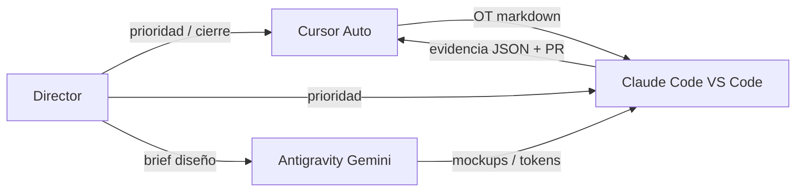

# Equipo Nexus Core — Roles y estándares

---

## Director de proyecto

- Define prioridad (Motor, PP, web, report).
- Aprueba cierre gerencial y push Git unificado.
- No se asume commit/push de agentes sin pedido explícito.

---

## Cursor — Auto (auditor + OT)

**Herramienta:** Cursor IDE  
**Perfil:** `roles/CURSOR-AUTO.md`

| Hace | No hace |
|------|---------|
| Redactar OT con criterios, anti-patrones, pruebas | Marcar OT CERRADA sin auditoría |
| Auditar diffs vs CONTRATO + P1–P8 | Parches rápidos que violen pilares |
| Actualizar `OT_REGISTRO_ESTADO.md` tras PASS | TRUNCATE / reset sin OT |
| Diagnosticar cuellos de botella (arquitectura) | Sustituir a Claude en migraciones largas SQL |

**Entregables:** `OT-*.md`, veredicto PASS/FAIL/CONDICIONAL, comentarios en PR si aplica.

---

## Claude Code — VS Code (implementación + DB)

**Herramienta:** VS Code + Claude Code  
**Perfil:** `roles/CLAUDE-CODE-DB.md`

| Hace | No hace |
|------|---------|
| Ejecutar OT (Python, TS, Streamlit, Next) | Cerrar OT sin evidencia |
| Migraciones SQL, índices, funciones, RPC | `linea.caso_id` en lógica nueva |
| `OT-*-EVIDENCIA.json` con counts pre/post | Commits con `.env` / secrets |
| Push `main` cuando la OT lo pida | Marcar `auditoria_auto: PASS` |

**Especialidad:** base de datos Supabase/Postgres — fuente de verdad relacional.

---

## Antigravity — Gemini (diseño)

**Herramienta:** Antigravity  
**Modelos:** Gemini 3 Flash · 3.1 Pro Low · 3.1 Pro High  
**Perfil:** `roles/ANTIGRAVITY-DISENO.md`

| Hace | No hace |
|------|---------|
| UI/UX, glassmorphism, flujos, copy | Lógica de precio ni SQL |
| Prototipos visuales alineados a marca | Deduplicar datos en cliente |
| Tokens color/tipografía RIMEC | Cambiar esquema BD |

**Handoff:** diseño → Claude implementa → Cursor audita.

---

## Estándar común (los tres)

Leer antes de actuar:

1. `docs/CONTRATO_ARQUITECTURA.md`
2. `control_central/docs/CONTROL_INTEGRIDAD_HOLDING.md`
3. `.cursorrules` (Cursor) o equivalente citado en la OT
