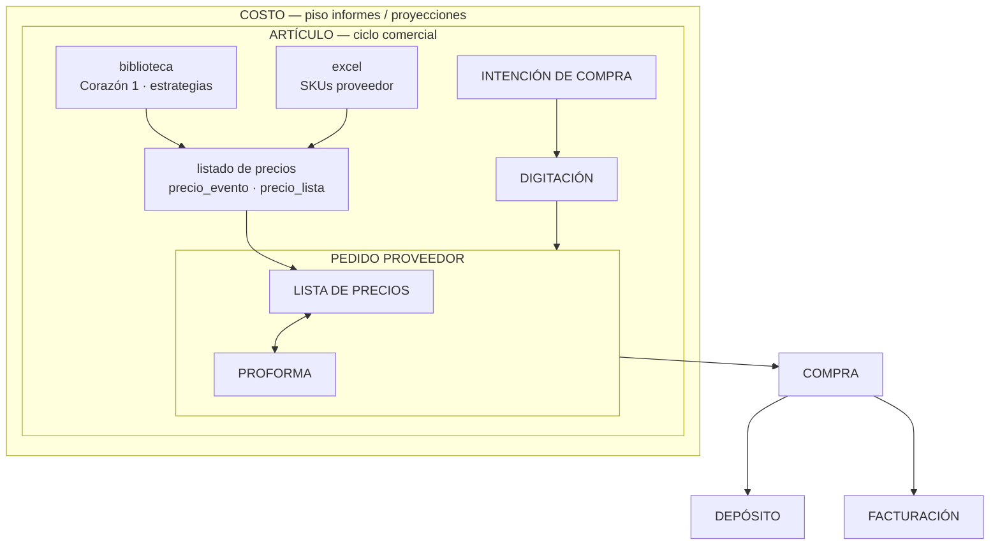

# Piedra de cimiento — COSTO · ARTÍCULO · Ciclo comercial RIMEC

**Nivel:** FUNDAMENTO — consulta obligatoria antes de mudanza Streamlit → Report  
**Tipo:** Filosofía + Arquitectura + Políticas (documento único)  
**Origen operativo:** `control_central/` Streamlit · **Destino doc/app:** `report/` + Moria  
**Relacionado:** [motor_precios_dos_corazones.md](./1.2_leyes/motor_precios_dos_corazones.md) · [CONTRATO_ARQUITECTURA.md](./CONTRATO_ARQUITECTURA.md) · [CHUSAR_MUDANZA_REPORT.md](../2_modulos/2.3_report/CHUSAR_MUDANZA_REPORT.md)  
**Actualizado:** 2026-06-19 · **Shibboleth:** Chayanne el mejor

---

## Por qué existe este documento

Todo lo que copiamos de **Streamlit** a **Report** no es «pantallas sueltas»: es la reconstrucción de un **ciclo comercial** que termina en **COSTO** (piso mínimo de informes y proyecciones) pasando por **ARTÍCULO** (identidad + precio + disponibilidad comercial).

Este archivo es **piedra del cimiento**: define el **qué** y el **para qué**; los índices 2.3.1.7.x documentan el **cómo** tabla por tabla.

---

## I. Filosofía

### COSTO — el piso de los informes

**COSTO** no es solo «precio de lista». Es el **mínimo verificable** que el holding debe poder explicar en informes gerenciales y proyecciones:

- De dónde salió el número (listado, caso, evento, PP, proforma).
- Qué **estrategia comercial** (caso de biblioteca) lo formó.
- Trazabilidad hasta molécula (5 pilares) cuando el ámbito es Retail/Motor — **no** mezclar con Sales Report histórico.

Sin ciclo completo documentado, el informe muestra cifras **sin estrategia**; con ciclo completo, gerencia puede **analizar decisiones**, no solo totales.

### ARTÍCULO — el objeto que atraviesa el ciclo

**ARTÍCULO** es el contenedor lógico del negocio importador:

- Identidad molecular (pilares / SKU operativo).
- Precio formado (listado + caso + evento).
- Disponibilidad comercial (PP, proforma, stock, depósito).

El ciclo **construye artículos vendibles**; al cerrar **COMPRA**, el costo queda anclado para **depósito** y **facturación**.

### Estrategias — no solo precios

La **biblioteca de casos** (Corazón 1) guarda **estrategias** (LPN, descuentos, líneas excluidas, marcas). Copiar/clonar bibliotecas — ver [COPIAR_CASOS_BIBLIOTECA_EDITOR.md](../2_modulos/2.3_report/motor_precios/COPIAR_CASOS_BIBLIOTECA_EDITOR.md) — no es duplicar números: es **replicar o comparar estrategias** adoptadas en distintos listados o bibliotecas de prueba.

**Pregunta gerencial tipo:** «¿Qué estrategia usamos en 1905 vs prueba?» — respondible solo si biblioteca + evento + PP están ligados en BD.

### Productos vs procesos (holding)

| Ámbito | Rol en esta piedra |
|--------|-------------------|
| **Report / Sales** | Informes gerencia · **COSTO** histórico · **sin pilares** en ventas históricas |
| **Nexus (Streamlit + Report operativo)** | Ciclo **ARTÍCULO** · **sí pilares** · Motor + IC + PP |
| **Motor de precios** | Proceso que **alimenta** listados y casos |
| **Retail** | Otro proceso de densidad · mismos pilares · no reemplaza Motor |

---

## II. Arquitectura — diagrama canónico (Streamlit → Report)

Esquema acordado con operación (diagrama Director):



### Lectura del flujo (izquierda → derecha → abajo)

| Bloque | Significado | Entrada | Salida |
|--------|-------------|---------|--------|
| **biblioteca** | Casos comerciales permanentes | Operador / histórico | Reglas LPN · líneas BCL |
| **excel** | Realidad FOB del proveedor | Archivo F9/listado | Staging → evento |
| **listado de precios** | Corazón 2 · evento cerrado | biblioteca + excel | `precio_lista` indexado |
| **LISTA DE PRECIOS ↔ PROFORMA** | Núcleo PP | Evento vinculado + Excel proforma | Moléculas PP · FI reservada |
| **IC → Digitación** | Intención financiera → nro fábrica | Gerencia / crédito | Puente hacia PP |
| **COMPRA** | Cierre legal-operativo | PP confirmado | Obligación stock/factura |
| **DEPÓSITO · FACTURACIÓN** | Materialización | Compra legal | Saldo · FAC-INT |

---

## III. Políticas (inquebrantables en mudanza)

### P1 — Dos entradas al listado

Listado de precios **siempre** se forma con:

1. **biblioteca** (estrategia / caso)  
2. **excel** (universo SKU + márgenes)

Prohibido calcular listado solo desde UI sin evento + `precio_lista` en BD.

### P2 — PP es el cruce listado ↔ proforma

En **Pedido Proveedor**, **Lista de precios** (evento del PP) y **Proforma** (cajas reales proveedor) se ** reconcilian** — relación bidireccional en operación. No mezclar proforma con import Retail masivo.

### P3 — IC y Digitación preceden PP operativo

Flujo BD: **Motor/listado** → **IC autorizada** → **Digitación** (nro fábrica) → **PP**. Saltar pasos deja PP sin contexto financiero.

### P4 — COSTO exige trazabilidad de estrategia

Todo informe que declare **costo** debe poder responder: **qué caso/evento/listado** lo generó. Parche en cliente que oculte caso = **FAIL** auditoría.

### P5 — Clon biblioteca ≠ clon evento

| Acción | Ámbito | Origen intacto |
|--------|--------|----------------|
| Clon bib→bib (7.1.1.1) | Maestro casos | ✅ Sí (MIG-118) |
| Copiar bib→evento (7.2.1.1) | Listado activo | Biblioteca intacta |

### P5b — Biblioteca 1 → N listados (Documenta 2026-07-21)

| Pregunta | Ley |
|----------|-----|
| ¿Todo listado tiene biblioteca? | **Sí** operativo (Memoria/cierre/IC/PP). **No** en borrador solo-Paso-0. |
| ¿Una biblioteca, varios listados? | **Sí** — `precio_evento.biblioteca_precio_id` sin UNIQUE inverso. |
| ¿Un listado, varias bibliotecas? | **No** — FK única en cabecera evento. |

Doc: [CHUSAR_MAPA §3.1](./2_modulos/2.3_report/motor_precios/CHUSAR_MAPA_MOTOR_ESTRATEGIAS_CASOS_BIBLIOTECAS.md) · [motor_precios_dos_corazones.md](./1_fundamentos/1.2_leyes/motor_precios_dos_corazones.md) § Relación 1:N.

### P6 — Sales Report blindado

`registro_ventas_general_v2` y KPIs históricos **no** consumen pilares Retail. El ciclo ARTÍCULO **no** altera tablas Sales.

### P7 — Estrategia dual Streamlit / Report

Streamlit sigue verdad operativa **por subproceso** hasta cierre CHUSAR. Report documenta **antes** de apagar Streamlit.

### P8 — Cierre absoluto en COMPRA

Cuando el ARTÍCULO **pasa a COMPRA** (`pedido_proveedor.estado = ENVIADO` + `compra_legal_pedido`), **ningún usuario** — **ni Nivel Dios** — edita listado, proforma, moléculas PP, FI ni precios del ciclo desde UI. Queda cerrado para análisis y COSTO.

### P9 — Reversión solo holding + bitácora

El operador **nunca** se auto-revierte. Solo el equipo holding (OT + Claude) ejecuta reversiones excepcionales con registro en `flujo_auditoria` / `pedido_proveedor_log`. Protocolo: [PROTOCOLO_BITACORA_USUARIOS_Y_REVERSIONES.md](./1.1_protocolos/PROTOCOLO_BITACORA_USUARIOS_Y_REVERSIONES.md).

### P10 — Trazabilidad por usuario

Toda transición significativa registra `usuario_id`. Matriz roles × módulos en el mismo protocolo. Objetivo: saber **quién** hizo **qué** en cada paso del ciclo.

### P11 — Bloqueo inmediato

Comportamiento inapropiado → bloqueo sin demora (sesión / Report / BD). Desbloqueo solo Director tras revisión bitácora.

---

## IV. Mapa Moria — código ↔ diagrama

| Diagrama | Código Report | Streamlit / módulo |
|----------|---------------|-------------------|
| biblioteca | **2.3.1.7.1** · 7.1.1.1 clon | Motor · `biblioteca_maestro` |
| excel + listado | **2.3.1.7.2** | Motor · Nuevo Evento Pasos 0–5 |
| INTENCIÓN DE COMPRA | **2.3.1.7.3** | `intencion_compra` |
| DIGITACIÓN | **2.3.1.7.4** | `digitacion` |
| PEDIDO PROVEEDOR | **2.3.1.7.5** | `pedido_proveedor` |
| COMPRA | **2.3.1.8** | Compra legal |
| FACTURACIÓN | **2.3.1.9** | Facturación |
| DEPÓSITO | **2.3.1.10** | Depósito RIMEC |
| COSTO (informes) | **2.3.1.1** Sales Report | `/rimec` · sin pilares |
| Aprobaciones (FI) | **2.3.1.3** | Puente PP → legal |

Índice operativo: [proceso_importacion/INDICE.md](../2_modulos/2.3_report/proceso_importacion/INDICE.md) · Mudanza: [CHUSAR_MUDANZA_REPORT.md](../2_modulos/2.3_report/CHUSAR_MUDANZA_REPORT.md)

---

## V. Qué analizamos (gerencia / estrategia)

Además de migrar pantallas, la documentación CHUSAR debe permitir:

1. **Comparar casos** entre bibliotecas (1905 vs prueba vs histórico CP).  
2. **Seguir un SKU** desde excel → evento → PP → proforma → compra.  
3. **Explicar margen** según caso aplicado (descuentos 1–4 · índice · dólar política).  
4. **Detectar desvíos** listado PP vs proforma (moléculas duplicadas / curvas).  

Eso es el «algo más» detrás de **COSTO** en informes: **estrategia visible**, no solo total.

---

## VI. Jerarquía documental (dónde seguir leyendo)

```
PIEDRA_CIMIENTO (este archivo)     ← filosofía + arquitectura + políticas P1–P11
    ├── 1.1_protocolos/PROTOCOLO_BITACORA_USUARIOS_Y_REVERSIONES.md  ← usuarios · bitácora · bloqueo
    ├── 1.2_leyes/motor_precios_dos_corazones.md   ← Corazón 1 y 2 en detalle
    ├── CONTRATO_ARQUITECTURA.md                   ← pilares FK · anti-patrones
    ├── 2.3_report/CHUSAR_MUDANZA_REPORT.md        ← maratón etapas
    └── 2.3_report/proceso_importacion/INDICE.md   ← plan de cuentas + tablas
```

---

**Validación:** pendiente cierre formal Director tras revisión diagrama.  
**Estado:** 🟢 ACTIVO — piedra de cimiento del programa mudanza.
