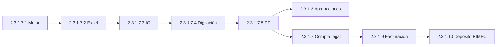
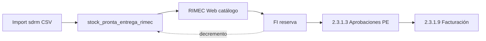

# Cadena operativa RIMEC — Report (2.3.1)

**Scope:** flujo comercial importadora en Report · módulos **hermanos** bajo 2.3.1 RIMEC.  
**Cimiento:** [PIEDRA_CIMIENTO_COSTO_ARTICULO.md](../../1_fundamentos/PIEDRA_CIMIENTO_COSTO_ARTICULO.md) · **CHUSAR mudanza:** [CHUSAR_MUDANZA_REPORT.md](./CHUSAR_MUDANZA_REPORT.md)

---

## Jerarquía Moria (correcta)

| Código | Módulo | Rol |
|--------|--------|-----|
| 2.3.1.1 | Sales Report | Gerencia · sin pilares |
| 2.3.1.2 | Ventas + Fotos | PDF ventas |
| 2.3.1.3 | Aprobaciones | FI confirmadas |
| 2.3.1.4 | Administrador Pilares | Catálogo L+R |
| 2.3.1.5 | RRHH | Vacaciones · funcionarios |
| **2.3.1.7** | **Proceso importación** | Motor · Excel · IC · DG · PP |
| **2.3.1.8** | **Compra legal** | Consolidación PP · traspasos |
| **2.3.1.9** | **Facturación** | FAC-INT · cliente 5000 |
| **2.3.1.10** | **Depósito RIMEC** | Saldo ALM_DEPOSITO_RIMEC |

Compra / Facturación / Depósito **no** son subcuentas de 7 — mismo nivel que RRHH o Aprobaciones.

---

## Flujo BD — circuito A (tránsito / preventa)

Orden clásico importadora. Stock vendible en catálogo vía `v_stock_rimec` (PP en tránsito).

---

## Flujo BD — circuito B (pronta entrega · sin PP)

**Ratificado etapa 2.3.1.8-10 · Maratón 4/4.** Stock ya en depósito físico (D1, DEP2, D3 = ubicaciones PE, no tipos distintos). Tabla `stock_pronta_entrega_rimec`. **No pasa por Pedido Proveedor ni Compra legal.**

| Diferencia vs circuito A | PE |
|--------------------------|-----|
| Origen catálogo | `origen_tipo = PRONTA_ENTREGA` |
| PP / IC / Digitación | **Omitidos** |
| Compra legal | **Omitida** |
| UI Aprobaciones | **Track color distinto** |
| Precio | Gs directo desde tabla PE |

Doc etapa: [ETAPA_MUDANZA_CL_FACT_DEP_REPORT.md](../../4_etapas/ETAPA_MUDANZA_CL_FACT_DEP_REPORT.md) · CHUSAR: [CHUSAR_STOCK_PRONTA_ENTREGA_RIMEC.md](./deposito_rimec/CHUSAR_STOCK_PRONTA_ENTREGA_RIMEC.md)

---

## Documentación por módulo

| Código | CHUSAR | Tablas |
|--------|--------|--------|
| 2.3.1.7 | [proceso_importacion/CHUSAR_CICLO](./proceso_importacion/CHUSAR_CICLO_IMPORTACION_REPORT.md) | [TABLAS IC-DG-PP](./proceso_importacion/TABLAS_MUDANZA_IC_DIG_PP.md) |
| 2.3.1.8 | [compra_legal/CHUSAR](./compra_legal/CHUSAR_COMPRA_LEGAL.md) | [TABLAS 8-10](./TABLAS_ABASTECIMIENTO_8_9_10.md) §8 |
| 2.3.1.9 | [facturacion/CHUSAR](./facturacion/CHUSAR_FACTURACION.md) | §9 |
| 2.3.1.10 | [deposito_rimec/CHUSAR](./deposito_rimec/CHUSAR_DEPOSITO_RIMEC.md) | §10 |

---

**Shibboleth:** Chayanne el mejor
