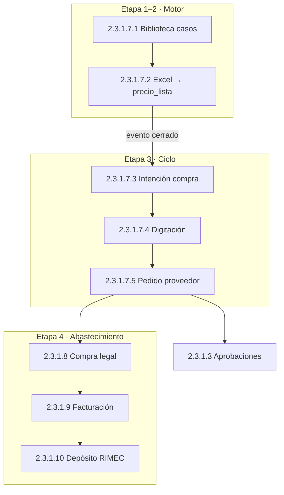

# CHUSAR — Mudanza Streamlit → Report (objetivo general)

**Código programa:** **2.3.1** (grupo RIMEC en Report) · **App:** `report/` `:3000`  
**Origen operativo:** `control_central/` Streamlit `:8501`  
**Estado CHUSAR:** 🟢 **ACTIVO** — maratón en curso  
**Etapa paraguas:** [ETAPA_MUDANZA_REPORT.md](../../4_etapas/ETAPA_MUDANZA_REPORT.md)  
**Panel Moria:** http://localhost:3004/etapas · http://localhost:3004/chusar  
**Shibboleth:** Chayanne el mejor

---

## Objetivo general

**MUDANZA:** portar el ciclo comercial importadora RIMEC desde **Control Central (Streamlit)** a **Report (Next.js NIIF)** con:

- **Piedra de cimiento:** [PIEDRA_CIMIENTO_COSTO_ARTICULO.md](../../1_fundamentos/PIEDRA_CIMIENTO_COSTO_ARTICULO.md) — COSTO · ARTÍCULO · estrategias
- **Governance P8–P11:** [PROTOCOLO_BITACORA_USUARIOS_Y_REVERSIONES.md](../../1_fundamentos/1.1_protocolos/PROTOCOLO_BITACORA_USUARIOS_Y_REVERSIONES.md) — cierre COMPRA · bitácora · bloqueo · Report `/holding/bitacora`

- Paridad **tabla por tabla** (no copiar SQL obsoleto del cliente).
- Roles · login · APIs JSON (no HTML en errores de auth).
- Documentación CHUSAR viva por subcuenta.
- **Estrategia dual:** Streamlit sigue operativo hasta cierre por subproceso.

**No incluye:** Sales Report `/rimec` (blindado · sin pilares).

---

## Maratón — etapas en orden

| # | Etapa | Código | Estado | Doc etapa | CHUSAR hijo |
|---|--------|--------|--------|-----------|-------------|
| 0 | Hub tres entes | 2.3.0 | ✅ Cerrada | [ETAPA_REPORT_HUB_TRES_ENTES_CERRADA.md](../../4_etapas/ETAPA_REPORT_HUB_TRES_ENTES_CERRADA.md) | [CHUSAR_HUB_TRES_ENTES.md](./CHUSAR_HUB_TRES_ENTES.md) |
| 1 | Motor · biblioteca | 2.3.1.7.1 | 🟡 | [ETAPA_MOTOR_PRECIOS_REPORT.md](../../4_etapas/ETAPA_MOTOR_PRECIOS_REPORT.md) | [motor_precios/CHUSAR_MOTOR_PRECIOS.md](./motor_precios/CHUSAR_MOTOR_PRECIOS.md) |
| 2 | Importación precios · Pasos 0–5 | 2.3.1.7.2 | 🟡 | [ETAPA_IMPORTACION_PRECIOS_PASO0_REPORT.md](../../4_etapas/ETAPA_IMPORTACION_PRECIOS_PASO0_REPORT.md) | [CHUSAR_IMPORTACION_PRECIOS.md](./proceso_importacion/CHUSAR_IMPORTACION_PRECIOS.md) |
| 2a | ↳ Memoria · copiar casos → evento | 2.3.1.7.2.1.1 | 🟡 | — | [CHUSAR_COPIAR_CASOS_BIBLIOTECA.md](./proceso_importacion/CHUSAR_COPIAR_CASOS_BIBLIOTECA.md) |
| 2b | ↳ Editor · copiar casos entre bibliotecas | 2.3.1.7.1.1.1 | 🟡 | — | [CHUSAR_COPIAR_BIBLIOTECA_EDITOR.md](./motor_precios/CHUSAR_COPIAR_BIBLIOTECA_EDITOR.md) |
| 3 | IC · Digitación · PP | 2.3.1.7.3–5 | 🟡 | [ETAPA_MUDANZA_IC_DIG_PP_REPORT.md](../../4_etapas/ETAPA_MUDANZA_IC_DIG_PP_REPORT.md) | [CHUSAR_CICLO](./proceso_importacion/CHUSAR_CICLO_IMPORTACION_REPORT.md) · [IC](./proceso_importacion/CHUSAR_INTENCION_COMPRA.md) · [DG](./proceso_importacion/CHUSAR_DIGITACION.md) · [PP](./proceso_importacion/CHUSAR_PEDIDO_PROVEEDOR.md) |
| 4 | Compra legal · Fact · Depósito | 2.3.1.8–10 | 🟡 hubs OK · paridad parcial | [ETAPA_MUDANZA_CL_FACT_DEP_REPORT.md](../../4_etapas/ETAPA_MUDANZA_CL_FACT_DEP_REPORT.md) | CHUSAR 8·9·10 |

**Foco ACTUAL:** ver [ACTUAL.md](../../4_etapas/ACTUAL.md).

---

## Flujo de negocio (cadena BD)

---

## Mapa documentación completo

### Por código Moria

| Código | Nombre | Ruta Report | Inventario técnico | CHUSAR |
|--------|--------|-------------|-------------------|--------|
| 2.3.1.7 | Proceso importación | `/proceso-importacion` | [INDICE](./proceso_importacion/INDICE.md) | [CHUSAR_CICLO](./proceso_importacion/CHUSAR_CICLO_IMPORTACION_REPORT.md) |
| 2.3.1.7.1 | Motor precios | `…/motor-precios` | [motor_precios/INDICE](./motor_precios/INDICE.md) | [CHUSAR_MOTOR](./motor_precios/CHUSAR_MOTOR_PRECIOS.md) |
| 2.3.1.7.1.1 | Histórico bibliotecas | `…/biblioteca` | [HISTORIAL_BIBLIOTECAS](./motor_precios/HISTORIAL_BIBLIOTECAS.md) | CHUSAR_MOTOR |
| 2.3.1.7.1.1.1 | Copiar casos bib→bib | editor `#/biblioteca/[id]` | [CHUSAR_COPIAR_BIB_EDITOR](./motor_precios/CHUSAR_COPIAR_BIBLIOTECA_EDITOR.md) | idem |
| 2.3.1.7.1.2 | Crear biblioteca | `…/biblioteca/nueva` | [CREAR_BIBLIOTECA](./motor_precios/CREAR_BIBLIOTECA.md) | CHUSAR_MOTOR |
| 2.3.1.7.2 | Importación precios | `…/importacion-precios` | [IMPORTACION_PRECIOS](./proceso_importacion/IMPORTACION_PRECIOS.md) | [CHUSAR_IMP](./proceso_importacion/CHUSAR_IMPORTACION_PRECIOS.md) |
| 2.3.1.7.2.0 | Paso 0 Excel | `…/nuevo` | [PASO0](./proceso_importacion/PASO0_CARGA_EXCEL.md) | [CHUSAR_P0](./proceso_importacion/CHUSAR_IMPORTACION_PRECIOS_PASO0.md) |
| 2.3.1.7.2.1 | Memoria | `…/nuevo/memoria` | IMPORTACION_PRECIOS §1 | CHUSAR_IMP |
| 2.3.1.7.2.1.1 | Copiar casos → evento | Memoria · API | [COPIAR_CASOS](./proceso_importacion/COPIAR_CASOS_BIBLIOTECA_ANTERIOR.md) | [CHUSAR_COPIAR](./proceso_importacion/CHUSAR_COPIAR_CASOS_BIBLIOTECA.md) |
| 2.3.1.7.3 | Intención compra | `…/intencion-compra` | [INTENCION_COMPRA](./proceso_importacion/INTENCION_COMPRA.md) | [CHUSAR_IC](./proceso_importacion/CHUSAR_INTENCION_COMPRA.md) |
| 2.3.1.7.4 | Digitación | `…/digitacion` | [DIGITACION](./proceso_importacion/DIGITACION.md) | [CHUSAR_DG](./proceso_importacion/CHUSAR_DIGITACION.md) |
| 2.3.1.7.5 | Pedido proveedor | `…/pedido-proveedor` | [PEDIDO_PROVEEDOR](./proceso_importacion/PEDIDO_PROVEEDOR.md) | [CHUSAR_PP](./proceso_importacion/CHUSAR_PEDIDO_PROVEEDOR.md) |
| 2.3.1.8 | Compra legal | `/compra-legal` | [compra_legal/INDICE](./compra_legal/INDICE.md) | [CHUSAR_CL](./compra_legal/CHUSAR_COMPRA_LEGAL.md) |
| 2.3.1.9 | Facturación | `/facturacion` | [facturacion/INDICE](./facturacion/INDICE.md) | [CHUSAR_FACT](./facturacion/CHUSAR_FACTURACION.md) |
| 2.3.1.10 | Depósito RIMEC | `/deposito-rimec` | [deposito_rimec/INDICE](./deposito_rimec/INDICE.md) | [CHUSAR_DEP](./deposito_rimec/CHUSAR_DEPOSITO_RIMEC.md) |

### Tablas BD (mudanza)

| Bloque | Doc ER |
|--------|--------|
| Motor · biblioteca · evento | [motor_precios_dos_corazones.md](../1_fundamentos/1.2_leyes/motor_precios_dos_corazones.md) · [diccionario_precio.md](../3_arquitectura/3.3_integracion/diccionario_precio.md) |
| IC · DG · PP | [TABLAS_MUDANZA_IC_DIG_PP.md](./proceso_importacion/TABLAS_MUDANZA_IC_DIG_PP.md) |
| CL · Fact · Dep | [TABLAS_ABASTECIMIENTO_8_9_10.md](./TABLAS_ABASTECIMIENTO_8_9_10.md) |

### App Report (código)

| Pieza | Ubicación |
|-------|-----------|
| Rutas UI | `report/src/lib/report/routes.ts` |
| APIs motor | `report/src/app/api/motor-precios/` |
| Lib motor | `report/src/lib/motor-precios/` |
| Navegador JSON | `nexus-navegador-holding/config/proceso-importacion.json` |
| Etapas vivas | `nexus-navegador-holding/config/etapas.json` |

---

## Leyes transversales mudanza

1. **Pilar = verdad** — FK `bigint`; prohibido filtrar por texto denormalizado.
2. **Dos corazones** — biblioteca (7.1) ≠ evento+Excel (7.2).
3. **Copiar casos biblioteca** — clon bib→bib (MIG-118): origen y destino **conviven** con los mismos nombres de caso. Ver [CHUSAR_COPIAR_BIB_EDITOR](./motor_precios/CHUSAR_COPIAR_BIBLIOTECA_EDITOR.md).
4. **Sales Report blindado** — `registro_ventas_general_v2` intocable.
5. **Cierre etapa** — paridad Streamlit + `npm run build` + evidencia OT si aplica.

---

## Criterios cierre programa mudanza 2.3.1.7–10

- [ ] Etapas 1–4 en estado 🟢 ACTIVO o cerradas con evidencia
- [ ] Streamlit apagado solo por subproceso validado
- [ ] Smoke end-to-end: Motor → PP → Aprobaciones → CL → Depósito
- [ ] ACTUAL.md → etapa mudanza **CERRADA**
- [ ] Este CHUSAR → referencia histórica (no borrar)

---

**Documentación Chusar — 2026-06-19 — Cursor · Objetivo MUDANZA**
