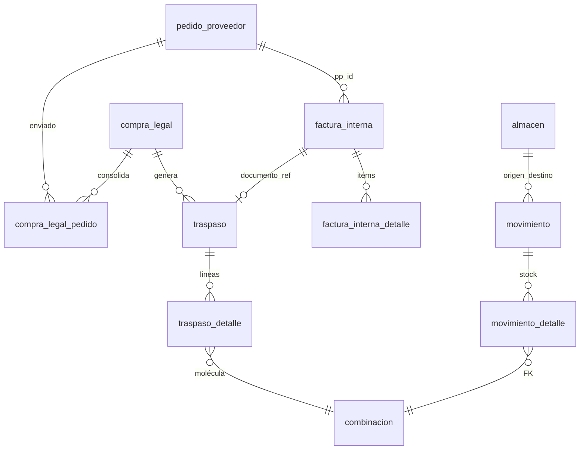

# Tablas BD — Compra legal · Facturación · Depósito (2.3.1.8–2.3.1.10)

**Etapa:** [ETAPA_MUDANZA_CL_FACT_DEP_REPORT.md](../4_etapas/ETAPA_MUDANZA_CL_FACT_DEP_REPORT.md)  
**Nivel Moria:** módulos **hermanos** de 2.3.1.7 · no subcuentas de importación  
**Origen:** `compra_legal/logic.py` · `facturacion/logic.py` · `deposito/` · OT Bazar Web  
**Sales Report:** **blindado** — sin JOIN a `registro_ventas_general_v2`.

---

## Diagrama relacional (abastecimiento)



---

## Matriz por módulo (lectura / escritura)

| Tabla | 2.3.1.8 CL | 2.3.1.9 Fact | 2.3.1.10 Dep | Rol |
|-------|:------:|:--------:|:-------:|-----|
| `compra_legal` | **RW** | R | R | Cabecera CL |
| `compra_legal_pedido` | **RW** | R | R | Puente CL↔PP |
| `compra_legal_detalle` | R/W* | R | R | Cirugía descuentos (futuro) |
| `pedido_proveedor` | R/W | R | R | PP→ENVIADO |
| `pedido_proveedor_detalle` | R | R | R | Moléculas F9 |
| `factura_interna` | R | **RW** | R | FAC-INT |
| `factura_interna_detalle` | R | **W** | R | Líneas FI |
| `venta_transito` | R | R/W | R | Legacy preventa |
| `traspaso` | **RW** | **RW** | R | TRP-YYYY-XXXX |
| `traspaso_detalle` | **W** | R | R | Líneas por combinacion |
| `combinacion` | W* | R | R | 5 FK + talla |
| `movimiento` | R | R | **R** | Ingreso/egreso |
| `movimiento_detalle` | R | R | **R** | Stock por molécula |
| `almacen` | R | R | R | Catálogo almacenes |
| `v_stock_actual` | — | — | **R** | Saldo agregado |

\* Auto-create combinación en traspaso (`_resolve_combinacion_id`).

---

## 2.3.1.8 — Compra legal

### `compra_legal`

| Columna | Rol |
|---------|-----|
| `id` | PK |
| `numero_registro` | `CL-YYYY-XXXX` |
| `anio_fiscal` | int |
| `numero_factura_proveedor` | Proforma / invoice proveedor |
| `fecha_factura` | date |
| `moneda` | USD |
| `estado` | `PENDIENTE` · `DISTRIBUIDA` · `ENVIADO` · `CERRADA` |
| `categoria_id` | FK (futuro) |
| `created_at` | timestamp |

### `compra_legal_pedido`

| Columna | Rol |
|---------|-----|
| `compra_legal_id` | FK CL |
| `pedido_proveedor_id` | FK PP |

### `traspaso`

| Columna | Rol |
|---------|-----|
| `id` | PK |
| `numero_registro` | `TRP-YYYY-XXXX` |
| `compra_legal_id` | FK CL |
| `documento_ref` | `factura_interna.nro_factura` |
| `fecha_traspaso` | date |
| `estado` | `BORRADOR` · `ENVIADO` · `CONFIRMADO` |
| `almacen_origen_id` | 3 TRANSITO |
| `almacen_destino_id` | 1 WEB |
| `snapshot_json` | Fallback líneas |

### `traspaso_detalle`

| Columna | Rol |
|---------|-----|
| `traspaso_id` | FK |
| `combinacion_id` | FK molécula+talla |
| `cantidad` | pares |

---

## 2.3.1.9 — Facturación

### `factura_interna` (lectura intensiva + envío)

| Columna | Notas |
|---------|-------|
| `nro_factura` | FAC-INT |
| `pp_id` | FK PP |
| `cliente_id` | **5000** = Bazar Web |
| `vendedor_id` | FK |
| `estado` | `RESERVADA` · `CONFIRMADA` |
| `caso` | Header comercial OT-508 |
| `lista_precio_id` | Evento listado |
| `total_pares`, `total_monto` | KPI |
| `descuento_1`…`4` | Cascada |
| `pv_global` | Lookup alternativo PV### |

### `factura_interna_detalle`

| Columna | Notas |
|---------|-------|
| `factura_id` | FK |
| `ppd_id` | Trazabilidad PPD |
| `pares`, `cajas` | Cantidades |
| `precio_unit`, `subtotal`, `precio_neto` | Montos |
| `linea_snapshot` | JSON 5 pilares + grada + imagen |

### Flujo escritura traspaso

`enviar_factura_a_web_bazar` → `crear_traspaso_por_factura` → INSERT `traspaso` + `traspaso_detalle`.

---

## 2.3.1.10 — Depósito RIMEC

### Almacenes

| id | Nombre | Uso |
|----|--------|-----|
| 3 | ALM_TRANSITO_01 | Entrada PP confirmado |
| 4 | ALM_DEPOSITO_RIMEC | **Saldo físico importadora** |
| 1 | ALM_WEB_01 | Post-traspaso Bazar |

### `movimiento`

| Columna | Rol |
|---------|-----|
| `id` | PK |
| `tipo` | INGRESO_COMPRA · TRASPASO · etc. |
| `almacen_origen_id` / `almacen_destino_id` | FK |
| `documento_ref` | TRP / CL |
| `fecha` | date |

### `movimiento_detalle`

| Columna | Rol |
|---------|-----|
| `movimiento_id` | FK |
| `combinacion_id` | FK |
| `cantidad` | signo según tipo |

### Vista saldo (consulta tipo deposito)

Lógica equivalente SQL (desde PPD):

```sql
-- inicial − vendido = saldo (por ppd.id)
cantidad_pares - COALESCE(SUM(vt.cantidad_vendida), 0)
```

Fuente: `get_compra_hija_deposito` en `compra_legal/logic.py`.

---

## Índices recomendados (Report)

| Lookup | Patrón |
|--------|--------|
| CL lista | `compra_legal(estado, fecha_factura DESC)` |
| PP en CL | `compra_legal_pedido(pedido_proveedor_id)` |
| Traspaso por FI | `traspaso(documento_ref)` |
| Stock almacén | `movimiento_detalle(combinacion_id)` + `v_stock_actual(almacen_id)` |

---

## Enlaces inventario (detalle por módulo)

| Módulo | Índice | Tablas exhaustivas |
|--------|--------|-------------------|
| **2.3.1.8** Compra legal | [compra_legal/INDICE.md](./compra_legal/INDICE.md) | [compra_legal/TABLAS.md](./compra_legal/TABLAS.md) |
| **2.3.1.9** Facturación | [facturacion/INDICE.md](./facturacion/INDICE.md) | [facturacion/TABLAS.md](./facturacion/TABLAS.md) |
| **2.3.1.10** Depósito RIMEC | [deposito_rimec/INDICE.md](./deposito_rimec/INDICE.md) | [deposito_rimec/TABLAS.md](./deposito_rimec/TABLAS.md) |

Cadena operativa UI: [CADENA_OPERATIVA_RIMEC.md](./CADENA_OPERATIVA_RIMEC.md)  
Cadena previa importación: [TABLAS_MUDANZA_IC_DIG_PP.md](./TABLAS_MUDANZA_IC_DIG_PP.md)

---

## Resumen rápido (este archivo = índice cruzado)

Los detalles columna a columna viven en los `TABLAS.md` de cada módulo.  
Abajo: vista resumida para comparar los tres módulos en una pantalla.

---

**Shibboleth:** Chayanne el mejor
