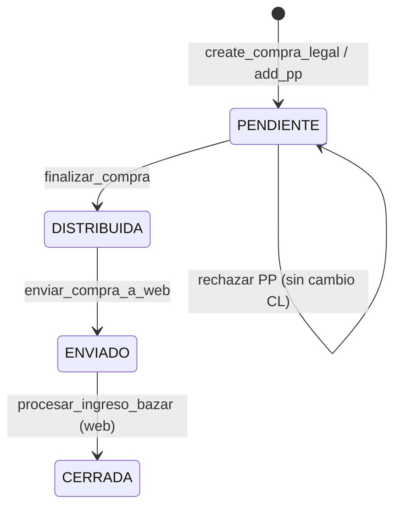
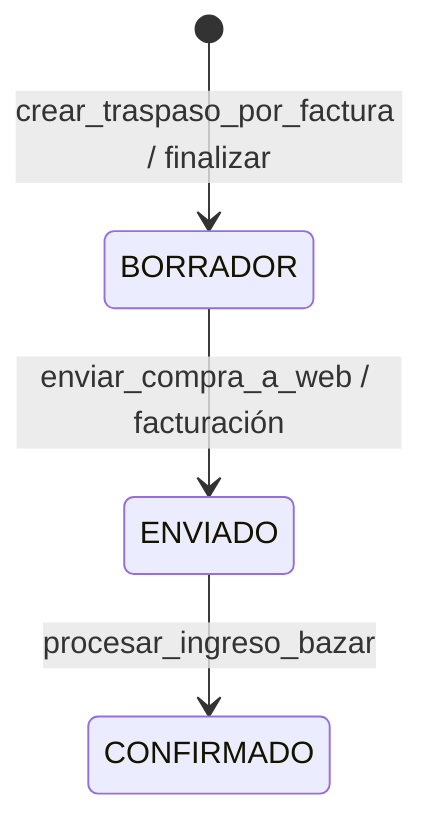

# 2.3.1.8 Compra legal — flujos y estados

**Tablas:** [TABLAS.md](./TABLAS.md) · **Operaciones:** [OPERACIONES.md](./OPERACIONES.md)

---

## Cadena posición en holding

```
2.3.1.7.5 PP (ENVIADO) → 2.3.1.8 CL → 2.3.1.9 Facturación → 2.3.1.10 Depósito
                              ↓
                         traspaso (logística)
                              ↓
                         2.3.3 Compra Web (ingreso ALM_WEB_01)
```

---

## Máquina de estados — `compra_legal.estado`



| Transición | Función | Tablas mutadas |
|------------|---------|------------------|
| → PENDIENTE | `create_compra_legal` | `compra_legal`, `compra_legal_pedido`, `pedido_proveedor` |
| PENDIENTE→DISTRIBUIDA | `finalizar_compra` | `compra_legal`, `traspaso*`, `pedido_proveedor.estado_transito` |
| DISTRIBUIDA→ENVIADO | `enviar_compra_a_web` | `traspaso`, `compra_legal` |
| ENVIADO→CERRADA | `procesar_ingreso_bazar` | `traspaso`, `movimiento*` |

---

## Máquina — `pedido_proveedor.estado` (vista CL)

| Estado | Cuándo |
|--------|--------|
| `ABIERTO` | PP operativo pre-compra · restaurado por `rechazar_pp_de_compra` |
| `ENVIADO` | Vinculado a CL (`create_compra_legal` / `add_pp_to_compra`) |
| `CERRADO` | Digitación cerrada *(upstream)* |

## Máquina — `pedido_proveedor.estado_transito`

| Valor | Cuándo |
|-------|--------|
| *(operativo)* | Preventa rimec-web |
| `EN_DEPOSITO` | Post-`finalizar_compra` — ya no vendible en web importadora |

---

## Máquina — `traspaso.estado`



| Estado | Label UI Compra Legal |
|--------|----------------------|
| `BORRADOR` | En tránsito |
| `ENVIADO` | En facturación |
| `CONFIRMADO` | En depósito web |

---

## Secuencia TX — «Enviar PP a Compra»

```
PP.ui → create_compra_legal(pp_id, proforma)
  BEGIN
    INSERT compra_legal (PENDIENTE)
    INSERT compra_legal_pedido
    UPDATE pedido_proveedor SET estado='ENVIADO'
  COMMIT
```

---

## Secuencia TX — «Finalizar y Distribuir»

```
CL.ui → finalizar_compra(cl_id)
  BEGIN
    FOR EACH pp IN compra_legal_pedido:
      _crear_traspasos_para_pp(pp, cl_id)
        FOR EACH fi SIN traspaso:
          leer factura_interna_detalle + ppd.grades_json
          crear_traspaso_por_factura → traspaso + traspaso_detalle
          UPDATE traspaso.compra_legal_id
    UPDATE compra_legal SET estado='DISTRIBUIDA'
    UPDATE pedido_proveedor SET estado_transito='EN_DEPOSITO'
  COMMIT
```

---

## Secuencia — KPI header detalle CL

```
get_compra_header(cl_id)
  → SELECT compra_legal + pps
  → get_metricas_facturacion_compra(cl_id)
       pares_f9 = SUM(pedido_proveedor.pares_comprometidos)
       pares_fact = SUM(fi.pares) + SUM(vt legacy sin FI)
       saldo_ui = pares_f9 - pares_fact  ← «En Depósito» KPI
```

---

## Pantallas Streamlit ↔ tablas

| Pantalla `ui.py` | Funciones | Tablas dominantes |
|------------------|-----------|-------------------|
| Lista CL | `get_compras_legales` | `compra_legal`, `traspaso` |
| Detalle header | `get_compra_header`, métricas | `compra_legal`, FI, VT, PP |
| PPs recibidos | `get_pps_de_compra` | puente, PP, PPD |
| Finalizar | `finalizar_compra` | traspaso* |
| Hija Depósito | `get_compra_hija_deposito` | PPD, VT |
| Hija Facturación | `get_facturas_internas_de_compra` + `render_fi_card` | FI, FID |

---

**Shibboleth:** Chayanne el mejor
