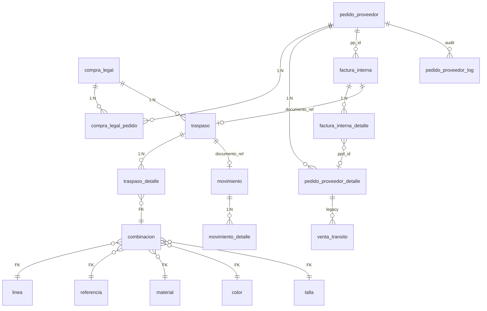

# 2.3.1.8 Compra legal — catálogo de tablas BD

**Índice:** [INDICE.md](./INDICE.md) · **Operaciones:** [OPERACIONES.md](./OPERACIONES.md)  
**Código fuente:** `control_central/modules/compra_legal/logic.py`  
**Sales Report:** blindado — este módulo **no** toca `registro_ventas_general_v2`.

---

## Leyenda matriz R/W

| Símbolo | Significado |
|---------|-------------|
| **R** | SELECT / JOIN |
| **W** | INSERT / UPDATE / DELETE |
| **W\*** | Escritura condicional (auto-create) |
| **—** | No usada en este módulo |

---

## Diagrama ER (tablas que toca Compra Legal)

---

## Matriz global — tabla × operación CL

| Tabla | Consolidar PP | Finalizar CL | Traspaso | Métricas/UI | Rechazar PP |
|-------|:---:|:---:|:---:|:---:|:---:|
| `compra_legal` | **W** | **W** | R | R | R |
| `compra_legal_pedido` | **W** | R | R | R | **W** del |
| `compra_legal_detalle` | — | — | — | — | — |
| `pedido_proveedor` | **W** estado | **W** transito | R | R | **W** |
| `pedido_proveedor_detalle` | R | R | R | R | R |
| `pedido_proveedor_log` | W* | — | — | — | W* |
| `factura_interna` | R | R | R | R | R |
| `factura_interna_detalle` | R | R | R | R | R |
| `venta_transito` | R | R | R | R | R |
| `traspaso` | R | **W** | **W** | R | **W** |
| `traspaso_detalle` | — | **W** | **W** | R | — |
| `combinacion` | — | **W\*** | **W\*** | R | — |
| `linea` | R | R | R | R | — |
| `referencia` | R | R | R | R | — |
| `material` | R | R | R | R | — |
| `color` | R | R | R | R | — |
| `talla` | R | R | R | R | — |
| `marca_v2` | R | R | — | R | — |
| `cliente_v2` | — | — | — | R | — |
| `precio_lista` | — | — | R | — | — |
| `precio_evento` | R | — | — | — | — |
| `categoria_v2` | R | — | — | — | — |
| `tipo_v2` | R | — | — | — | — |
| `almacen` | R | R | R | — | — |
| `movimiento` | — | — | W† | — | — |
| `movimiento_detalle` | — | — | W† | — | — |
| `v_stock_actual` | — | — | R† | — | — |

\* Migr. 063 — si implementado en UI PP.  
† `procesar_ingreso_bazar` — ejecutado desde Compra Web, código en `compra_legal/logic.py`.

---

## 1. `compra_legal` — cabecera consolidadora

**PK:** `id` (bigint) · **Negocio:** `numero_registro` = `CL-YYYY-XXXX`

| Columna | Tipo | R/W | Origen / regla |
|---------|------|:---:|----------------|
| `id` | bigint | R | PK serial |
| `numero_registro` | text | W | `get_next_numero_cl()` — MAX split `-` por año |
| `anio_fiscal` | int | W | año corriente al INSERT |
| `numero_factura_proveedor` | text | W | Proforma proveedor (= `pedido_proveedor.numero_proforma`) |
| `fecha_factura` | date | W | `CURRENT_DATE` al crear |
| `moneda` | text | W | `'USD'` fijo en `create_compra_legal` |
| `estado` | text | R/W | Ver [FLUJOS.md](./FLUJOS.md) |
| `categoria_id` | bigint FK | R/W | → `categoria_v2.id_categoria` *(migr. 063)* |
| `tipo_v2_id` | bigint FK | R/W | → `tipo_v2.id_tipo` *(migr. 063)* |
| `precio_evento_id` | bigint FK | R/W | → `precio_evento.id` *(migr. 063)* |
| `created_at` | timestamptz | R | auditoría |

**Estados `estado`:**

| Valor | Significado |
|-------|-------------|
| `PENDIENTE` | Recibe PPs · editable |
| `DISTRIBUIDA` | Post-`finalizar_compra` · traspasos BORRADOR creados |
| `ENVIADO` | Post-`enviar_compra_a_web` · traspasos ENVIADO |
| `CERRADA` | Stock confirmado en web |

**Índices recomendados Report:** `(estado, fecha_factura DESC)`, `(numero_registro)` UNIQUE.

---

## 2. `compra_legal_pedido` — puente CL ↔ PP

**Relación:** N:M · **UNIQUE:** `(compra_legal_id, pedido_proveedor_id)` — `uq_compra_legal_pedido_pp`

| Columna | Tipo | R/W | Regla |
|---------|------|:---:|-------|
| `id` | bigint | R | PK *(si existe)* |
| `compra_legal_id` | bigint FK | W | → `compra_legal.id` |
| `pedido_proveedor_id` | bigint FK | W | → `pedido_proveedor.id` |
| `categoria_id` | bigint FK | W | Snapshot al vincular *(migr. 063)* |
| `precio_evento_id` | bigint FK | W | Snapshot listado PP *(migr. 063)* |
| `pares_snapshot` | int | W | `pedido_proveedor.pares_comprometidos` al vincular |
| `snapshot_at` | timestamptz | W | `now()` al vincular |

**Guard:** `pp_ya_en_compra(id_pp)` — un PP solo en una CL activa.

---

## 3. `compra_legal_detalle` — cirugía invoice *(planificado)*

Tabla diseñada en [NEXUS_OBJETIVO_ACTUAL.md](../../2.5_bazzar_web/NEXUS_OBJETIVO_ACTUAL.md) para comparar PP (USD full) vs invoice (USD neto).

| Columna plan | Rol |
|--------------|-----|
| `compra_legal_id` | FK CL |
| `pedido_proveedor_detalle_id` | FK PPD |
| `cantidad_pedida` / `cantidad_facturada` | pares |
| `precio_lista_usd` | snapshot |
| `descuento_pct_1` … `2` | cirugía |
| `precio_neto_usd` | GENERATED |
| `costo_despacho_pyg` | prorrateo |
| `costo_landed_pyg` | landed cost |

**Estado código Streamlit actual:** no INSERT en `logic.py` vigente — documentar para OT futura.

---

## 4. `pedido_proveedor` — upstream obligatorio

Columnas que **Compra Legal** lee o muta:

| Columna | R/W | Cuándo |
|---------|:---:|--------|
| `id` | R | FK puente |
| `numero_registro` | R | UI `PP-YYYY-XXXX` |
| `numero_proforma` | R | Selector CL por proforma |
| `estado` | **W** | `ENVIADO` al vincular · `ABIERTO` al rechazar |
| `estado_transito` | **W** | `EN_DEPOSITO` post-finalizar |
| `estado_digitacion` | R | display |
| `pares_comprometidos` | R | KPI F9 |
| `enviado_at` | W* | migr. 063 |
| `enviado_por` | W* | → `usuario_v2.id_usuario` |

---

## 5. `pedido_proveedor_detalle` — moléculas F9

| Columna | Uso en CL |
|---------|-----------|
| `id` | FK `venta_transito.pedido_proveedor_detalle_id` |
| `pedido_proveedor_id` | agrupación |
| `linea`, `referencia` | texto código proveedor |
| `descp_material`, `descp_color` | match `combinacion` |
| `id_material`, `id_color` | IDs espacio F9 *(no FK directo a pilar)* |
| `id_marca` | JOIN `marca_v2` |
| `grades_json` | distribución tallas FI → traspaso |
| `cantidad_pares` | saldo depósito hija |
| `t33`…`t40` | legacy VT |

---

## 6. `factura_interna` — verdad comercial FAC-INT

| Columna | Uso en CL |
|---------|-----------|
| `id` | PK |
| `nro_factura` | = `traspaso.documento_ref` |
| `pp_id` | FK → PP de la CL |
| `estado` | Filtro `CONFIRMADA`, `RESERVADA` |
| `cliente_id` | display · guard 5000 en web |
| `vendedor_id` | display |
| `marca`, `marca_id` | header card |
| `caso`, `caso_id` | header comercial OT-508 |
| `lista_precio_id` | evento listado |
| `total_pares`, `total_monto` | KPI |
| `descuento_1`…`4` | cascada |
| `pv_global` | lookup alternativo |
| `created_at` | orden bandeja |

---

## 7. `factura_interna_detalle` — líneas molécula FI

| Columna | Uso en CL |
|---------|-----------|
| `id` | PK línea |
| `factura_id` | FK cabecera |
| `ppd_id` | FK → `pedido_proveedor_detalle.id` |
| `pares` | **cantidad facturada** (escala grades) |
| `cajas` | display |
| `precio_unit`, `subtotal`, `precio_neto` | montos |
| `linea_snapshot` | JSON: `linea_codigo`, `ref_codigo`, `material_nombre`, `color_nombre`, `gradas_fmt`, `imagen_url` |

---

## 8. `venta_transito` — legacy preventa

Usada cuando FI no migrada a `factura_interna`:

| Columna | Uso en CL |
|---------|-----------|
| `pedido_proveedor_id` | FK PP |
| `pedido_proveedor_detalle_id` | FK PPD |
| `numero_factura_interna` | = `documento_ref` traspaso |
| `cantidad_vendida` | pares vendidos |
| `codigo_cliente` | match cliente |
| `t33`…`t40` | tallas legacy |
| `fecha_operacion` | display hija facturación |

**Regla anti-doble-conteo:** excluir VT si existe FI mismo `nro_factura` (`get_metricas_facturacion_compra`).

---

## 9. `traspaso` — documento logístico TRP

| Columna | Tipo | R/W | Regla |
|---------|------|:---:|-------|
| `id` | bigint | R/W | PK |
| `numero_registro` | text | W | `TRP-YYYY-XXXX` |
| `anio_fiscal` | int | W | año |
| `compra_legal_id` | bigint FK | W | vinculado en finalizar |
| `documento_ref` | text | W | `factura_interna.nro_factura` |
| `fecha_traspaso` | date | R/W | |
| `estado` | text | R/W | `BORRADOR` → `ENVIADO` → `CONFIRMADO` |
| `almacen_origen_id` | int FK | W | **3** ALM_TRANSITO_01 |
| `almacen_destino_id` | int FK | W | **1** ALM_WEB_01 |
| `snapshot_json` | jsonb | W | fallback líneas si falla `combinacion` |
| `confirmado_en` | timestamptz | W | post `procesar_ingreso_bazar` |

---

## 10. `traspaso_detalle` — líneas por talla

| Columna | R/W | Regla |
|---------|:---:|-------|
| `id` | R | PK |
| `traspaso_id` | W | FK |
| `combinacion_id` | W | `_resolve_combinacion_id` |
| `cantidad` | W | pares por talla |

**JOIN display** (`get_traspaso_detalle_lines`):  
`combinacion` → `linea`, `referencia`, `material`, `color`, `talla` + `precio_lista.nombre_caso_aplicado`.

---

## 11. `combinacion` — molécula + talla (5+1 FK)

| Columna | R/W | Regla |
|---------|:---:|-------|
| `id` | R/W | PK |
| `linea_id` | W | → `linea.id` |
| `referencia_id` | W | → `referencia.id` |
| `material_id` | W | → `material.id` |
| `color_id` | W | → `color.id` |
| `talla_id` | W | → `talla.id` |
| `activo_web` | W | `false` stock interno OT-2026-023 |
| `proveedor_id` | — | NULL stock interno OT-2026-027 |

**Lookup clave:** códigos/descripciones desde PPD, **no** `ppd.id_material` directo.

---

## 12. Pilares en JOIN traspaso

### `linea`
| Columna | Uso |
|---------|-----|
| `id` | FK combinacion |
| `codigo_proveedor` | match PPD.linea |

### `referencia`
| Columna | Uso |
|---------|-----|
| `id` | FK |
| `codigo_proveedor` | match PPD.referencia |

### `material`
| Columna | Uso |
|---------|-----|
| `id` | FK |
| `descripcion` | match PPD.descp_material |

### `color`
| Columna | Uso |
|---------|-----|
| `id` | FK |
| `nombre` | match PPD.descp_color |

### `talla`
| Columna | Uso |
|---------|-----|
| `id` | FK |
| `talla_etiqueta` | `'33'`…`'40'` |

---

## 13. Maestras UI

| Tabla | PK | Columnas leídas |
|-------|-----|-----------------|
| `marca_v2` | `id_marca` | `descp_marca` |
| `cliente_v2` | `id_cliente` | `descp_cliente` |
| `usuario_v2` / `vendedor_v2` | id | nombre vendedor FI |
| `categoria_v2` | `id_categoria` | snapshot CL |
| `tipo_v2` | `id_tipo` | snapshot CL |
| `precio_evento` | `id` | nombre evento |
| `precio_lista` | — | `nombre_caso_aplicado` por L+R en traspaso lines |

---

## 14. `almacen` — catálogo físico

| id | nombre lógico | tipo | Rol en CL |
|----|---------------|------|-----------|
| 1 | ALM_WEB_01 | WEB | destino traspaso |
| 3 | ALM_TRANSITO_01 | TRANSITO | origen traspaso / movimiento |
| 4 | ALM_DEPOSITO_RIMEC | DEPOSITO | saldo hija depósito *(módulo 2.3.1.10)* |

---

## 15. `movimiento` + `movimiento_detalle` *(post-CL)*

Escritura en `procesar_ingreso_bazar`:

### `movimiento`
| Columna | Valor |
|---------|-------|
| `tipo` | `'INGRESO_COMPRA'` |
| `fecha` | `CURRENT_DATE` |
| `almacen_origen_id` | 3 |
| `almacen_destino_id` | 1 |
| `documento_ref` | `traspaso.numero_registro` |
| `estado` | `'CONFIRMADO'` |

### `movimiento_detalle`
| Columna | Valor |
|---------|-------|
| `movimiento_id` | FK |
| `combinacion_id` | desde `traspaso_detalle` |
| `cantidad` | pares |
| `signo` | `+1` ingreso |

**Vista:** `v_stock_actual` — saldo por almacén + combinacion.

---

## 16. `pedido_proveedor_log` — auditoría *(migr. 063)*

| Columna | Rol |
|---------|-----|
| `pp_id` | FK PP |
| `estado_anterior` / `estado_nuevo` | transición |
| `usuario_id` | → `usuario_v2` |
| `compra_legal_id` | FK CL si aplica |
| `observaciones` | texto |
| `timestamp` | cuándo |

---

## 17. Tablas relacionadas NO mutadas por CL

| Tabla | Por qué aparece en joins |
|-------|--------------------------|
| `intencion_compra_pedido` | cadena IC→PP→precio_lista en traspaso lines |
| `precio_lista` | caso comercial display |
| `stock_sano_deposito` | downstream Bazar Web |
| `registro_ventas_general_v2` | **PROHIBIDO** — Sales Report blindado |

---

**Shibboleth:** Chayanne el mejor
