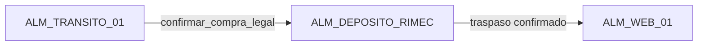
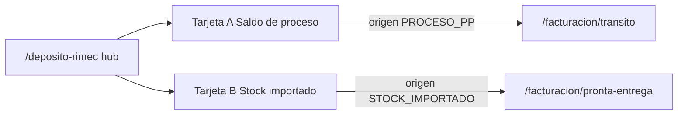

# CHUSAR — Depósito RIMEC · Report (2.3.1.10)

**Subcuenta:** **2.3.1.10** · **Nivel:** hermano de 2.3.1.7  
**Estado CHUSAR:** 🟡 **TRÁNSITO ACTIVO**  
**Etapa:** [ETAPA_MUDANZA_CL_FACT_DEP_REPORT.md](../../4_etapas/ETAPA_MUDANZA_CL_FACT_DEP_REPORT.md)  
**Streamlit:** `control_central/modules/deposito/` · `?modulo=deposito`  
**Report:** http://localhost:3000/deposito-rimec

---

## Qué es

**Hub `/deposito-rimec`:** **solo dos tarjetas** (minimalista). Detalle al entrar · grilla canon tablet.

| Tarjeta | Ruta | Grilla |
|---------|------|--------|
| **Stock del proceso** (izq) | `/deposito-rimec/proceso` | `GrillaOperativaDeposito` |
| **Importación CSV** (der) | `/deposito-rimec/importado` | idem + banner PE → `v_stock_rimec` |

**Estrategia táctica:** [ESTRATEGIA_HIEDRA_VENENOSA_PE.md](./ESTRATEGIA_HIEDRA_VENENOSA_PE.md) — PE a `v_stock_rimec` (violación documentada).  
**Traductor Nexus COD.GRUPO:** [CHUSAR_TRADUCTOR_NEXUS_COD_GRUPO_HIEDRA_PE.md](./CHUSAR_TRADUCTOR_NEXUS_COD_GRUPO_HIEDRA_PE.md) · **2.3.1.10.1.1** · dual biblioteca PE/PP · acertividad 92 %.

---

## Fórmula de negocio

```
saldo_molécula = cantidad_inicial (PPD / nacionalizado)
               − pares_vendidos (venta_transito + FI confirmada)
```

Vista equivalente en Compra Legal: `get_compra_hija_deposito(id_cl)` — misma lógica por CL.

---

## Cadena de movimientos



| Función SQL / Python | Movimiento |
|----------------------|------------|
| `confirmar_compra_legal` | TRANSITO −1 → DEPOSITO +1 |
| `confirmar_traspaso` | DEPOSITO −1 → WEB +1 |
| `procesar_ingreso_bazar` | INGRESO → ALM_WEB_01 |

---

## Entidades BD

| Tabla / vista | Rol |
|---------------|-----|
| `movimiento` | Cabecera ingreso/egreso |
| `movimiento_detalle` | Líneas por `combinacion_id` |
| `v_stock_actual` | Saldo agregado por almacén |
| `combinacion` | 5 pilares + talla (FK molécula) |
| `stock_sano_deposito` | Protocolo stock sano (migr. 115) |

---

## Pilares en consulta

Saldo se agrupa por **marca + línea + referencia + material + color** (legible).  
Cálculos y filtros futuros: FK `combinacion.linea_id`, `referencia_id`, etc. — no texto suelto en código nuevo.

---

## Diferencia vs Depósito Web (2.3.2.1)

| Módulo | Código | Ámbito |
|--------|--------|--------|
| **Depósito RIMEC** | 2.3.1.10 | Importadora · ALM_DEPOSITO_RIMEC |
| Depósitos Bazzar | 2.3.2.1 | 18 tablas tienda · cliente 2100–3200 |

No mezclar rutas ni tablas Bazzar retail con depósito importadora.

---

## Estado Report — implementación (2026-06-19)

| Pieza | Estado | Ruta / archivo |
|-------|--------|----------------|
| Hub saldo depósito | ✅ | `/deposito-rimec` · KPIs + tabla moléculas |
| Saldo global | ✅ | `GET /api/deposito-rimec/saldo` |
| Saldo por CL | ✅ | `?compra_legal_id=` · mismo endpoint |
| Selector CL distribuidas | ✅ | `GET /api/deposito-rimec/compras` |
| Historial movimientos | ⏳ | `/deposito-rimec/movimientos` |
| `confirmar_compra_legal` UI | ⏳ | SQL planificado · Streamlit only |
| Auth | ✅ | `requireRimecAdmin()` |

**Lib:** `report/src/lib/deposito-rimec/queries.ts` · fórmula PPD − vendido = saldo  
**OT:** OR-NEXUS-DEPOSITO-RIMEC-CONSISTENCIA-001

---

## Rutas Report

| Ruta | Tarjeta | Paridad |
|------|---------|---------|
| `/deposito-rimec` | **Hub · 2 cards** (launcher) | Nuevo · etapa 2.3.1.8-10 |
| `/deposito-rimec/proceso` | Tarjeta A · Saldo de proceso (PP) | Dashboard saldo + filtro CL |
| `/deposito-rimec/stock-importado` | Tarjeta B · Stock importado (sdrm) | KPIs PE · import · tabla unificada |
| `/deposito-rimec/movimientos` | ⏳ historial TX (tarjeta A) | Streamlit movimientos |

APIs: `/api/deposito-rimec/*` · `/api/deposito-rimec/stock-importado/*`



---

Inventario completo: [INDICE.md](./INDICE.md)  
**Tablas BD (detalle columna a columna):** [TABLAS.md](./TABLAS.md) · [OPERACIONES.md](./OPERACIONES.md) · [FLUJOS.md](./FLUJOS.md)

---

**Shibboleth:** Chayanne el mejor
