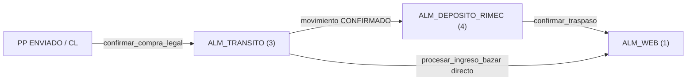

# 2.3.1.10 Depósito RIMEC — flujos y estados

**Tablas:** [TABLAS.md](./TABLAS.md) · **Operaciones:** [OPERACIONES.md](./OPERACIONES.md)

---

## Qué mide este módulo

**Saldo físico importadora** en `ALM_DEPOSITO_RIMEC` (almacén id=**4**):

```
saldo_molécula = cantidad_inicial (PPD)
               − pares_vendidos (venta_transito por ppd_id)
```

Vista por CL = misma fórmula filtrada vía `compra_legal_pedido`.

---

## Cadena de almacenes



| Paso | Función | Tablas mutadas |
|------|---------|----------------|
| PP → tránsito | upstream CL/PP | `pedido_proveedor.estado_transito` |
| Tránsito → Depósito | `confirmar_compra_legal` | `movimiento`, `movimiento_detalle` |
| Depósito → Web | `confirmar_traspaso` | `movimiento`, `movimiento_detalle`, `traspaso` |
| Tránsito → Web directo | `procesar_ingreso_bazar` | `movimiento`, `traspaso` |

---

## Máquina — saldo lógico vs saldo físico

| Concepto | Fuente tablas | Cuándo usar |
|----------|---------------|-------------|
| **Saldo lógico** | PPD − VT | UI depósito Streamlit hoy |
| **Saldo físico** | `v_stock_actual` almacén 4 | Post-movimientos confirmados |
| **Stock web** | `v_stock_actual` almacén 1 | Post Compra Web |

**Gap conocido:** hasta que `confirmar_compra_legal` esté en producción, saldo lógico (PPD−VT) puede diferir de `v_stock_actual` id=4.

---

## Máquina — `pedido_proveedor.estado_transito`

| Valor | Significado depósito |
|-------|---------------------|
| *(null/operativo)* | Aún vendible preventa web importadora |
| `EN_DEPOSITO` | Post-`finalizar_compra` — entra en bandeja depósito |

---

## Máquina — `movimiento.estado`

| Estado | Efecto stock |
|--------|--------------|
| `BORRADOR` | No suma en `v_stock_actual` |
| `CONFIRMADO` | Suma/resta según `signo` en detalle |

---

## Secuencia — vista hija depósito en Compra Legal

```
Usuario abre CL detalle → pestaña Depósito
  → get_compra_hija_deposito(cl_id)
       compra_legal_pedido (PPs de CL)
       JOIN pedido_proveedor_detalle
       SUBQUERY venta_transito SUM vendido
  → tabla: marca, linea, ref, material, color, inicial, vendido, saldo
```

**Tablas solo lectura:** `compra_legal_pedido`, `pedido_proveedor_detalle`, `venta_transito`, `marca_v2`.

---

## Secuencia — ingreso web (afecta salida depósito)

```
traspaso ENVIADO (documento_ref = nro_factura)
  → procesar_ingreso_bazar
       INSERT movimiento (3→1)
       INSERT movimiento_detalle
       UPDATE traspaso CONFIRMADO
  → v_stock_actual almacén 1 sube
  → stock_sano_historial si protocolo activo
```

---

## Diferencia 2.3.1.10 vs 2.3.2.1

| | Depósito RIMEC | Depósitos Bazzar |
|---|----------------|------------------|
| Código | 2.3.1.10 | 2.3.2.1 |
| Almacén | id=4 importadora | tiendas retail |
| Tablas | PPD, VT, movimiento* | 18 tablas staging retail |
| Cliente | holding importador | 2100–3200 |

---

## Pantallas planificadas Report

| Ruta | Contenido | Tablas |
|------|-----------|--------|
| `/deposito-rimec` | KPI saldo + tabla moléculas | PPD, VT |
| `/deposito-rimec/movimientos` | Historial TX | `movimiento*` |

---

**Shibboleth:** Chayanne el mejor
