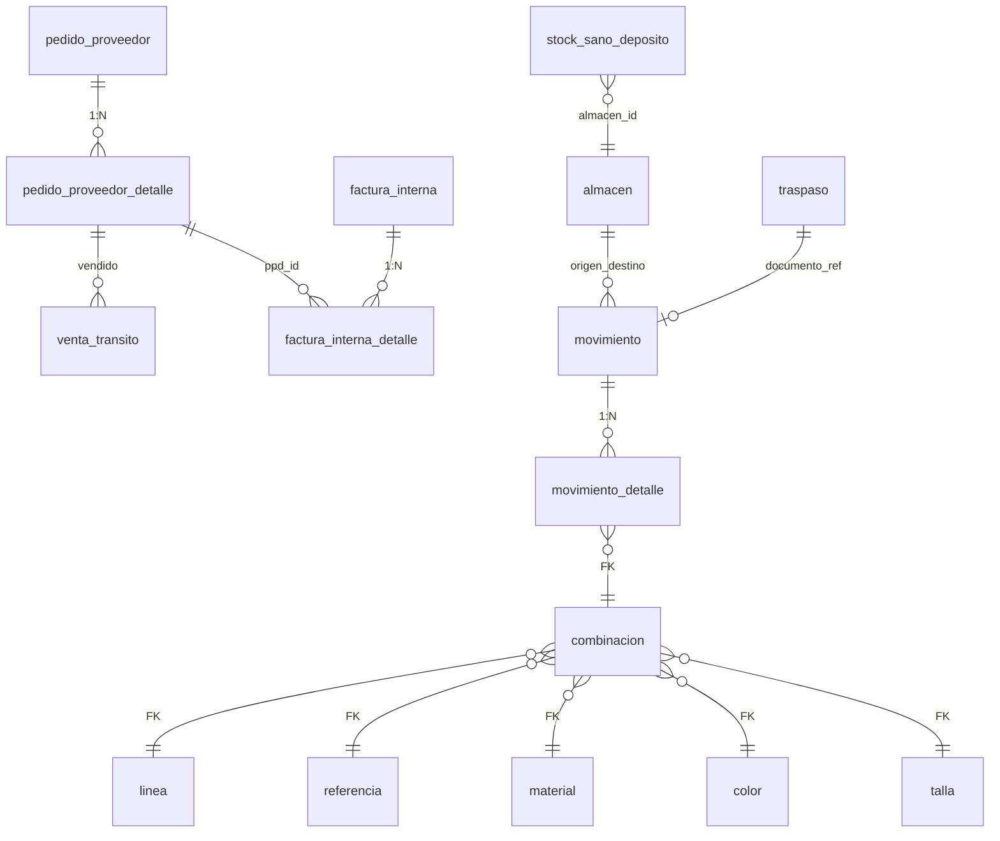

# 2.3.1.10 Depósito RIMEC — catálogo de tablas BD

**Índice:** [INDICE.md](./INDICE.md) · **Operaciones:** [OPERACIONES.md](./OPERACIONES.md)  
**Código Streamlit:** `control_central/modules/deposito/` · `?modulo=deposito`  
**Fórmula compartida:** `get_compra_hija_deposito` en `compra_legal/logic.py`  
**Sales Report:** blindado — **no** toca `registro_ventas_general_v2`.

---

## Leyenda matriz R/W

| Símbolo | Significado |
|---------|-------------|
| **R** | SELECT / JOIN / vista |
| **W** | INSERT / UPDATE *(movimientos confirmados)* |
| **P** | Planificado SQL — `confirmar_compra_legal`, `confirmar_traspaso` |

---

## Diagrama ER (tablas Depósito RIMEC)



---

## Matriz global — tabla × operación Depósito

| Tabla | Dashboard saldo | Por CL | Movimientos | Stock Sano | Traspaso salida |
|-------|:---:|:---:|:---:|:---:|:---:|
| `pedido_proveedor_detalle` | **R** | **R** | R | R | R |
| `venta_transito` | **R** | **R** | — | — | R |
| `factura_interna` | R | R | — | — | R |
| `factura_interna_detalle` | R | R | — | — | R |
| `pedido_proveedor` | R | R | R | — | R |
| `compra_legal_pedido` | R | **R** | — | — | R |
| `compra_legal` | R | R | — | — | R |
| `movimiento` | **R** | R | **R/P** | R | **R/P** |
| `movimiento_detalle` | **R** | R | **R/P** | **R** | **R/P** |
| `v_stock_actual` | **R** | R | **R** | — | R |
| `combinacion` | R | R | R | R | R |
| `linea` | R | R | R | R | R |
| `referencia` | R | R | R | R | R |
| `material` | R | R | R | R | R |
| `color` | R | R | R | R | R |
| `talla` | R | R | R | R | R |
| `marca_v2` | R | R | — | — | R |
| `almacen` | R | R | R | R | R |
| `traspaso` | R | R | R | R | R |
| `traspaso_detalle` | R | — | R | — | R |
| `stock_sano_deposito` | R | — | R | **R/W** | — |
| `stock_sano_almacen` | R | — | R | R | — |
| `stock_sano_historial` | R | — | W | **W** | R |
| `v_stock_sano_deposito` | **R** | — | R | **R** | — |

---

## Fórmula de negocio (saldo lógico depósito)

Por molécula PPD (marca + L + R + material + color):

```
saldo = ppd.cantidad_pares − SUM(vt.cantidad_vendida WHERE ppd_id)
```

**Nota:** FI confirmada también reduce saldo vía VT o vía conteo en métricas CL (`get_metricas_facturacion_compra`). Vista global depósito agrega todas las PPD en `EN_DEPOSITO` / CL activas.

**SQL canónico** (desde `get_compra_hija_deposito`):

```sql
SELECT
  ppd.cantidad_pares AS cantidad_inicial,
  COALESCE(SUM(vt.cantidad_vendida), 0) AS vendido,
  ppd.cantidad_pares - COALESCE(SUM(vt.cantidad_vendida), 0) AS saldo
FROM pedido_proveedor_detalle ppd
LEFT JOIN venta_transito vt ON vt.pedido_proveedor_detalle_id = ppd.id
GROUP BY ppd.id, ppd.cantidad_pares
```

---

## 1. `almacen` — catálogo físico importadora

| id | nombre | tipo | Rol Depósito |
|----|--------|------|--------------|
| **3** | ALM_TRANSITO_01 | TRANSITO | Entrada marítima PP confirmado |
| **4** | ALM_DEPOSITO_RIMEC | DEPOSITO | **Saldo físico importadora** |
| **1** | ALM_WEB_01 | WEB | Destino post-traspaso Bazar |

| Columna | Tipo | Uso |
|---------|------|-----|
| `id` | bigint | PK |
| `nombre` | text | Display |
| `codigo` | text | `ALM_DEPOSITO_RIMEC` etc. |
| `tipo` | text | `TRANSITO` · `DEPOSITO` · `WEB` |
| `activo` | bool | Filtro |

---

## 2. `pedido_proveedor_detalle` — stock inicial nacionalizado

| Columna | Tipo | R/W | Rol depósito |
|---------|------|:---:|--------------|
| `id` | bigint | R | PK · FK VT/FID |
| `pedido_proveedor_id` | bigint FK | R | agrupación PP |
| `linea` | bigint/text | R | código proveedor |
| `referencia` | bigint/text | R | código proveedor |
| `descp_material` | text | R | label material |
| `descp_color` | text | R | label color |
| `id_marca` | bigint FK | R | → `marca_v2` |
| `cantidad_pares` | int | R | **inicial** saldo |
| `grades_json` | jsonb | R | curva caja |
| `t33`…`t40` | int | R | legacy |

---

## 3. `venta_transito` — pares vendidos (resta saldo)

| Columna | R/W | Rol |
|---------|:---:|-----|
| `pedido_proveedor_detalle_id` | R | FK PPD |
| `cantidad_vendida` | R | **vendido** en fórmula saldo |
| `numero_factura_interna` | R | trazabilidad FAC |
| `t33`…`t40` | R | tallas legacy |

---

## 4. `factura_interna` + `factura_interna_detalle` — venta formal

No restan directamente en SQL hija depósito; sí en métricas CL:

| Tabla | Columna | Rol |
|-------|---------|-----|
| `factura_interna` | `pp_id`, `estado`, `total_pares` | KPI facturado |
| `factura_interna_detalle` | `ppd_id`, `pares` | pares por molécula |

---

## 5. `movimiento` — cabecera ingreso/egreso físico

| Columna | Tipo | R/W | Valores depósito |
|---------|------|:---:|------------------|
| `id` | bigint | R/W | PK |
| `tipo` | text | R/W | `INGRESO_COMPRA` · `TRASPASO` · `EGRESO_*` |
| `fecha` | date | R/W | operación |
| `almacen_origen_id` | bigint FK | R/W | 3 TRANSITO o 4 DEPOSITO |
| `almacen_destino_id` | bigint FK | R/W | 4 DEPOSITO o 1 WEB |
| `documento_ref` | text | R/W | `TRP-*` · `CL-*` |
| `estado` | text | R/W | `CONFIRMADO` para stock |
| `created_at` | timestamptz | R | auditoría |

### Movimientos planificados (Capa 3–4 Nexus)

| Función SQL | tipo | origen → destino |
|-------------|------|------------------|
| `confirmar_compra_legal(p_cl_id)` | TRASPASO/INGRESO | 3 → **4** |
| `confirmar_traspaso(p_trp_id)` | TRASPASO | **4** → 1 |
| `procesar_ingreso_bazar` | INGRESO_COMPRA | 3 → 1 *(Compra Web)* |

---

## 6. `movimiento_detalle` — stock por molécula+talla

| Columna | Tipo | R/W | Regla |
|---------|------|:---:|-------|
| `id` | bigint | R | PK |
| `movimiento_id` | bigint FK | R/W | → cabecera |
| `combinacion_id` | bigint FK | R/W | 5 pilares + talla |
| `cantidad` | int | R/W | pares absolutos |
| `signo` | smallint | R/W | `+1` ingreso · `-1` egreso |

**Agregación saldo:** `SUM(cantidad * signo)` GROUP BY `combinacion_id`, `almacen_destino_id` WHERE `movimiento.estado = 'CONFIRMADO'`.

---

## 7. `v_stock_actual` — vista saldo agregado

| Columna típica | Rol |
|----------------|-----|
| `almacen_id` | FK almacén |
| `combinacion_id` | FK molécula |
| `stock_pares` | SUM movimiento_detalle |

Consulta depósito: `WHERE almacen_id = 4` (ALM_DEPOSITO_RIMEC).

---

## 8. `combinacion` + pilares

| Tabla | FK en combinacion | Display depósito |
|-------|-------------------|------------------|
| `linea` | `linea_id` | código + descripción |
| `referencia` | `referencia_id` | código |
| `material` | `material_id` | descripción |
| `color` | `color_id` | nombre |
| `talla` | `talla_id` | etiqueta 33–40 |

**Regla arquitectura:** filtros futuros Report por FK `{pilar}_id`, no texto PPD.

---

## 9. `traspaso` + `traspaso_detalle` — salida hacia web

| Columna traspaso | Rol depósito |
|--------------------|--------------|
| `almacen_origen_id` | 4 cuando sale depósito físico |
| `almacen_destino_id` | 1 ALM_WEB |
| `estado` | `CONFIRMADO` = ya no en depósito RIMEC |
| `documento_ref` | FI asociada |

| Columna traspaso_detalle | Rol |
|--------------------------|-----|
| `combinacion_id` | qué molécula sale |
| `cantidad` | pares |

---

## 10. Protocolo Stock Sano *(migr. 115 — ALM_WEB_01)*

Aplica post-ingreso web; documentado aquí por cadena depósito→web.

### `stock_sano_deposito`

| Columna | Tipo | Rol |
|---------|------|-----|
| `id` | bigint | PK |
| `almacen_id` | bigint FK | depósito web |
| `linea_id` | bigint FK | triplete precio |
| `referencia_id` | bigint FK | triplete |
| `material_id` | bigint FK | triplete |
| `material_id_key` | bigint GENERATED | COALESCE(material_id,0) |
| `precio_venta` | numeric | precio canon |
| `lpn` | numeric | landed |
| `caso_codigo` | text | caso comercial |
| `markup_pct` | numeric | markup web |
| `vigente_desde` | timestamptz | vigencia |

UNIQUE: `(almacen_id, linea_id, referencia_id, material_id_key)`

### `stock_sano_almacen`

| Columna | Rol |
|---------|-----|
| `almacen_id` | PK |
| `lista_precio_id` | lista web asociada |
| `protocolo_activo` | bool |

### `stock_sano_historial`

| Columna | Rol |
|---------|-----|
| `traspaso_id` | FK traspaso ingreso |
| `movimiento_id` | FK movimiento |
| `evento` | `INGRESO_SANO`, `CONFLICTO`, etc. |
| `precio_aplicado` | decisión Director |

### `v_stock_sano_deposito`

Vista: stock en depósito + precio canon + `estado_stock_sano` (`SANO` / `SIN_PRECIO` / `SIN_PROTOCOLO`).

Fuente SQL: `movimiento_detalle` ⋈ `movimiento` WHERE `tipo = 'INGRESO_COMPRA'` AND `estado = 'CONFIRMADO'`.

---

## 11. Puente Compra Legal *(filtro por CL)*

| Tabla | Columnas | Uso |
|-------|----------|-----|
| `compra_legal` | `id`, `numero_registro`, `estado` | filtro vista |
| `compra_legal_pedido` | `compra_legal_id`, `pedido_proveedor_id` | PPs de una CL |

Misma query que `get_compra_hija_deposito(id_cl)` — vista acotada vs dashboard global.

---

## 12. Maestras display

| Tabla | PK | Columna |
|-------|-----|---------|
| `marca_v2` | `id_marca` | `descp_marca` |

---

## 13. NO confundir — Depósitos Bazzar (2.3.2.1)

| Código | Tablas | Ámbito |
|--------|--------|--------|
| **2.3.1.10** | `movimiento*`, PPD, VT, FI | Importadora ALM id=4 |
| **2.3.2.1** | 18 tablas retail tienda | Clientes 2100–3200 |

Doc separada: [../depositos/INDICE.md](../depositos/INDICE.md)

---

## 14. Tablas PROHIBIDAS

| Tabla | Motivo |
|-------|--------|
| `registro_ventas_general_v2` | Sales Report blindado |

---

**Shibboleth:** Chayanne el mejor
