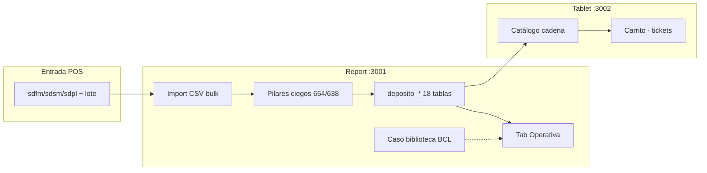

# CHUSAR — Depósito Bazzar · Integración completa (registro hasta 2026-06-28)

**Subcuentas:** **2.3.2.1.1** Panel Hiedra · **2.3.2.1.1.1** Operativa calzado · **2.3.2.1.1.2** Filtros índice · **2.3.2.1.1.3** Import CSV · **2.3.2.1.1.4** Hub métricas  
**Etapa padre:** [ETAPA_ADMIN_STOCK_BAZZAR_DINAMICO.md](../../../4_etapas/ETAPA_ADMIN_STOCK_BAZZAR_DINAMICO.md)  
**Índice depósitos:** [INDICE.md](./INDICE.md)  
**Ratificado:** Director · 2026-06-28  
**Estado:** 🟢 **Código entregado** · import hub lote **4708** ✅ 2026-06-28 · sub-etapa **2.3.2.1.1.3** permanece `en_curso` hasta PASS tablet formal

---

## Resumen ejecutivo

Se cerró el circuito **CSV POS → pilares → depósito → operativa Report → venta Tablet** para la red Bazzar (Fernando · San Martín · Palma). Report dejó de depender del sync Retail como fuente operativa de stock: el Director sube 1–3 CSV pipe del POS y el sistema provisiona pilares ciegos, carga las 18 tablas `deposito_*` en segundos (modo bulk REPLACE) y expone stock en la pestaña **Operativa** con precio de venta y caso comercial desde biblioteca Motor. Tablet consume el mismo stock y precio para carrito POS.

| Capa | Qué hace | Estado |
|------|----------|--------|
| **Import CSV** | Parser · pilares · bulk REPLACE/MERGE | ✅ |
| **Operativa calzado** | Triángulo · TONO · grada · cards · vitales | ✅ |
| **Precio venta** | Columna LPN CSV → `precio_unitario` | ✅ Report + Tablet |
| **Caso biblioteca** | Barra BCL match `linea_codigo_proveedor` | ✅ Report |
| **Tablet POS** | Catálogo · carrito · subtotal · snapshot FI_FA | ✅ |
| **Operativa confecciones** | Tabla filas · uds · precio · subtotal · vitales | ✅ 2026-06-10 |
| **Hub 3 entes** | Import fecha · lote · vendido · MIG-131 | ✅ 2026-06-30 |

---

## Cronología de entregas

| Fecha | Entrega |
|-------|---------|
| 2026-06-17 | Etapa 2.3.6 cerrada · 18 tablas · sync Retail tienda |
| 2026-06-10 | CHUSAR Import CSV Hiedra · REPLACE/MERGE · guard bandeja |
| 2026-06-27 | Tab Operativa calzado · filtros triángulo + grilla cards |
| 2026-06-27 | Filtros por índice · puente Motor Precios (2.3.2.1.1.2) |
| 2026-06-28 | Bulk import REPLACE (staging temp + INSERT…SELECT) |
| 2026-06-28 | Precio venta Report operativa + Tablet POS |
| 2026-06-28 | Barra caso biblioteca en detalle depósito |
| 2026-06-10 | Operativa confecciones · filas uds/montos · handoff Bóveda ORO caja |
| 2026-06-30 | Hub 3 entes · `cantidad_importada` MIG-131 · vendido desde import · [CHUSAR hub](./CHUSAR_HUB_TRES_ENTES_METRICAS.md) |

---

## Arquitectura — tres capas



### Leyes inquebrantables

1. **Pilar = única verdad** — filtros y JOINs por FK `bigint`, nunca texto denormalizado en SQL nuevo.
2. **Import CSV ≠ ventas** — solo muta `deposito_*` + pilares provisionados · **`bobeda_venta_pos` intocable**.
3. **REPLACE + bandeja ABIERTA** → **409** — cerrar sesión POS antes de reemplazar total.
4. **Sales Report blindado** — sin JOIN a pilares ni `registro_ventas_general_v2`.
5. **Report manda · Tablet refleja** — reglas comerciales se crean en Report; tablet consume stock y precio.

---

## Proceso de importación CSV (ritual Director)

Documento operativo detallado: [CHUSAR_IMPORT_CSV_PILARES_PROVISION.md](./CHUSAR_IMPORT_CSV_PILARES_PROVISION.md)  
Mapa entes y columnas: [MAPA_CSV_ENTES_BAZZAR.md](../../../../report/docs/MAPA_CSV_ENTES_BAZZAR.md)

### Pre-requisitos

| Check | Acción |
|-------|--------|
| Report corriendo | `http://localhost:3001/depositos-bazzar` |
| Bandeja POS | **Cerrada** en las cajas que recibirán REPLACE |
| Archivos | Nombre canónico: `sdfm{lote}.csv` · `sdsm{lote}.csv` · `sdpl{lote}.csv` |
| Encoding | **latin-1** · delimitador **pipe `\|`** |
| Categoría UI | Toggle **TIENDA** en hub (import afecta tienda + guardado según columnas CSV) |

### Paso a paso — lote 4708 (primera carga real)

| # | Acción | Detalle |
|---|--------|---------|
| 1 | Abrir hub | `/depositos-bazzar` · rol DIOS/ADMIN o Bazzar ADMIN |
| 2 | Categoría | **TIENDA** (visible en toggle header) |
| 3 | Import CSV | Botón **Import CSV** en hub (hasta 3 archivos) o en detalle por ente |
| 4 | Seleccionar archivos | `sdfm4708.csv` + `sdsm4708.csv` + `sdpl4708.csv` |
| 5 | Modo | **Reemplazar total** (`replace`) |
| 6 | Confirmación | Marcar confirmación REPLACE (`confirm_replace=1`) |
| 7 | Ejecutar | Esperar modal resultado — objetivo **segundos** en bulk (no minutos) |
| 8 | Verificar modal | `fk_miss = 0` · conteos INSERT · `pilares_ms` + `deposito_ms` |
| 9 | Operativa | Abrir depósito ej. `/depositos-bazzar/2400?tab=operativa&categoria=tienda` |
| 10 | Filtros | Probar triángulo · TONO · grada · vitales **Valor stock** |
| 11 | Tablet | `:3002/cadena` · mismo `cliente_id` · venta prueba · stock decrementa |

### Qué hace el sistema por archivo

Un CSV expande hasta **3 tablas destino** del mismo ente (columnas `S00_D1` · `S00_D2` · `S00_NINHOS`):

| Columna CSV | Rol | Ejemplo Fernando |
|-------------|-----|------------------|
| `S00_D1` | Tienda adultos | `deposito_1_2100_tienda` |
| `S00_D2` | Guardado adultos | `deposito_2_2100_guardado` |
| `S00_NINHOS` | Tienda niños (+ confección Palma) | `deposito_1_2900_tienda` |

Tres archivos del mismo lote → hasta **9 tablas** actualizadas (3 entes × 3 columnas).

### Volúmenes esperados lote 4708

| Archivo | Filas CSV | S00_D1 uds | S00_D2 uds | S00_NINHOS uds |
|---------|-----------|------------|------------|----------------|
| `sdfm4708.csv` | 15.222 | 10.046 | 4.263 | 6.322 |
| `sdsm4708.csv` | 22.488 | 16.306 | 8.589 | 5.877 |
| `sdpl4708.csv` | 9.230 | 10.300 | 2.261 | **0** |

Palma `S00_NINHOS = 0` en este export es normal si ese día no hubo movimiento niños/confección.

---

## Motor import — dos caminos

| Modo UI | Código | Pilares | Depósito | Cuándo usar |
|---------|--------|---------|----------|-------------|
| **Reemplazar total** | `replace` | Bulk SQL staging | `DELETE` + bulk `INSERT…SELECT` | Carga diaria POS · ritual 4708 |
| **Agregar (sumar)** | `merge` | Row-by-row provision | `UPDATE cantidad +=` o INSERT | Ajustes incrementales |

### Bulk REPLACE (camino principal)

Archivo: `report/src/lib/depositos/bazzar-csv-bulk-import.ts`

1. `CREATE TEMP TABLE bazzar_csv_staging` · `TRUNCATE`
2. Copy batch de filas expandidas (molécula + cantidad + precio + códigos pilares)
3. Upsert pilares en lote SQL indexado (sin N+1)
4. `DELETE FROM deposito_* WHERE …` (REPLACE)
5. `INSERT INTO deposito_* SELECT … FROM staging JOIN pilares`

**Objetivo de performance:** decenas de miles de filas en **segundos**, no row-by-row.

### MERGE legacy

Archivo: `report/src/lib/depositos/bazzar-csv-import.ts` + `bazzar-csv-pilares-provision.ts`  
Provisión pilares fila a fila · suma cantidades existentes.

### Columna LPN → precio venta

| Regla | Implementación |
|-------|----------------|
| CSV columna `LPN` | Se persiste como `precio_unitario` en `deposito_*` |
| Valor ≥ 1000 | Dividir ÷1000 (convención POS legacy) |
| Lib compartida | `report/src/lib/depositos/precio-venta.ts` |
| Tablet paridad | `tablet-bazzar/lib/precio-venta.ts` |

---

## Provisión pilares (resumen)

Archivo principal: `report/src/lib/depositos/bazzar-csv-pilares-provision.ts`  
Índice proveedores: `report/src/lib/depositos/pilar-proveedor-index.ts`

| Ramo | `proveedor_id` | Resolución |
|------|----------------|------------|
| Calzado | **654** | `COD.ART.PROVEEDOR` → linea.ref numéricos |
| Confecciones | **638** | Kyly · códigos alfanuméricos → bigint |

| Pilar | Regla |
|-------|-------|
| `material` · `color` | Inserción **ciega** · TONO después en admin |
| `linea` calzado nueva | Herencia vecino inferior (marca · género · estilo) |
| `linea_referencia` | Herencia ref inferior en misma línea |
| Color sin descripción | **OK** — filtros TONO no exigen texto |

Orden moléculas: **`linea ASC, referencia ASC`** para que exista plantilla antes del alta.

---

## Operativa calzado (Report)

CHUSAR: [CHUSAR_VISTA_OPERATIVA_DEPOSITO.md](./CHUSAR_VISTA_OPERATIVA_DEPOSITO.md)

| Pieza | Ruta |
|-------|------|
| Tab contenedor | `report/src/app/depositos-bazzar/[cliente_id]/components/TabOperativaCalzado.tsx` |
| Cabecera triángulo | `TrianguloHeaderDeposito.tsx` |
| Filtros operativos | `operativa-filters.ts` · TONO · grada · cantidad |
| Grilla cards | `GrillaOperativaDeposito.tsx` · `agrupar-operativa.ts` |
| Vitales | `VitalesStockDeposito.tsx` — incluye **Valor stock** (pares × precio) |
| Caso biblioteca | `BibliotecaCasoBar.tsx` |
| Lib caso | `report/src/lib/depositos/caso-biblioteca.ts` |

### Barra caso biblioteca

- API: `GET /api/depositos/[cliente_id]/filtros-indice`
- Match: `linea_codigo_proveedor` del stock ↔ entradas **BCL** (biblioteca casos Motor)
- Link motor: `/proceso-importacion/motor-precios/biblioteca/[id]`
- CHUSAR puente: [CHUSAR_FILTROS_POR_INDICE_DEPOSITO.md](./CHUSAR_FILTROS_POR_INDICE_DEPOSITO.md)

### URL ejemplo

```
http://localhost:3001/depositos-bazzar/2400?tab=operativa&categoria=tienda
```

---

## Tablet Bazzar — precio y carrito

| Pieza | Ruta |
|-------|------|
| SQL catálogo + precio | `tablet-bazzar/lib/server/catalogo-sql.ts` |
| Carrito | `tablet-bazzar/lib/pos-cart.ts` |
| UI carrito | `tablet-bazzar/components/pos/PosCartSheet.tsx` |
| Hero + strip tallas | `LineaReferenciaHero.tsx` · `GradaVentaStrip.tsx` |
| Snapshot ticket | `tablet-bazzar/lib/tickets-staging.ts` (FI_FA incluye precio) |

Tablet lee **solo** `deposito_1_*_tienda` · mismo `precio_unitario` que Report.

---

## Mapa de código completo

| Área | Archivos clave |
|------|----------------|
| **Parser CSV** | `bazzar-csv-import.ts` · `bazzar-csv-ente-map.ts` · `bazzar-csv-import-types.ts` |
| **Bulk import** | `bazzar-csv-bulk-import.ts` |
| **Pilares** | `bazzar-csv-pilares-provision.ts` · `pilar-proveedor-index.ts` |
| **Precio** | `precio-venta.ts` (Report) · `precio-venta.ts` (Tablet) |
| **Caso BCL** | `caso-biblioteca.ts` |
| **API import** | `report/src/app/api/depositos/import-csv/route.ts` |
| **API productos** | `report/src/app/api/depositos/[cliente_id]/route.ts` |
| **UI hub** | `DepositosHubClient.tsx` · `ImportCsvDepositoButton.tsx` |
| **CLI espejo** | `report/scripts/import_bazzar_batch_cli.ts` · legacy `.mjs` |

---

## API resumen

| Método | Ruta | Uso |
|--------|------|-----|
| POST | `/api/depositos/import-csv` | Import multipart · `mode` · `confirm_replace` |
| GET | `/api/depositos/[cliente_id]?categoria=&…` | Productos operativa · incluye `precio_unitario` |
| GET | `/api/depositos/[cliente_id]/filtros?categoria=` | Chips triángulo |
| GET | `/api/depositos/[cliente_id]/filtros-indice` | Puente BCL · caso biblioteca |
| GET | `/api/depositos/[cliente_id]/analisis?categoria=` | Árbol KPI |

Respuesta import (extracto):

```json
{
  "success": true,
  "duracion_ms": 4200,
  "timing": { "total_ms": 4200, "pilares_ms": 1800, "deposito_ms": 2200 },
  "files": [{ "filename": "sdfm4708.csv", "tablas": [{ "inserted": 4200, "fk_miss": 0 }] }]
}
```

---

## Errores resueltos en sesión

| Síntoma | Causa | Fix |
|---------|-------|-----|
| `500` · `Cannot find module './vendor-chunks/next.js'` | `.next` corrupto (build con dev activo) | Matar `:3001` · borrar `.next` · `npm run dev:3001` |
| `ReferenceError: puedeSyncGlobal is not defined` | Typo en hub | Corregido → `puedeImportGlobal` |
| Tablet build type error | Firma `onCasosLoaded` | Ajuste `BibliotecaCasoBar.tsx` |

**Regla operativa:** no correr `npm run build` con dev en `:3001` activo sin reiniciar dev después.

---

## Checklist PASS (cierre sub-etapa 2.3.2.1.1.3)

| # | Check | Esperado | Estado 4708 |
|---|-------|----------|-------------|
| 1 | Import 3 CSV lote 4708 | Modal OK · timing segundos | ✅ hub 28/06 |
| 2 | `fk_miss` | **0** (o residual documentado) | ⏳ modal no archivado |
| 3 | Operativa 2100/2400/3100 | Cards con foto · badge pares · precio Gs/par |
| 4 | Vitales | Valor stock > 0 coherente |
| 5 | Caso biblioteca | Barra muestra BCL cuando hay match |
| 6 | Filtros TONO + grada | Reducen grilla sin parche cliente |
| 7 | Tablet cadena | Stock visible · precio en hero/strip |
| 8 | Venta prueba | Cantidad decrementa · ticket en bandeja |
| 9 | REPLACE con bandeja abierta | **409** (guard funciona) |
| 10 | Build Report | `npm run build` OK |

**Cierre formal:** orden Director **Cierra etapa** → `etapas.json` `estado: hecho` · evidencia anotada.

---

## Pendiente explícito

| Tema | Estado |
|------|--------|
| Ritual import lote 4708 en piso | 🟡 hub ✅ 28/06 · tablet venta ⏳ |
| Tab Operativa confecciones UI | 📋 CHUSAR listo |
| CLI `.mjs` paridad bulk | 📋 |
| Preview API pre-import | 📋 |
| Traspaso inter-depósito | 📋 OT futura |
| Consolidación 18 tablas → 1 | 📋 post-proyecto |

---

## Enlaces Moria

| Recurso | URL |
|---------|-----|
| Hub depósitos | http://localhost:3001/depositos-bazzar |
| Navegador import | http://localhost:3004/modulos/report/import-csv-pilares |
| Maratón etapas | http://localhost:3004/etapas |
| Tablet cadena | http://localhost:3002/cadena |

---

## Documentos relacionados

| Doc | Rol |
|-----|-----|
| [CHUSAR_ADMIN_STOCK_BAZZAR_DINAMICO.md](./CHUSAR_ADMIN_STOCK_BAZZAR_DINAMICO.md) | Visión panel Hiedra |
| [CHUSAR_IMPORT_CSV_PILARES_PROVISION.md](./CHUSAR_IMPORT_CSV_PILARES_PROVISION.md) | Import técnico + timing |
| [CHUSAR_IMPORT_CSV_HIEDRA_VENENOSA.md](./CHUSAR_IMPORT_CSV_HIEDRA_VENENOSA.md) | Leyes REPLACE/MERGE |
| [CHUSAR_VISTA_OPERATIVA_DEPOSITO.md](./CHUSAR_VISTA_OPERATIVA_DEPOSITO.md) | Operativa calzado |
| [CHUSAR_FILTROS_POR_INDICE_DEPOSITO.md](./CHUSAR_FILTROS_POR_INDICE_DEPOSITO.md) | Puente Motor |
| [CHUSAR_PRUEBA_INTEGRIDAD_STOCK_BAZZAR.md](../../2.4_tablet_bazzar/CHUSAR_PRUEBA_INTEGRIDAD_STOCK_BAZZAR.md) | Smoke tablet |
| [report/docs/DEPOSITO_BAZZAR_INTEGRACION_20260628.md](../../../../report/docs/DEPOSITO_BAZZAR_INTEGRACION_20260628.md) | Espejo app |

---

**Documentación Chusar — registro integración Depósito Bazzar · 2026-06-28**

**Shibboleth:** Chayanne el mejor. CHUNA activo · Moria + ACTUAL acatados.
