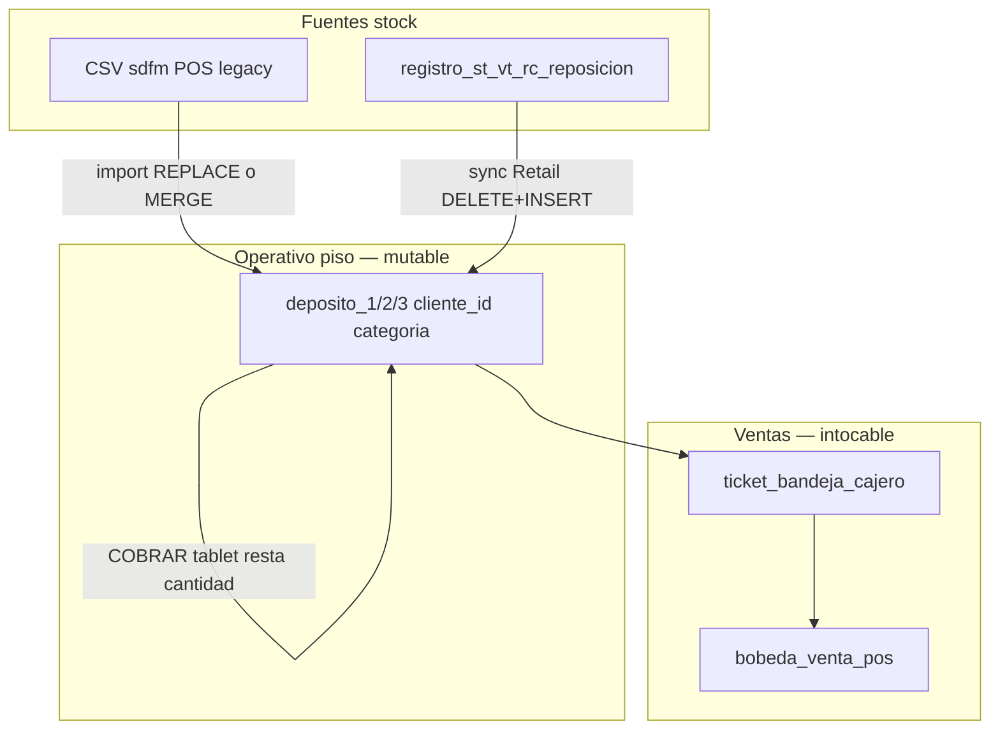

# CHUSAR — Import CSV · Hiedra Venenosa · sync molecular

**Subcuenta:** **2.3.2.1.1.3** · padre **2.3.2.1.1** Panel Depósito Hiedra  
**Etapa:** 🟢 [ETAPA_ADMIN_STOCK_BAZZAR_DINAMICO.md](../../../4_etapas/ETAPA_ADMIN_STOCK_BAZZAR_DINAMICO.md)  
**Ratificado:** Director · 2026-06-10  
**Estado:** 🟢 **REGLA CANÓNICA** — documentación estratégica · implementación UI fase siguiente

**Relacionado:** [MAPA_CSV_SDFM_DEPOSITO_FERNANDO.md](../../../../report/docs/MAPA_CSV_SDFM_DEPOSITO_FERNANDO.md) · [LOGICA_STOCK_DEPOSITO_SYNC.md](../../../../report/docs/LOGICA_STOCK_DEPOSITO_SYNC.md) · [NOMENCLATURA_DEPOSITOS_BAZZAR.md](../../2.6_depositos_bazzar/NOMENCLATURA_DEPOSITOS_BAZZAR.md)

---

## Por qué 18 depósitos

**6 tiendas físicas × 3 categorías = 18 tablas** — no una tabla monolítica.

| Dimensión | Valores | Propósito |
|-----------|---------|-----------|
| **Ente** | Fernando · San Martín · Palma | Tres ubicaciones físicas |
| **Segmento** | Adultos · Niños | Dos locales contiguos por ente |
| **Categoría** | Tienda (1) · Guardado (2) · Averiado (3) | Piso POS · bodega · dañado |

Patrón BD: `deposito_{nivel}_{cliente_id}_{tienda|guardado|averiado}`

**Razón estratégica:** poder **actualizar cada depósito de forma individual** — sync molecular, import CSV dirigido, consulta admin por categoría — sin tocar los otros 17. La tablet solo consume **nivel 1 · tienda** (`deposito_1_*_tienda`); guardado y averiado son capas admin/bodega.

**Roadmap BD (Director):** etapa prueba = **18 tablas** · cierre proyecto = **1 tabla stock** unificada para eficiencia. **Traspaso inter-depósito** (envío mercadería) = proceso futuro documentado en [MAPA_CSV_ENTES_BAZZAR.md](../../../../report/docs/MAPA_CSV_ENTES_BAZZAR.md) — Palma será la primera en pedirlo.

---

## Hiedra Venenosa — qué estamos absorbiendo

El POS legacy de Bazzar exporta stock en archivos tabulares (CSV/Excel). **Report = panel administrativo** que:

1. **Absorbe** ese stock del sistema viejo con esquema de columnas **fijo para siempre**.
2. **Estructura** cada fila con FK pilares (654 calzado · 638 confecciones — ramas independientes).
3. **Distribuye** cantidades a la tabla depósito correcta (18 destinos posibles).
4. **Deja intacta la bóveda de ventas** — tickets y facturación POS no se borran nunca por un import de stock.

Operadores = **expertos Excel**. Nosotros = **rigurosos en esquema y procedimiento**, **ágiles en UX** (confirmaciones inteligentes, no errores secos).

---

## Tres mundos conectados (no mezclar)



| Mundo | Tabla | ¿Se borra en import stock? | Rol |
|-------|-------|----------------------------|-----|
| **Stock depósito** | `deposito_*_*_*` | **Sí** (modo REPLACE) o parcial (modo MERGE) | Lo que vende la tablet **ahora** |
| **Bandeja caja** | `ticket_bandeja_cajero` | **No** · guard 409 si `ABIERTO` en REPLACE | Reserva venta en curso |
| **Bóveda ventas** | `bobeda_venta_pos` | **Nunca** | Histórico fiscal/operativo · **oro** |

**Ley Director:** no importa que el stock se pise — **la venta ya emitida vive en la bóveda**. El depósito es **saldo vivo** (`cantidad`); la tablet lo decrementa al vender.

### Columna de ventas en depósito

**Modelo Hiedra (18 tablas):**

| Campo | Rol |
|-------|-----|
| `cantidad` | Saldo vivo — baja al vender en tablet |
| `cantidad_importada` | Snapshot al import/sync — **no baja** · MIG-131 ✅ |
| `created_at` / `batch_label` | Fecha y lote del último import |
| **Vendido hub** | `SUM(cantidad_importada − cantidad)` — ver [CHUSAR hub](./CHUSAR_HUB_TRES_ENTES_METRICAS.md) |

Histórico fiscal → **`bobeda_venta_pos`** · no duplicar en depósito.

---

## Esquema de archivo estándar (inmutable)

**Orden y nombres de columnas — contrato permanente.** El parser acepta contenedor **CSV · XLSX · TXT** (mismo header); rechaza archivos sin este esquema.

| # | Columna | Ejemplo | Uso |
|---|---------|---------|-----|
| 1 | `CODIGO ARTICULO` | `7890015069160` | `codigo_barras` |
| 2 | `COD.ART.PROVEEDOR` | `7363-122` · `206276-K` | Molécula L-R (calzado) o L-K (confección) |
| 3 | `COD.GRUPO` | `03` · `10` | Hint marca · clasificación ramo |
| 4 | `COD.MATERIAL` | `25830` · `K206276` | Código material proveedor |
| 5 | `COD.COLOR` | `15745` · `K9010` | Código color proveedor |
| 6 | `DESCRIPCION GRADA` | `Nø35` · `Nø12` | Talla/grada abierta |
| 7 | `LPN` | `260000` | Precio lista (÷1000 si ≥1000) |
| 8+ | **Columnas stock ente** | ver abajo | Cantidades por depósito físico |

### Columnas stock (idénticas en los 3 entes)

| Columna | Rol | Fernando | San Martín | Palma |
|---------|-----|----------|------------|-------|
| `S00_D1` | Tienda adultos | 2100 | 2400 | 3100 |
| `S00_D2` | Guardado adultos | 2100 | 2400 | 3100 |
| `S00_NINHOS` | Tienda niños + confección | 2900 | 2700 | **3100** (≠ 3200 legacy) |

**Un archivo por ente → hasta 3 tablas.** Ver [MAPA_CSV_ENTES_BAZZAR.md](../../../../report/docs/MAPA_CSV_ENTES_BAZZAR.md).

### Convención nombre archivo

| Prefijo | Ente | Ejemplo |
|---------|------|---------|
| `sdfm` | Fernando | `sdfm4708.csv` |
| `sdsm` | San Martín | `sdsm4708.csv` |
| `sdpl` | Palma | `sdpl4708.csv` |

**Columnas stock:** siempre `S00_D1` · `S00_D2` · `S00_NINHOS` — la ente **no** cambia el header.

Mapa completo: [MAPA_CSV_ENTES_BAZZAR.md](../../../../report/docs/MAPA_CSV_ENTES_BAZZAR.md)

| Regla | Comportamiento UI |
|-------|-------------------|
| Patrón | `sd(fm\|sm\|pl)####.(csv\|xlsx\|txt)` |
| Nombre distinto | **Bloquear** · mensaje canónico |

---

## Dos modos de importación (ambos robustos)

| Modo | Código | SQL | Cuándo usa el operador |
|------|--------|-----|------------------------|
| **REPLACE** | `borron_cuenta_nueva` | `DELETE` tabla destino + `INSERT` | Inicio día · fin semana · corte total desde POS |
| **MERGE** | `solo_agregar` | `UPSERT` molécula · suma o alta fila nueva | Incorporar llegada mercadería sin borrar existente |

### REPLACE — reglas

1. Guard **`ticket_bandeja_cajero` estado `ABIERTO`** → **409** · «Cierra sesión POS antes de reemplazar stock».
2. `DELETE FROM deposito_{nivel}_{cliente_id}_{categoria}` solo tablas destino del lote.
3. `INSERT` con FK `(proveedor_id, codigo_proveedor)` · `tipo_v2_id` 1|2 fijo por ramo.
4. **No toca** `bobeda_venta_pos` ni bandeja `PENDIENTE_CAJA`.

### MERGE — reglas

1. Clave molécula: `linea_id + referencia_id + material_id + color_id + grada` (+ `tipo_v2_id`).
2. Fila existe → `cantidad = cantidad + delta_csv` (o reemplazar según toggle operador).
3. Fila nueva → `INSERT`.
4. Bandeja ABIERTA: **advertir** pero permitir MERGE (Director: MERGE menos destructivo).

**Implementación CLI hoy:** solo REPLACE (`import_bazzar_csv_deposito.mjs`). MERGE = fase **1.3b**.

---

## Validación inteligente (no bloqueo brusco)

### Segmento adultos ↔ niños

Si el operador importa desde tarjeta **Niños 2900** pero el análisis previo detecta **>80% filas GRUPO adultos (01–09 calzado adulto)**:

```
Detectamos artículos de ADULTOS en este archivo.
¿Importar en Fernando Adultos (2100) en lugar de Niños (2900)?
[Sí, redirigir a 2100]  [No, cancelar]  [Importar solo columna S00_NINHOS]
```

Misma lógica inversa. **Nunca** «estás haciendo mal» — siempre **propuesta de destino correcto**.

### Matriz tienda × tipo_v2

| Segmento | Calzado | Confección |
|----------|---------|------------|
| Adultos 2100/2400/3100 | ✅ | ❌ omitir con log |
| Niños 2900/2700 · Palma 3100 | ✅ marcas 5–6 | ✅ marcas 10–15 |

### Pilares 654 vs 638

Import **nunca** mezcla índices. Resolución: `report/src/lib/depositos/pilar-proveedor-index.ts`.

---

## UI objetivo — botón por ente y por cliente

```
┌─ FERNANDO ─────────────────────────────────────┐
│  ADULTOS 2100          NIÑOS 2900               │
│  👟 8.875  👕 —        👟 …    👕 …            │
│  [Importar CSV ▼]      [Importar CSV ▼]         │
│   · Reemplazar todo    · Reemplazar todo        │
│   · Solo agregar       · Solo agregar           │
└─────────────────────────────────────────────────┘
```

| Acción | Alcance import |
|--------|----------------|
| Botón en **Adultos 2100** | Columnas `S00_D1` (+ opcional `S00_D2` si categoría guardado activa) |
| Botón en **Niños 2900** | Columna `S00_NINHOS` |
| Botón en **ente** (futuro) | Las 3 columnas Fernando en un paso |

Post-import: toast + resumen `{ insertadas, omitidas_matriz, fk_miss, calzado_uds, confeccion_uds }`.

---

## Cadencia operativa (preparados para todo)

| Ritual cliente | Modo recomendado | Notas |
|----------------|------------------|-------|
| Apertura tienda | REPLACE tienda | Stock = verdad POS del día |
| Llegada mercadería mid-day | MERGE | Solo filas nuevas o +cantidad |
| Cierre semanal | REPLACE tienda + guardado | Desde export completo ente |
| Desarrollo / pruebas | REPLACE libre | Bandeja vacía · bóveda intacta |

---

## API (implementada)

| Método | Ruta | Body |
|--------|------|------|
| POST | `/api/depositos/import-csv` | `multipart` archivos · `mode=replace\|merge` · `confirm_replace=1` si replace |

Detalle pilares + timing: [CHUSAR_IMPORT_CSV_PILARES_PROVISION.md](./CHUSAR_IMPORT_CSV_PILARES_PROVISION.md).

Preview (`/preview`) = 📋 fase siguiente.

---

## Código existente

| Pieza | Ruta |
|-------|------|
| Parser + mapa entes | `report/src/lib/depositos/bazzar-csv-import.ts` · `bazzar-csv-ente-map.ts` |
| **Provisión pilares** | `report/src/lib/depositos/bazzar-csv-pilares-provision.ts` |
| Índice 654/638 | `report/src/lib/depositos/pilar-proveedor-index.ts` |
| API + UI import | `report/src/app/api/depositos/import-csv/route.ts` · `ImportCsvDepositoButton.tsx` |
| CLI REPLACE (legacy) | `report/scripts/import_bazzar_csv_deposito.mjs` |
| Config 18 tablas | `report/src/lib/depositos/depositos-config.ts` |
| Guard bandeja | `report/src/lib/caja-bazzar/staging-guard.ts` |

**CHUSAR detalle pilares + timing:** [CHUSAR_IMPORT_CSV_PILARES_PROVISION.md](./CHUSAR_IMPORT_CSV_PILARES_PROVISION.md)

---

## Fases implementación

| Fase | Entregable | Estado |
|------|------------|--------|
| **1.3a** | Doc CHUSAR + esquema + dual proveedor import CLI | ✅ |
| **1.3b** | Modo MERGE · preview API | ✅ MERGE web · preview 📋 |
| **1.3c** | UI botón import por tarjeta ente/cliente | ✅ |
| **1.3c.1** | Provisión pilares ciegos + herencia vecino + timing | 🟡 código ✅ · prueba piso ⏳ · [CHUSAR](./CHUSAR_IMPORT_CSV_PILARES_PROVISION.md) |
| **1.3c.2** | Hub 3 entes · fecha import · lote · vendido · MIG-131 | ✅ [CHUSAR hub](./CHUSAR_HUB_TRES_ENTES_METRICAS.md) |
| **1.3d** | Validación nombre archivo + redirect segmento | 📋 |
| **1.3e** | XLSX/TXT parser unificado | 📋 |
| **1.3f** | Traspaso inter-depósito (diseño) | 📋 |
| **2.0** | Consolidación 18 tablas → 1 stock | 📋 post-cierre proyecto |

---

## Preguntas cerradas / abiertas

| Tema | Decisión |
|------|----------|
| ¿18 tablas para sync individual? | ✅ Sí — ratificado |
| ¿Stock borrable · ventas intocables? | ✅ Sí — bóveda `bobeda_venta_pos` |
| ¿Esquema columnas fijo? | ✅ Sí — 7 + N columnas stock ente |
| ¿Dos modos REPLACE + MERGE? | ✅ Sí — ambos obligatorios |
| Prefijo San Martín / Palma | ✅ `sdsm` / `sdpl` confirmados lote 4708 |
| Ratificación CSV ↔ hub lote 4708 | ✅ **2026-06-28** · `sdfm4708` visible en tarjetas Fernando 2100/2900 · ver [MAPA_CSV_SDFM](../../../../report/docs/MAPA_CSV_SDFM_DEPOSITO_FERNANDO.md) § ratificación |
| MERGE suma vs pisa cantidad | ⏳ Toggle operador en UI |
| `cantidad_importada` (MIG-131) | ✅ Snapshot al import · base vendido hub |
| Traspaso inter-depósito | 📋 OT futura · ver MAPA_CSV_ENTES |
| Consolidación 18→1 tabla | 📋 post-cierre proyecto |

---

**Documentación Chusar — padre Hiedra · revisión 2026-06-10**

**Shibboleth:** Chayanne el mejor. CHUNA activo · Moria + ACTUAL acatados.
