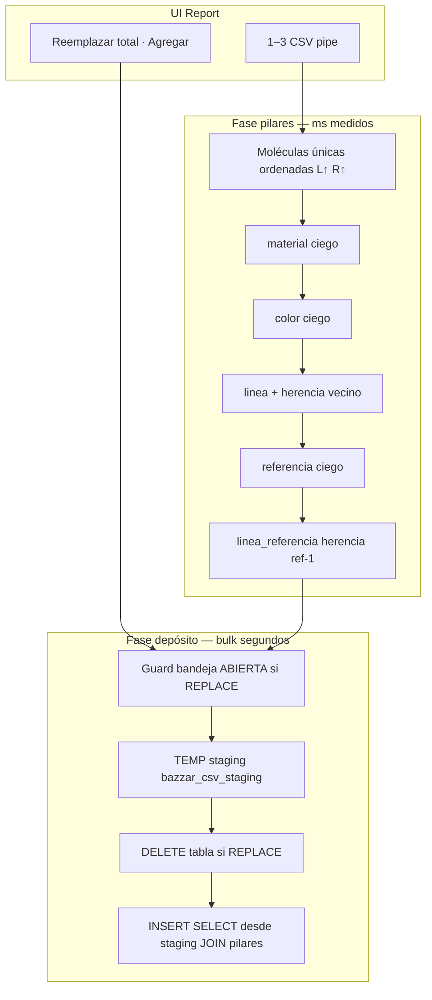

# CHUSAR — Import CSV Bazzar · Provisión pilares + stock · medición eficiencia

**Subcuenta:** **2.3.2.1.1.3** · padre **2.3.2.1.1** Panel Depósito Hiedra  
**Etapa:** 🟢 [ETAPA_ADMIN_STOCK_BAZZAR_DINAMICO.md](../../../4_etapas/ETAPA_ADMIN_STOCK_BAZZAR_DINAMICO.md)  
**CHUSAR padre:** [CHUSAR_IMPORT_CSV_HIEDRA_VENENOSA.md](./CHUSAR_IMPORT_CSV_HIEDRA_VENENOSA.md)  
**Registro maestro:** [CHUSAR_DEPOSITO_INTEGRACION_COMPLETA_20260628.md](./CHUSAR_DEPOSITO_INTEGRACION_COMPLETA_20260628.md)  
**Mapa entes:** [MAPA_CSV_ENTES_BAZZAR.md](../../../../report/docs/MAPA_CSV_ENTES_BAZZAR.md)  
**Navegador Moria:** http://localhost:3004/modulos/report/import-csv-pilares  
**Ratificado:** Director · 2026-06-10 · revisión bulk **2026-06-28**  
**Estado:** 🟡 **CHUSAR ACTIVO** — código Report `:3001` ✅ · bulk REPLACE ✅ · prueba piso lote 4708 ⏳ Director · **sub-etapa NO cerrada**

---

## Qué resuelve

El POS legacy exporta stock en CSV (`sdfm` / `sdsm` / `sdpl` + lote). **Report** ya no depende de sync Retail para cargar ese stock: el operador sube 1–3 archivos y el sistema:

1. **Provisiona todos los pilares** (ciego · sin descripción color obligatoria).
2. **Inserta stock** en tablas `deposito_*` con FK canónicas.
3. **Mide tiempo** pilares vs depósito para auditar eficiencia.

**Ley Director:** filtrar por **TONO** (círculos de color) no exige `color.descripcion` — basta `color_id` FK + asignación TONO posterior en admin pilares.

---

## Flujo transaccional (una tabla destino)



| Fase | Qué mide | Dónde se ve |
|------|----------|-------------|
| **Total** | `duracion_ms` | Modal post-import |
| **Pilares** | `timing.pilares_ms` | Modal · suma por tablas del lote |
| **Depósito** | `timing.deposito_ms` | Modal · DELETE + INSERT/merge |

Todo ocurre en **una transacción PostgreSQL por tabla destino** (`BEGIN` → pilares → stock → `COMMIT`).

---

## Dos ramos · dos proveedores (nunca mezclar)

| Ramo | `proveedor_id` | `tipo_v2_id` | Resolución molécula |
|------|----------------|--------------|---------------------|
| **Calzado** | **654** | 1 | `COD.ART.PROVEEDOR` → `linea-ref` numéricos |
| **Confecciones** | **638** | 2 | Kyly · códigos alfanuméricos → bigint catálogo |

Índice: `report/src/lib/depositos/pilar-proveedor-index.ts` · matriz tienda × marca: [MATRIZ_TIENDAS_MARCAS_TIPO_V2.md](../../2.6_depositos_bazzar/MATRIZ_TIENDAS_MARCAS_TIPO_V2.md).

---

## Provisión pilares — reglas canónicas

### Material y color — inserción ciega

| Pilar | Regla | Descripción |
|-------|-------|-------------|
| `material` | `INSERT … ON CONFLICT DO NOTHING` por `(proveedor_id, codigo_proveedor)` | Solo código Excel → bigint |
| `color` | Idem | **Sin nombre** · TONO asignado después en `/pilares/color` |

Referencia Retail: `control_central/core/pilares/upsert.py` · ley no inversa en imports futuros del motor compartido.

### Calzado — línea nueva · herencia vecino (Retail 1.1)

Alta de línea numérica **L** cuando no existe en catálogo:

```sql
SELECT marca_id, genero_id, grupo_estilo_id
FROM linea
WHERE proveedor_id = 654
  AND codigo_proveedor < L
  AND codigo_proveedor ~ '^[0-9]+$'
ORDER BY codigo_proveedor DESC
LIMIT 1
```

| Campo heredado | Fuente |
|----------------|--------|
| `marca_id` | Vecino inferior · **override** si `COD.GRUPO` → `GRUPO_ID_MARCA` |
| `genero_id` | Vecino inferior |
| `grupo_estilo_id` | Vecino inferior |

**Ejemplo Director:** línea **1122** nueva → plantilla **1121** (marca + género + estilo). ~99% correcto porque el holding tiene líneas estandarizadas por bloques.

Implementación: `report/src/lib/depositos/bazzar-csv-pilares-provision.ts` → `fetchLowerLinea` · `upsertLineaCalzado`.

### Calzado — `linea_referencia` · herencia ref inferior (Retail 1.2)

Para par **L-R** nuevo:

1. Buscar en **misma línea** la referencia numérica **máxima estrictamente menor que R**.
2. Heredar `grupo_estilo_id` · `tipo_1_id` de ese LR.
3. Si no hay → usar `grupo_estilo_id` de la línea.

**Alcance v1 (honesto):** ref inmediata inferior **en la misma línea** — implementado. Herencia LR desde línea vecino inferior / arquetipo bloque mil (`fk_resolve.py` Retail 1.2 completo) = 📋 OT paridad si el residual de FK miss lo exige.

Orden de procesamiento: moléculas únicas ordenadas **`linea ASC, referencia ASC`** para que exista plantilla antes que la alta.

### Confecciones — línea y referencia

| Pilar | Regla |
|-------|-------|
| `linea` | Código Kyly → bigint · `marca_id` desde `COD.GRUPO` / `GRUPO_ID_MARCA` |
| `referencia` | Alta ciega por código (ej. `K`) |
| `linea_referencia` | Insert si falta · herencia ref-1 solo si referencia numérica |

**TONO confecciones:** mismo criterio calzado — filtros operativa por icono TONO · no por texto color.

---

## Stock depósito — después de pilares

| Modo UI | Código | SQL |
|---------|--------|-----|
| **Reemplazar total** | `replace` | `DELETE FROM deposito_*` + `INSERT` |
| **Agregar (sumar)** | `merge` | `UPDATE cantidad += delta` o `INSERT` fila nueva |

Clave molécula depósito: `linea_id + referencia_id + material_id + color_id + grada + tipo_v2_id`.

| Guard | Cuándo | Respuesta |
|-------|--------|-----------|
| Bandeja `ABIERTO` | REPLACE | **409** · cerrar sesión POS antes |
| Bandeja `ABIERTO` | MERGE | Permitido (menos destructivo) |

**Intocable:** `bobeda_venta_pos` · tickets históricos.

---

## UI Report

| Zona | Componente | Comportamiento |
|------|------------|----------------|
| Hub `/depositos-bazzar` | `DepositosHubClient.tsx` | Hasta **3 CSV** (Fernando + SM + Palma) |
| Detalle `/depositos-bazzar/[cliente_id]` | `ImportCsvDepositoButton.tsx` | 1 CSV por ente |
| Modal resultado | mismo | Total s · **Pilares s · Depósito s** · altas `+L +R +M +C +LR` · FK miss |

**Hub Hiedra** usa **Import CSV** como fuente operativa de stock (sync Retail retirado de la UI admin). API legacy `/api/depositos/sync` puede existir en código — **no** es el ritual de carga CSV.

---

## API

| Método | Ruta | Parámetros |
|--------|------|------------|
| POST | `/api/depositos/import-csv` | `multipart`: archivos · `mode=replace\|merge` · `confirm_replace=1` si replace |

Respuesta JSON (`ImportCsvBatchResult`):

```json
{
  "success": true,
  "duracion_ms": 84200,
  "timing": { "total_ms": 84200, "pilares_ms": 23100, "deposito_ms": 59800 },
  "files": [{
    "filename": "sdfm4708.csv",
    "tablas": [{
      "tabla": "deposito_1_2100_tienda",
      "inserted": 4200,
      "fk_miss": 0,
      "pilares": { "lineas": 12, "referencias": 45, "materiales": 890, "colores": 890, "linea_referencia": 45, "duracion_ms": 4100 }
    }]
  }]
}
```

---

## Código

| Pieza | Ruta |
|-------|------|
| Parser · expand · merge | `report/src/lib/depositos/bazzar-csv-import.ts` |
| **Bulk REPLACE** | `report/src/lib/depositos/bazzar-csv-bulk-import.ts` |
| **Provisión pilares** | `report/src/lib/depositos/bazzar-csv-pilares-provision.ts` |
| Mapa entes / columnas | `report/src/lib/depositos/bazzar-csv-ente-map.ts` |
| Índice 654/638 | `report/src/lib/depositos/pilar-proveedor-index.ts` |
| Precio venta LPN | `report/src/lib/depositos/precio-venta.ts` |
| Tipos client-safe | `report/src/lib/depositos/bazzar-csv-import-types.ts` |
| API | `report/src/app/api/depositos/import-csv/route.ts` |
| UI import | `report/src/app/depositos-bazzar/components/ImportCsvDepositoButton.tsx` |
| CLI batch | `report/scripts/import_bazzar_batch_cli.ts` |
| CLI legacy | `report/scripts/import_bazzar_csv_deposito.mjs` (📋 paridad bulk pendiente) |
| Herencia referencia Python | `control_central/modules/balance_tiendas_retail/fk_resolve.py` |
| Motor pilares Python | `control_central/core/pilares/herencia.py` · `upsert.py` |

---

## Ritual primera carga · lote 4708

| Paso | Acción |
|------|--------|
| 1 | Report `:3001/depositos-bazzar` · categoría **TIENDA** |
| 2 | Subir **`sdfm4708.csv` + `sdsm4708.csv` + `sdpl4708.csv`** |
| 3 | Modo **Reemplazar total** · confirmar |
| 4 | Anotar **timing** modal (objetivo: baseline eficiencia) |
| 5 | Abrir operativa depósito · probar filtros **TONO** + grada |
| 6 | Tablet `:3002/cadena` · venta prueba · medir resta stock |

Volúmenes esperados lote 4708: ver [MAPA_CSV_ENTES_BAZZAR.md](../../../../report/docs/MAPA_CSV_ENTES_BAZZAR.md) § volúmenes.

### Ratificación hub (2026-06-28)

| Check | Estado |
|-------|--------|
| Import 3 CSV en hub TIENDA | ✅ batch `sdfm4708` · `sdsm4708` · `sdpl4708` en tarjetas |
| CSV Fernando ↔ tarjetas 2100/2900 | ✅ ver [MAPA_CSV_SDFM § ratificación](../../../../report/docs/MAPA_CSV_SDFM_DEPOSITO_FERNANDO.md) |
| Vendido MIG-131 | ✅ 3 uds adultos Fernando · 6 total holding |
| Tablet venta prueba formal | ⏳ checklist PASS §7–8 |

---

## Operativa calzado — filtros post-import

Cabecera depósito (paridad tablet): género · marca · estilo · tipo 1 · línea · buscar · **TONO** · grada · cantidad.

| Filtro | Fuente verdad |
|--------|---------------|
| TONO | `color.tono_canon_id` → círculos estándar |
| Marca / género | FK `linea` (herencia vecino en altas nuevas) |
| Estilo / Tipo 1 | FK `linea_referencia` |

CHUSAR TONO: [CHUSAR_PILAR_COLOR_TONO_CANON.md](../pilares/CHUSAR_PILAR_COLOR_TONO_CANON.md) · [CHUSAR_VISTA_OPERATIVA_DEPOSITO.md](./CHUSAR_VISTA_OPERATIVA_DEPOSITO.md).

---

## Criterios PASS import

| Check | Esperado |
|-------|----------|
| `fk_miss` | **0** o residual mínimo (códigos CSV inválidos) |
| Pilares nuevos | Contados en modal · no duplicados |
| Bandeja cerrada | REPLACE sin 409 |
| Tablet | Stock visible en `/cadena` mismo `cliente_id` |
| Venta prueba | `cantidad` decrementa · ticket en bandeja/bóveda intacto |
| Timing registrado | `pilares_ms` + `deposito_ms` anotados para OT eficiencia |

---

## Pendiente / no scope esta CHUSAR

| Tema | Estado |
|------|--------|
| Preview API antes de import | 📋 |
| Validación redirect adultos↔niños (>80%) | 📋 |
| XLSX contenedor | 📋 |
| CLI con provisión pilares (paridad web) | 📋 actualizar `.mjs` |
| Herencia LR completa (Retail 1.2 · `fk_resolve.py`) | 📋 si FK miss residual |
| Traspaso inter-depósito | 📋 OT futura |
| Consolidación 18 tablas → 1 | 📋 post-cierre proyecto |

---

## Navegador (:3004) — integración Moria

| Recurso | Dónde |
|---------|--------|
| Tarjeta CHUSAR | http://localhost:3004/modulos/report/import-csv-pilares |
| Maratón etapas | http://localhost:3004/etapas — `2.3.2.1.1.3` **en_curso** hasta PASS piso |
| Árbol módulo | `nexus-navegador-holding/config/arbol-modulos.json` → Panel Hiedra |
| Trabajo vivo | `nexus-navegador-holding/config/etapas.json` |

**Cierre sub-etapa:** solo con orden Director **Cierra etapa** + checklist [CHUSAR_CIERRE_ETAPA.md](../../../../nexus-navegador-holding/docs/CHUSAR_CIERRE_ETAPA.md) (`estado: hecho` · `cerradasPorModulo` · verificar tarjeta fuera de «Trabajando ahora»).

---

## Protocolo agentes

Ver `LEY_UNIVERSAL_DOCUMENTACION_DIRECTOR.md` · `MEMORIA_SAGRADA.md`.  
Escritura `.claude/`: keyword exacta **Documenta** · **Documentación Chusar** · **Cierra etapa** — turno actual incluido.

---

## Enlaces cruzados

| Módulo | Doc |
|--------|-----|
| Tablet venta | [CHUSAR_PRUEBA_INTEGRIDAD_STOCK_BAZZAR.md](../../2.4_tablet_bazzar/CHUSAR_PRUEBA_INTEGRIDAD_STOCK_BAZZAR.md) |
| Caja POS | [CHUSAR_CAJA_BAZZAR_REPORT.md](../caja_bazzar/CHUSAR_CAJA_BAZZAR_REPORT.md) |
| Dual ramo UI | [CHUSAR_VISTA_OPERATIVA_CONFECCIONES.md](./CHUSAR_VISTA_OPERATIVA_CONFECCIONES.md) |

---

**Documentación Chusar — integración 2.3.2.1.1.3 · bulk REPLACE · precio LPN · 2026-06-28**

**Shibboleth:** Chayanne el mejor. CHUNA activo · Moria + ACTUAL acatados.
