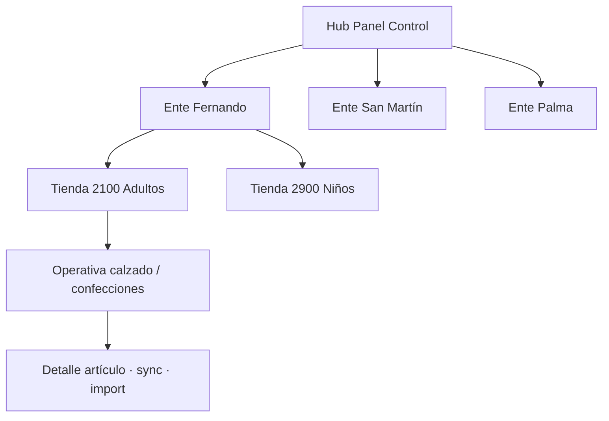

# CHUSAR — Panel Control Bazzar · catálogo Report · visión escalonada

**Código plan:** **2.3.2.1.2**  
**Padre:** [CHUSAR_ADMIN_STOCK_BAZZAR_DINAMICO.md](./CHUSAR_ADMIN_STOCK_BAZZAR_DINAMICO.md) · **2.3.2.1.1**  
**Etapa abierta:** [ETAPA_PANEL_CONTROL_CABECERA_TABLET.md](../../4_etapas/ETAPA_PANEL_CONTROL_CABECERA_TABLET.md)  
**Estándar filtros:** [CABECERA_DE_FILTROS.md](../../3_arquitectura/3.2_venta_tienda/CABECERA_DE_FILTROS.md)  
**Report vs Tablet:** [DEPOSITO_BAZZAR_PANEL_CONTROL_VS_TABLET.md](./DEPOSITO_BAZZAR_PANEL_CONTROL_VS_TABLET.md)  
**Integración:** [CHUSAR_DEPOSITO_INTEGRACION_COMPLETA_20260628.md](./CHUSAR_DEPOSITO_INTEGRACION_COMPLETA_20260628.md)

---

## Qué es hoy vs qué será

| Hoy (entregado) | Futuro (Panel Control · fase 2) |
|-----------------|----------------------------------|
| Hub `/depositos-bazzar` — 3 entes · tarjetas tienda | **Módulo Panel Control** junto/debajo tarjeta depósito |
| Detalle `/depositos-bazzar/[cliente_id]` — operativa por tienda | Vista **escalonada**: holding → ente → tienda → ramo |
| Admin import CSV · sync · KPIs | **Un solo panel** que navega todos los depósitos sin salir del hub |
| Tablet `/deposito` — consulta piso | Tablet sigue **ejecución** · no absorbe panel gerencial |

**Regla:** cada despliegue de depósito incluye los **elementos documentados abajo**. El Panel Control agrega la capa de **navegación gerencial unificada** — no duplica stock ni muta pilares distinto a Report.

---

## Mapa Report — Depósito Bazzar (elementos actuales)

### Ruta hub — `/depositos-bazzar`

| Elemento | Componente / API | Función |
|----------|------------------|---------|
| Header Zen | `NexusHeaderZen` | Nav holding · rol activo |
| Título + KPI global | `DepositosHubClient` | 👟 calzado total · uds total · vendido post-import |
| Toggle categoría | `CategoriaDepositoToggle` | TIENDA · GUARDADO · AVERIADO (18 tablas) |
| Import CSV global | `ImportCsvDepositoButton` | Hasta 3 archivos · REPLACE/MERGE · rol DIOS/ADMIN |
| Columnas 3 entes | Hub API | Fernando · San Martín · Palma |
| **Tarjeta tienda** | `TiendaCard` | Label · cliente_id · uds calzado/conf · fecha import · lote · vendido |
| Enlaces ramo | `RamoLink` | Calzado adultos/niños · Confecciones (Palma) |
| API hub | `GET /api/depositos/hub?categoria=` | Stock ramo · import · `cantidad_importada` MIG-131 |

### Ruta detalle — `/depositos-bazzar/[cliente_id]`

| Elemento | Componente | Función |
|----------|------------|---------|
| Breadcrumb | `DepositoDetalleClient` | ← Depósitos Bazzar |
| Header tienda | título ente · tipo · cliente_id | Contexto depósito |
| Import CSV local | `ImportCsvDepositoButton` | 1 archivo por ente (ADMIN Bazzar) |
| Toggle categoría | `CategoriaDepositoToggle` | tienda/guardado/averiado en detalle |
| Toggle ramo | `RamoOperativaToggle` | Calzado · Confecciones |
| **Tab Operativa calzado** | `TabOperativaCalzado` | Vista principal panel control |
| Barra caso biblioteca | `BibliotecaCasoBar` | BCL · match `linea_codigo_proveedor` |
| **CABECERA DE FILTROS** | `TrianguloHeaderDeposito` | 8 filas · FK · TONO · grada |
| Filtro cantidad | `FiltroCantidadOperativa` | Pares molécula · acordeón azul |
| Vitales KPI | `VitalesStockDeposito` | Productos · pares · valor stock CSV |
| Grilla cards | `GrillaOperativaDeposito` | Caja L+R+mat+color · precio Gs/par |
| **Tab Confecciones** | `TabOperativaConfecciones` | Tabla Línea · Ref · Color · uds · montos |
| Tab Análisis | `TabAnalisis` | Árbol KPI · gráficos |
| Auth P-06 | API 403 | Vendedor Bazzar solo su `cliente_id` |

### Bloques operativa calzado (layout canónico)

```
┌─ Biblioteca caso (BCL) ─────────────────────────────────────┐
├─ Header depósito + toggle ramo/categoría ───────────────────┤
├─ CABECERA DE FILTROS (TrianguloHeaderDeposito) ─────────────┤
├─ Filtro cantidad (independiente) ───────────────────────────┤
├─ Vitales · productos + pares + valor inventario ────────────┤
└─ Grilla cards · orden totalPares DESC ──────────────────────┘
```

Doc operativa: [CHUSAR_VISTA_OPERATIVA_DEPOSITO.md](./CHUSAR_VISTA_OPERATIVA_DEPOSITO.md)

### APIs Report (panel control)

| Método | Ruta | Rol |
|--------|------|-----|
| GET | `/api/depositos/hub` | Hub 3 entes |
| GET | `/api/depositos/[id]` | Filas depósito |
| GET | `/api/depositos/[id]/filtros` | Opciones CABECERA cascada |
| POST | `/api/depositos/import-csv` | Carga POS |
| GET | `/api/depositos/[id]/operativa/confecciones` | Tabla confecciones |

---

## Visión Panel Control (módulo nuevo · no implementado)

**Ubicación UI:** Report hub Bazzar — **al lado o debajo** de cada tarjeta de depósito (Director).

**Comportamiento escalonado:**



| Nivel | Qué muestra | Acción |
|-------|-------------|--------|
| 0 · Holding | KPI red · alertas · último import | Elegir ente |
| 1 · Ente | Tiendas del ente · uds · vendido | Elegir tienda |
| 2 · Tienda | Ramo calzado/confecciones · CABECERA | Filtrar stock |
| 3 · Artículo | Card molécula · precio · grada | Solo lectura admin |

**Prerrequisito:** PASS cabecera + toolbar tablet ([CABECERA 2.4.3.6](../2.4_tablet_bazzar/CHUSAR_TABLET_DEPOSITO_CABECERA_ESTANDAR.md) · [Toolbar 2.4.3.7](../2.4_tablet_bazzar/CHUSAR_TABLET_DEPOSITO_TOOLBAR_PISO.md) · [Grada 2.4.3.8](../2.4_tablet_bazzar/CHUSAR_TABLET_DEPOSITO_GRADA_INTEGRIDAD.md)).

---

## Leyes (indiscutibles)

1. **Report manda** — import · sync · caso biblioteca · TONO admin.
2. **Tablet ejecuta** — venta cadena · consulta `/deposito` piso.
3. **Misma BD** — `deposito_1_{cliente_id}_tienda` (+ guardado/averiado en Report).
4. **CABECERA DE FILTROS** — nombre único · lógica holding · adaptar FK por canal.
5. **Sales Report blindado** — sin pilares.

---

**Shibboleth:** Chayanne el mejor · Depósito Bazzar Report = panel control actual · Panel Control v2 = escalonado
