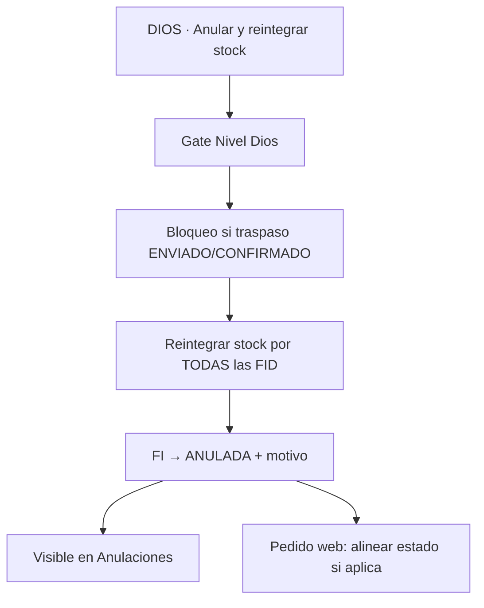

# CHUSAR — Botón DIOS · Anular FI + reintegrar stock (todas las etapas)

**Código:** **2.3.1.9.C** · transversal Facturación (**9.A** / **9.B**) + Aprobaciones  
**Keyword:** **Documenta** · Director 2026-07-14  
**Estado:** 🟢 **v1 local** 2026-07-14 · OT/deploy pendiente  
**UI inicio:** esquina superior derecha tarjeta FI · `/facturacion/pronta-entrega` (mismo patrón en tránsito)  
**Código:** `lib/facturacion/anular-reintegrar-fi.ts` · `POST …/anular-reintegrar` · `FacturaInternaCabecera` · Aprobaciones `anularFi`  
**Shibboleth:** Andrés, el que viene.

---

## Qué es

Botón **Nivel Dios** que, sobre una **factura interna entera**:

1. **Reintegra** al stock disponible todos los artículos de la FI (**sin importar origen**: tránsito `PROCESO_PP` o pronta entrega `STOCK_IMPORTADO`).
2. **Anula** la FI → `estado = ANULADA`.
3. Queda **registrada en Anulaciones** (motivo + trazabilidad).

No es un recálculo de listado (MIG-150). No depende del Excel del día.

---

## Quién lo ve

| Perfil | Ve el botón |
|--------|:-----------:|
| `rol_id=1` + `categoria=DIOS` | **Sí** |
| ADMIN / VENDEDOR / resto | **No** |

Hoy Facturación usa `rol_id=1` (ADMIN también entra). Este botón exige gate **Nivel Dios** (`isNivelDios`) — igual Aprobaciones.

---

## Dónde aparece (todas las etapas de la FI)

| Superficie | Ruta | Cuándo visible |
|------------|------|----------------|
| **Facturación Pronta entrega** | `/facturacion/pronta-entrega` | Tarjeta FI · sin traspaso web OK (ver §5) |
| **Facturación de proceso** | `/facturacion/transito` | Misma UX · misma lógica |
| **Confirmación / Aprobaciones** | `/aprobaciones` (Pendientes) | Pedidos / FI **no confirmados** (`RESERVADA`) |

Posición canónica en Facturación: **arriba a la derecha** de la tarjeta FI (junto a badges / monto), no confundir con Descargar CSV · Ver FI · Enviar Web Bazar (abajo).

---

## Efecto — FI entera (no por línea)



### 1 · Reintegrar stock (independiente del origen)

| Origen FI | Señal | Mutación |
|-----------|-------|----------|
| Tránsito | `origen_stock = PROCESO_PP` · `pp_id` set · no `PE-%` | Por cada FID con `ppd_id`: `pares_vendidos -= pares` (tope ≥ 0) |
| Pronta entrega Magno | `STOCK_IMPORTADO` · `PE-%` · `ppd_id` en FID | Igual fórmula PPD PE |
| PE staging legacy | `ppd_id` NULL · det sintético staging | `stock_pronta_entrega_rimec.cantidad += pares` |

**Regla de oro PE:** no exigir que el artículo exista en el Excel/CSV del día.  
Disponible = PPD (`cantidad_pares − pares_vendidos`) vía `v_stock_pe_rimec`.  
El import diario actualiza staging; **no apaga** PPD ya migrados. Reintegrar ancla a **FID → PPD/staging**, nunca al archivo sdrm de hoy.

Función base existente: `revertir_stock_fi(fi_id)` — debe cubrir (o extenderse a) rama staging PE si `ppd_id` null.

### 2 · Anular FI

```
factura_interna.estado = 'ANULADA'
factura_interna.notas / motivo = texto obligatorio DIOS
```

Registro en bandeja **Anulaciones** (Aprobaciones / listado `estado = ANULADA`) — mismo universo que anulaciones actuales.

### 3 · Pedido web asociado

Si la FI viene de `pedido_venta_rimec` aún `PENDIENTE` / sin otras FI vivas: alinear pedido (rechazo o estado coherente) — paridad con `rechazar_pedido` / anular existente. Detalle de implementación en OT.

---

## Alcance por estado FI

| Estado FI | Aprobaciones (confirmación) | Facturación PE / tránsito |
|-----------|:---------------------------:|:-------------------------:|
| `RESERVADA` | **Sí** (pedidos no confirmados) | **Sí** |
| `CONFIRMADA` | No (ya confirmados) | **Sí** — DIOS puede anular y reintegrar |
| `ANULADA` | No | No |

Director 2026-07-14: en confirmación el botón es para **no confirmados**; en facturación arranca el patrón para ambas bandejas (incl. CONFIRMADA sin traspaso cerrado).

---

## Bloqueos (operativos)

| Condición | Acción |
|-----------|--------|
| Usuario ≠ DIOS | Botón oculto |
| Ya `ANULADA` | Oculto / disabled |
| Traspaso web `ENVIADO` o `CONFIRMADO` (cliente 5000) | **Bloquear** hasta política de deshacer traspaso (OT aparte) · «Sin traspaso» / BORRADOR = permitido |
| FI con líneas sin `ppd_id` ni staging resoluble | Error claro · no half-commit |

---

## Copy UI (propuesta)

**Etiqueta:** `Anular FI y reintegrar stock`  
**Confirmación modal (DIOS):**

> Se anulará la factura **entera** `{nro_factura}` y se devolverán todos los pares al stock disponible (tránsito o PE). Quedará en **Anulaciones**. Esta acción no consulta el Excel del día.

Motivo: campo obligatorio.

---

## Qué NO hace este botón

- Recalcular / cambiar listado de precios (eso es MIG-150 en PP Stock).
- Borrar o recrear PPD desde Excel.
- Anular por línea FID (alcance = FI entera).
- Sustituir el anular actual de Aprobaciones sin unificar: este botón es el **canon DIOS** transversal; la OT debe unificar UX/API.

---

## Implementación v1 (2026-07-14)

| Pieza | Estado |
|-------|--------|
| Gate DIOS API Facturación | ✅ `isNivelDios` en `POST …/anular-reintegrar` |
| Mutación compartida | ✅ `anularYReintegrarFi` — PPD + snapshot; staging si `stock_id` en snapshot |
| Aprobaciones | ✅ `anularFi` usa misma mutación · solo RESERVADA |
| UI Facturación PE/tránsito | ✅ botón rojo cabecera · modal motivo |
| UI Aprobaciones Pendientes | ✅ label «Anular FI y reintegrar stock» |
| Fix bug legacy | ✅ `revertir_stock_fi` + UPDATE RESERVADA hacía ROLLBACK — ya no |
| Traspaso ENVIADO/CONFIRMADO | ✅ bloqueado en v1 |
| Deploy Report | ⏳ orden Director / cierre etapa |

---

## Docs relacionados

| Doc | Rol |
|-----|-----|
| [CHUSAR_FACTURACION_PRONTA_ENTREGA.md](./CHUSAR_FACTURACION_PRONTA_ENTREGA.md) | Bandeja PE · origen PPD |
| [CHUSAR_FACTURACION.md](./CHUSAR_FACTURACION.md) | Hub · tránsito |
| [FLUJOS.md](./FLUJOS.md) | Máquina estados FI |
| [CONTEXT.md](../../2.1_control_central/modules/aprobacion_pedidos/CONTEXT.md) | `anular_fi` · Anuladas |
| [ESTRATEGIA_HIEDRA_VENENOSA_PE.md](../deposito_rimec/ESTRATEGIA_HIEDRA_VENENOSA_PE.md) | Excel → PPD · saldo = `pares_vendidos` |

---

## Ratificación Director (2026-07-14)

1. Presente en **todas las etapas** (Facturación PE + tránsito + Confirmación no confirmados).  
2. Alcance: **factura entera**.  
3. Misma lógica tránsito y PE.  
4. **Anula** FI + registro en **Anulaciones**.  
5. Reintegro de stock **independiente del origen** y **sin depender del Excel diario**.  
6. Solo **Nivel Dios**.

**Integrado:** Documenta · Cursor Auto · 2026-07-14
