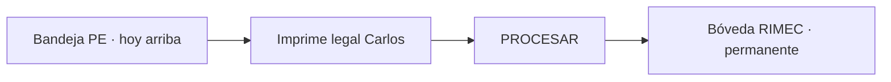

# CHUSAR — Bóveda RIMEC · Facturación Pronta entrega

**Subcuenta:** **2.3.1.9.B.2** · Padre **2.3.1.9.B** (Facturación PE)  
**Ratificado:** 2026-07-26 · orden Director **Documenta** + **despliega**  
**Report:** `/facturacion/pronta-entrega` · consulta `/facturacion/boveda`  
**Migración:** `report/migrations/186_facturacion_boveda_rimec.sql`

---

## Qué es

**Archivo operativo permanente** de FI de Pronta entrega ya procesadas por el facturador (tras imprimir el legal de Carlos).

| Concepto | Regla |
|----------|--------|
| Acción | Manual · botón grande **PROCESAR** en bandeja PE |
| Efecto | Sale de la bandeja viva · entra a `facturacion_boveda_rimec` |
| FI | **No se anula ni se borra** · `factura_interna.estado` intacto |
| Permanencia | **Registro permanente** en bóveda · este corte **sin** botón Restaurar |
| Alcance | Solo PE · tránsito fuera de alcance |

No es segunda FI ni tabla de negocio paralela: es **índice de archivo** (FK a `factura_interna`).

---

## Flujo facturador



1. Bandeja ordenada: **hoy primero** · último en entrar arriba (`created_at` DESC).
2. CSV / Ver FI / Web Bazar según necesidad.
3. Al terminar el legal de Carlos → **PROCESAR** → desaparece de bandeja.
4. Consulta en `/facturacion/boveda` (solo lectura).

---

## Modelo de datos

Tabla `facturacion_boveda_rimec`:

| Columna | Rol |
|---------|-----|
| `factura_interna_id` | UNIQUE FK → `factura_interna(id)` |
| `origen` | `pronta-entrega` (default) · `transito` reservado |
| `archivado_en` | timestamptz |
| `archivado_por` | usuario sesión |
| `nota` | opcional corta |

Bandeja viva excluye archivadas:

```sql
AND NOT EXISTS (
  SELECT 1 FROM facturacion_boveda_rimec b
  WHERE b.factura_interna_id = fi.id
)
```

---

## Código Report

| Pieza | Ruta |
|-------|------|
| Helper | `report/src/lib/facturacion/boveda.ts` |
| API | `GET/POST /api/facturacion/boveda` |
| Bandeja | `FacturacionBandejaClient.tsx` · botón PROCESAR |
| Vista | `report/src/app/facturacion/boveda/` |
| CAJA | `caja-rimec.ts` permite `/facturacion/boveda` |

Roles: mismos que Facturación PE (CAJA / Admin / DIOS).

---

## Fuera de alcance (este corte)

- Auto-archivo al CSV o Enviar Web Bazar  
- Bóveda de tránsito  
- Reversión «sacar de bóveda»  

---

## Relacionados

- Padre: [CHUSAR_FACTURACION_PRONTA_ENTREGA.md](./CHUSAR_FACTURACION_PRONTA_ENTREGA.md)  
- CSV Carlos: [CHUSAR_CSV_VENTAS_PE_CARLOS.md](./CHUSAR_CSV_VENTAS_PE_CARLOS.md)  
- CAJA: [CHUSAR_USUARIO_CAJA_RIMEC_PE.md](./CHUSAR_USUARIO_CAJA_RIMEC_PE.md)  
