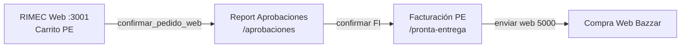

# CHUSAR — Facturación Pronta entrega · Report (2.3.1.9.B)

**Subcuenta:** **2.3.1.9.B** · Hermano **2.3.1.9.A** (proceso/tránsito)  
**Ratificado:** 2026-07-08 · orden Director **Documentación Chusar**  
**Etapa:** [ETAPA_MUDANZA_CL_FACT_DEP_REPORT.md](../../4_etapas/ETAPA_MUDANZA_CL_FACT_DEP_REPORT.md)  
**Report:** http://localhost:3000/facturacion/pronta-entrega

---

## Qué es

Segunda bandeja de **Facturación** — gemelo del hub Depósito RIMEC (2 tarjetas).

| Circuito | Ruta | Origen stock | Tabla molécula |
|----------|------|--------------|----------------|
| **Proceso** | `/facturacion/transito` | `PROCESO_PP` | PPD tránsito · Compra Legal |
| **Pronta entrega** | `/facturacion/pronta-entrega` | `STOCK_IMPORTADO` | **pedido_proveedor_detalle** (import CSV / PE) |

**Término único holding:** **Factura interna (FI)** — tabla canónica `factura_interna` + `factura_interna_detalle.ppd_id`. No crear tablas paralelas de FI.

**Excepción archivo operativo (2026-07-26):** `facturacion_boveda_rimec` (**2.3.1.9.B.2**) — índice permanente de FI ya procesadas (botón **PROCESAR**). No es segunda FI; no muta `factura_interna.estado`. Doc: [CHUSAR_FACTURACION_BOVEDA_RIMEC.md](./CHUSAR_FACTURACION_BOVEDA_RIMEC.md).

---

## Diferencia vs Compra previa (proceso)

| | Compra previa / proceso | Pronta entrega |
|---|-------------------------|----------------|
| Origen stock | Saldo PP en tránsito | Import CSV → PPD `quincena_desc = 'Pronta entrega'` |
| Espejo en PP | FI por PP×Marca×Caso vinculada a **PP específico** | FI `pp_id` NULL · `nro_factura` `PE-*` (MIG-141) |
| Compra Legal | Sí (circuito A) | **No** |
| Catálogo venta | `v_stock_rimec` | `v_stock_pe_rimec` |
| Aprobaciones | Tab Pendientes · confirmar FI | Igual · badge **PRONTA ENTREGA** |
| Facturación | `/facturacion/transito` | `/facturacion/pronta-entrega` |
| Traspaso web 5000 | Sí | Sí (mismo botón · Ley FI) |

Doc depósito: [CHUSAR_DEPOSITO_RIMEC.md](../deposito_rimec/CHUSAR_DEPOSITO_RIMEC.md)

---

## Cadena operativa PE (monitoreo)



1. **Venta web** → `pedido_venta_rimec` PENDIENTE + FI RESERVADA (`PE-*`).
2. **Aprobaciones** → confirmar FI → `pv_global` · estado CONFIRMADA.
3. **Facturación PE** → bandeja agrupada **por fecha** · expand Ley FI (Programado).
4. **Enviar Web Bazar** → traspaso → ALM_WEB_01.

CHUSAR carrito: [CHUSAR_CARRITO_PE_VALIDAR_LOCAL.md](../../2.2_rimec_web/CHUSAR_CARRITO_PE_VALIDAR_LOCAL.md)  
CHUSAR badge: [CHUSAR_APROBACIONES_PE_BADGE.md](../../2.1_control_central/modules/aprobacion_pedidos/CHUSAR_APROBACIONES_PE_BADGE.md)

---

## Discriminador SQL (canon)

Archivo: `report/src/lib/facturacion/filters.ts`

- PE: `fi.nro_factura LIKE 'PE-%'` OR `fi.pp_id IS NULL` OR PPD `quincena_desc = 'Pronta entrega'`
- Tránsito: excluye PE · requiere `fi.pp_id` + filtro Compra Legal

API: `GET /api/facturacion?origen=pronta-entrega`

---

## UI Report (2026-07-08)

| Pieza | Archivo |
|-------|---------|
| Hub 2 tarjetas | `facturacion/components/FacturacionLauncherClient.tsx` |
| Bandeja PE | `facturacion/pronta-entrega/page.tsx` |
| Bandeja compartida | `facturacion/components/FacturacionBandejaClient.tsx` |
| Queries | `lib/facturacion/queries.ts` · `getFacturasProntaEntrega()` |
| Ley FI panel | `CompraWebFiPanel` (paridad Programado) |
| Cabecera FI gerencial | `FacturaInternaCabecera.tsx` · cliente hero · descuentos |
| **CSV ventas Carlos PE** | **Descargar CSV** · [CHUSAR_CSV_VENTAS_PE_CARLOS.md](./CHUSAR_CSV_VENTAS_PE_CARLOS.md) |
| **Botón DIOS Anular + reintegrar** | Esquina superior tarjeta FI · [CHUSAR_BOTON_DIOS_ANULAR_REINTEGRAR_FI.md](./CHUSAR_BOTON_DIOS_ANULAR_REINTEGRAR_FI.md) (**2.3.1.9.C**) |

Agrupación: **por fecha** (`created_at::date`) · KPIs RESERVADA/CONFIRMADA + traspaso.

---

## CSV ventas PE (veneno Carlos · 2026-08-04)

**15 cols TSV** · col **DEPOSITO** cabecera una vez (`S00_D1|DEP2|D3`) · **Cant. Pares** por artículo.  
**Prohibido** tres columnas S00_* como cantidades. Doc: [CHUSAR_CSV_VENTAS_PE_CARLOS.md](./CHUSAR_CSV_VENTAS_PE_CARLOS.md) · [DEPOSITO cabecera](./CHUSAR_CSV_PE_DEPOSITO_CABECERA_20260804.md)

---

## Pendiente cierre

- [ ] OT implementar **botón DIOS Anular + reintegrar** (**2.3.1.9.C**) — spec Documenta 2026-07-14
- [ ] Smoke E2E: venta PE → Aprobaciones → Facturación PE → **CSV Carlos** → traspaso 5000
- [ ] Cod. Oper. legacy Carlos (`CR-6090120`) — regla pendiente Director
- [ ] FiPilaresDestaque en bandeja Facturación (5 pilares colapsado)
- [ ] Smoke import Carlos con CSV generado
- [ ] Deploy Report Vercel (CSV PE + cabecera) — Claude Code
- [ ] Rechazar duplicados PVR si aplica
- [ ] PPD `quincena_desc` canónico en todas las filas PE importadas
- [ ] MIG token one-shot confirmar (anti-duplicado)

---

## Comandos

```bash
cd report && npm run dev:3000
# Hub: http://localhost:3000/facturacion
# PE:  http://localhost:3000/facturacion/pronta-entrega
```
