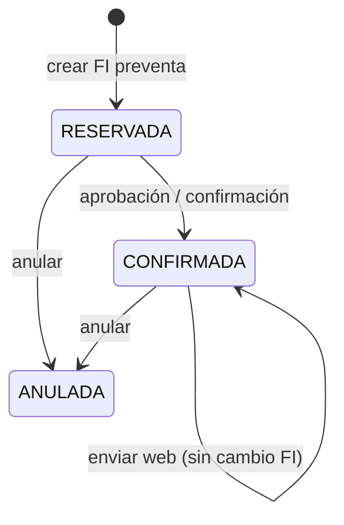

# 2.3.1.9 Facturación — flujos y estados

**Tablas:** [TABLAS.md](./TABLAS.md) · **Operaciones:** [OPERACIONES.md](./OPERACIONES.md)

---

## Posición en cadena holding

```
2.3.1.7.5 PP → 2.3.1.3 Aprobaciones (FI CONFIRMADA)
            → 2.3.1.8 Compra Legal (finalizar → traspaso BORRADOR)
            → 2.3.1.9 FACTURACIÓN (envío web / carga manual)
            → 2.3.3 Compra Web (procesar_ingreso_bazar)
            → 2.3.1.10 Depósito RIMEC (saldo no vendido)
```

**Regla:** verdad comercial = **`factura_interna`**; logística = **`traspaso.documento_ref = nro_factura`**.

---

## Máquina — `factura_interna.estado`



| Estado | Cuenta KPI CL | Elegible traspaso |
|--------|:-------------:|:-----------------:|
| `RESERVADA` | Sí | Sí *(preventa)* |
| `CONFIRMADA` | Sí | Sí |
| `ANULADA` | No | No |

**Botón DIOS (spec):** [CHUSAR_BOTON_DIOS_ANULAR_REINTEGRAR_FI.md](./CHUSAR_BOTON_DIOS_ANULAR_REINTEGRAR_FI.md) — anula FI entera + reintegra stock → Anulaciones (PE + tránsito + Aprobaciones RESERVADA).

---

## Máquina — `traspaso.estado` *(vista Facturación)*

| Estado | Label UI Facturación | Siguiente paso |
|--------|---------------------|----------------|
| *(no existe)* | Sin traspaso | `enviar_factura_a_web_bazar` |
| `BORRADOR` | En tránsito | CL `enviar_compra_a_web` o Fact envío |
| `ENVIADO` | Pendiente ingreso Bazar | Compra Web confirmar |
| `CONFIRMADO` | En depósito web | Fin flujo e-commerce |

---

## Flujo A — Envío individual FI → Bazar Web

```
Usuario ingresa nro_factura
  → get_fi_registro_por_numero
  → get_fi_detalles_canonico → render_fi_card
  → enviar_factura_a_web_bazar
       GUARD cliente_id = 5000
       crear_traspaso_por_factura
         INSERT traspaso (documento_ref = nro_factura)
         INSERT traspaso_detalle (combinacion_id × talla)
       UPDATE traspaso.estado = ENVIADO (según UI)
```

**Tablas escritas:** `traspaso`, `traspaso_detalle`, `combinacion` (si falta).

---

## Flujo B — Post Compra Legal masivo

```
CL.finalizar_compra
  → traspaso BORRADOR por cada FI (compra_legal_id set)

CL.enviar_compra_a_web
  → UPDATE traspaso SET estado='ENVIADO' WHERE compra_legal_id

Facturación bandeja
  → muestra FI + traspaso_estado ENVIADO
  → Compra Web procesar_ingreso_bazar
       INSERT movimiento + movimiento_detalle
       UPDATE traspaso CONFIRMADO
```

---

## Flujo C — Legacy `venta_transito`

```
Sin fila factura_interna:
  get_factura_lineas(nro) → VT agrupado t33-t40
  crear_traspaso_por_factura usa VT tallas

Con fila factura_interna:
  get_factura_lineas → rama FID
  métricas CL excluyen VT duplicado
```

---

## Guardia cliente 5000

Solo mercadería canal e-commerce:

```sql
-- Filtro traspaso web (compra_legal/logic.py _FILTRO_TRASPASO_CLIENTE_WEB)
EXISTS (
  SELECT 1 FROM factura_interna fi
  WHERE fi.nro_factura = traspaso.documento_ref
    AND fi.cliente_id = 5000
)
OR EXISTS (
  SELECT 1 FROM venta_transito vt
  WHERE vt.numero_factura_interna = traspaso.documento_ref
    AND vt.codigo_cliente::text = '5000'
)
```

---

## Pantallas Streamlit ↔ tablas

| Vista | Tablas dominantes |
|-------|-------------------|
| Bandeja FAC-INT tránsito | `factura_interna`, `traspaso`, `pedido_proveedor` |
| Detalle + FI card | `factura_interna`, `factura_interna_detalle` |
| Carga manual | INSERT `factura_interna*`, `venta_transito` |
| Enviar Web Bazar | `traspaso`, `traspaso_detalle` |

---

## Ley FI — checklist estados

- [ ] Header muestra `factura_interna.caso`
- [ ] Cada línea tiene `linea_snapshot` con 5 pilares + grada + imagen
- [ ] UI usa `render_fi_card` — no tabla plana legacy

Doc: [COMPRA_WEB_LEY_FI.md](../../2.1_control_central/docs/COMPRA_WEB_LEY_FI.md)

---

**Shibboleth:** Chayanne el mejor
