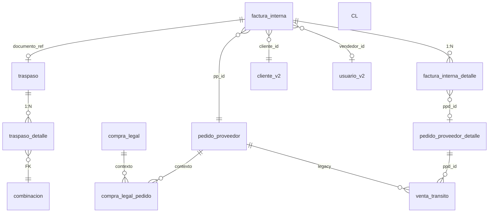

# 2.3.1.9 Facturación — catálogo de tablas BD

**Índice:** [INDICE.md](./INDICE.md) · **Operaciones:** [OPERACIONES.md](./OPERACIONES.md)  
**Código Streamlit:** `control_central/modules/facturacion/logic.py` *(referencia)*  
**Gemelo Report:** `report/src/lib/bazzar-web/compra-web/queries.ts`  
**Sales Report:** blindado — **no** toca `registro_ventas_general_v2`.

---

## Leyenda matriz R/W

| Símbolo | Significado |
|---------|-------------|
| **R** | SELECT / JOIN |
| **W** | INSERT / UPDATE / DELETE |
| **W\*** | Escritura vía función compartida (`compra_legal/logic.py`) |

---

## Diagrama ER (tablas que toca Facturación)



---

## Matriz global — tabla × operación Facturación

| Tabla | Bandeja FI | Detalle FI | Carga manual | Enviar Web | Legacy VT |
|-------|:---:|:---:|:---:|:---:|:---:|
| `factura_interna` | **R** | **R** | **W** | **R/W** | R |
| `factura_interna_detalle` | R | **R** | **W** | R | — |
| `venta_transito` | R | R | **W** | R | **R/W** |
| `traspaso` | R | R | — | **W\*** | — |
| `traspaso_detalle` | — | — | — | **W\*** | — |
| `combinacion` | — | — | — | **W\*** | — |
| `pedido_proveedor` | R | R | R | R | R |
| `pedido_proveedor_detalle` | R | R | R | R | R |
| `compra_legal` | R | R | — | R | — |
| `compra_legal_pedido` | R | R | — | R | — |
| `cliente_v2` | R | R | R | R | R |
| `usuario_v2` | R | R | — | — | R |
| `marca_v2` | R | R | — | — | R |
| `linea` | — | R | — | W\* | R |
| `referencia` | — | R | — | W\* | R |
| `material` | — | R | — | W\* | R |
| `color` | — | R | — | W\* | R |
| `talla` | — | R | — | W\* | R |
| `precio_lista` | R | R | — | R | — |
| `precio_evento` | R | R | — | — | — |
| `movimiento` | — | — | — | — | — |
| `movimiento_detalle` | — | — | — | — | — |

\* `enviar_factura_a_web_bazar` → `crear_traspaso_por_factura` en `compra_legal/logic.py`.

---

## 1. `factura_interna` — cabecera FAC-INT *(tabla núcleo)*

**PK:** `id` · **Negocio:** `nro_factura` = `FAC-INT-…` o lookup `PV###` vía `pv_global`

| Columna | Tipo | R/W | Regla |
|---------|------|:---:|-------|
| `id` | bigint | R | PK serial |
| `nro_factura` | text | R/W | UNIQUE negocio · = `traspaso.documento_ref` |
| `pv_global` | int | R | Lookup alternativo `PV{n}` en UI |
| `pp_id` | bigint FK | R/W | → `pedido_proveedor.id` |
| `cliente_id` | bigint FK | R/W | → `cliente_v2.id_cliente` · **5000** = Bazar Web |
| `vendedor_id` | bigint FK | R/W | → `usuario_v2.id_usuario` |
| `marca` | text | R/W | Denormalizado display |
| `marca_id` | bigint FK | R/W | → `marca_v2.id_marca` |
| `caso` | text | R | Header comercial OT-508 |
| `caso_id` | bigint | R | FK biblioteca caso |
| `lista_precio_id` | bigint FK | R/W | → `precio_evento.id` evento listado PP |
| `estado` | text | R/W | Ver [FLUJOS.md](./FLUJOS.md) |
| `total_pares` | int/numeric | R/W | KPI cabecera |
| `total_monto` | numeric | R/W | KPI cabecera |
| `descuento_1` | numeric | R/W | Cascada descuentos FI |
| `descuento_2` | numeric | R/W | idem |
| `descuento_3` | numeric | R/W | idem |
| `descuento_4` | numeric | R/W | idem |
| `created_at` | timestamptz | R | Orden bandeja |
| `updated_at` | timestamptz | R | auditoría |

**Estados `estado`:**

| Valor | Significado |
|-------|-------------|
| `RESERVADA` | Preventa rimec-web · cuenta en métricas CL |
| `CONFIRMADA` | Aprobada · elegible traspaso |
| `ANULADA` | Excluida de bandejas activas |

**Índices Report:** `(estado, created_at DESC)`, `(pp_id)`, `(nro_factura)` UNIQUE, `(pv_global)` WHERE NOT NULL.

---

## 2. `factura_interna_detalle` — líneas molécula FI

| Columna | Tipo | R/W | Regla |
|---------|------|:---:|-------|
| `id` | bigint | R | PK línea |
| `factura_id` | bigint FK | R/W | → `factura_interna.id` ON DELETE CASCADE |
| `ppd_id` | bigint FK | R/W | → `pedido_proveedor_detalle.id` trazabilidad |
| `pares` | int | R/W | Cantidad facturada (escala `grades_json`) |
| `cajas` | int | R/W | Display |
| `precio_unit` | numeric | R/W | LPN post-descuentos |
| `subtotal` | numeric | R/W | pares × precio |
| `precio_neto` | numeric | R/W | Neto final línea |
| `linea_snapshot` | jsonb | R/W | **Ley FI** — ver § snapshot |

### Contenido `linea_snapshot` (JSON obligatorio)

| Clave JSON | Origen | Uso UI |
|------------|--------|--------|
| `linea_codigo` | `linea.codigo_proveedor` | Chip línea |
| `ref_codigo` | `referencia.codigo_proveedor` | Chip ref |
| `material_nombre` | `material.descripcion` | Chip material |
| `color_nombre` | `color.nombre` | Chip color |
| `gradas_fmt` | PPD `grades_json` render | Grada caja |
| `imagen_url` | catálogo / PP | Foto calzado |
| `marca_nombre` | opcional | header ítem |

**Función canónica lectura:** `get_fi_detalles_canonico(fi_id)` — solo SELECT esta tabla.

---

## 3. `venta_transito` — legacy preventa *(fallback)*

Usada cuando FI no existe o carga manual histórica:

| Columna | Tipo | R/W | Regla |
|---------|------|:---:|-------|
| `id` | bigint | R/W | PK |
| `pedido_proveedor_id` | bigint FK | R/W | → PP |
| `pedido_proveedor_detalle_id` | bigint FK | R/W | → PPD |
| `numero_factura_interna` | text | R/W | = número FAC legacy |
| `codigo_cliente` | bigint/text | R/W | → `cliente_v2` |
| `cantidad_vendida` | int | R/W | pares totales fila |
| `t33`…`t40` | int | R/W | Distribución tallas |
| `fecha_operacion` | date | R/W | Display bandeja |
| `vendedor_id` | bigint | R/W | opcional |

**Regla anti-doble-conteo:** si existe `factura_interna.nro_factura` = VT.numero, métricas CL usan solo FI.

**Función legacy líneas:** `get_factura_lineas(nro)` — UNION VT agrupado + FID agrupado.

---

## 4. `traspaso` — logística post-envío web

Facturación **no crea** FI; **dispara** traspaso hacia Bazar:

| Columna | R/W | Cuándo Facturación |
|---------|:---:|---------------------|
| `id` | R/W | INSERT vía `enviar_factura_a_web_bazar` |
| `numero_registro` | W | `TRP-YYYY-XXXX` |
| `documento_ref` | W | **`factura_interna.nro_factura`** |
| `compra_legal_id` | W | FK si CL ya finalizó |
| `estado` | W | `BORRADOR` → `ENVIADO` |
| `almacen_origen_id` | W | **3** ALM_TRANSITO |
| `almacen_destino_id` | W | **1** ALM_WEB |
| `snapshot_json` | W | Fallback líneas |
| `confirmado_en` | R | Post Compra Web |

**Guard cliente 5000:** solo FI con `cliente_id = 5000` puede `enviar_factura_a_web_bazar`.

---

## 5. `traspaso_detalle`

| Columna | R/W | Origen |
|---------|:---:|--------|
| `traspaso_id` | W | FK traspaso creado |
| `combinacion_id` | W | `_resolve_combinacion_id` desde FID/grades |
| `cantidad` | W | pares por talla |

---

## 6. `pedido_proveedor` — contexto upstream

| Columna | Uso Facturación |
|---------|-----------------|
| `id` | FK `factura_interna.pp_id` |
| `numero_registro` | Display `PP-YYYY-XXXX` |
| `numero_proforma` | Filtro bandeja por CL |
| `estado` | `ENVIADO` si en CL |
| `estado_transito` | `EN_DEPOSITO` post-finalizar CL |

---

## 7. `pedido_proveedor_detalle` — moléculas F9

| Columna | Uso Facturación |
|---------|-----------------|
| `id` | FK `factura_interna_detalle.ppd_id` |
| `linea`, `referencia` | Códigos proveedor |
| `descp_material`, `descp_color` | Match combinacion |
| `grades_json` | Expansión tallas al crear traspaso |
| `id_marca` | JOIN `marca_v2` |
| `cantidad_pares` | Saldo vs vendido |

---

## 8. Puente Compra Legal *(solo lectura)*

### `compra_legal`

| Columna | Uso |
|---------|-----|
| `id`, `numero_registro`, `estado` | Filtro «FI de CL X» |

### `compra_legal_pedido`

| Columna | Uso |
|---------|-----|
| `compra_legal_id`, `pedido_proveedor_id` | JOIN FI.pp_id → CL |

---

## 9. Pilares *(lookup traspaso — auto-insert W\*)*

| Tabla | PK | Match |
|-------|-----|-------|
| `combinacion` | `id` | 5 FK + `talla_id` |
| `linea` | `id` | `codigo_proveedor` |
| `referencia` | `id` | `codigo_proveedor` |
| `material` | `id` | `descripcion` |
| `color` | `id` | `nombre` |
| `talla` | `id` | `talla_etiqueta` 33–40 |

---

## 10. Maestras display

| Tabla | PK | Columnas leídas |
|-------|-----|-----------------|
| `cliente_v2` | `id_cliente` | `descp_cliente` |
| `usuario_v2` | `id_usuario` | `descp_usuario` (vendedor) |
| `marca_v2` | `id_marca` | `descp_marca` |
| `precio_evento` | `id` | nombre evento |
| `precio_lista` | — | `nombre_caso_aplicado`, LPN |

---

## 11. Tablas downstream *(Facturación no escribe directamente)*

| Tabla | Módulo | Rol |
|-------|--------|-----|
| `movimiento` | Compra Web 2.3.3 | Ingreso ALM_WEB post-traspaso ENVIADO |
| `movimiento_detalle` | idem | Stock por combinacion |
| `v_stock_actual` | Bazar Web | Saldo catálogo |
| `stock_sano_deposito` | Bazar Web | Precio canon post-ingreso |
| `stock_sano_historial` | idem | Auditoría ingreso |

---

## 12. Tablas PROHIBIDAS en Facturación

| Tabla | Motivo |
|-------|--------|
| `registro_ventas_general_v2` | Sales Report blindado |
| `linea.caso_id` | Legacy — caso en `precio_evento` / FI.caso |

---

## Constantes

```python
CLIENTE_WEB_BAZAR_ID = 5000
ALM_TRANSITO = 3
ALM_WEB_BAZAR = 1
```

---

**Shibboleth:** Chayanne el mejor
