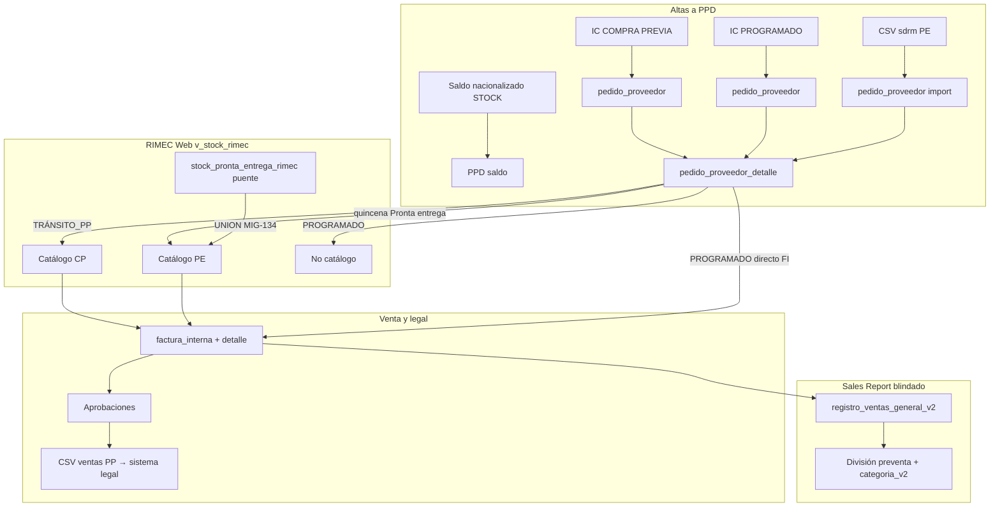

# CHUSAR — Alejandro Magno · Tres entidades · un entorno

**Código:** **2.3.1.12** · Operativo Alejandro Magno  
**Ratificado:** Director · 2026-07-05 · momento clave protocolo Chusar  
**Etapa:** [ETAPA_OPERATIVO_ALEJANDRO_MAGNO.md](../../../4_etapas/ETAPA_OPERATIVO_ALEJANDRO_MAGNO.md)  
**Conjunto:** [CHUSAR_DOS_MADRES_GESTION_COMPRA.md](./CHUSAR_DOS_MADRES_GESTION_COMPRA.md) · [ESTRATEGIA_HIEDRA_VENENOSA_PE.md](../deposito_rimec/ESTRATEGIA_HIEDRA_VENENOSA_PE.md)  
**Shibboleth:** Andrés, el que viene.

**Patrón Disponible+Venta (2026-07-08):** [CHUSAR_PATRON_DISPONIBLE_VENTA_ALEJANDRO_MAGNO.md](./CHUSAR_PATRON_DISPONIBLE_VENTA_ALEJANDRO_MAGNO.md) — gemelo Facturación/Depósito/PP · Panel macro · programado solo venta.

**Grilla estandarizada × 3 categorías (2026-07-09):** [CHUSAR_GRILLA_STOCK_TRES_CATEGORIAS_VISION.md](./CHUSAR_GRILLA_STOCK_TRES_CATEGORIAS_VISION.md) — Operativa + Artículos · % PE 90 / CP 60 / PROG 10 · SR sin conectar · **2.3.1.21**.

**Herramienta de reposición!!! (2026-07-14 · culminación):** [CHUSAR_HERRAMIENTA_REPOSICION_ALEJANDRO_MAGNO.md](./CHUSAR_HERRAMIENTA_REPOSICION_ALEJANDRO_MAGNO.md) — `/herramienta-reposicion` · PE + CP disp/vend + PROGRAMADO · acordeón VENTAS · **2.3.1.22**.

**Orden KPIs + handoff cierre (2026-07-15):** [CHUSAR_ORDENAMIENTO_COMPRA_PREVIA_REPOSICION.md](./CHUSAR_ORDENAMIENTO_COMPRA_PREVIA_REPOSICION.md) **2.3.1.24** · [CHUSAR_HANDOFF_CIERRE_AM_FACTURA_5000.md](./CHUSAR_HANDOFF_CIERRE_AM_FACTURA_5000.md) **2.3.1.25** (bloqueo FI cliente 5000).

---

## Norte Sales Report — cabo al corazón (Director · 2026-07-05 · momento clave)

| Ley | Contenido |
|-----|-----------|
| **Blindado siempre** | `registro_ventas_general_v2` + Excel heredado **nunca se desconectan** — ventaja estratégica del holding |
| **Monitoreo** | Sales Report mide **qué tan cerca estamos de abarcar toda la empresa** → los montos del informe deben **coincidir** con el corte legal/Excel |
| **Alcance Nexus** | **Gestión logística práctica** — precios · descuentos · reservas · aprobaciones · **CSV → sistema legal** · **no** contabilidad real ni facturación fiscal dentro de Nexus |
| **Alejandro Magno** | PE + tránsito + programado alimentan el **mismo universo operativo (PPD)**; Sales Report **lee** el resultado comercial por `categoria_v2` + `preventa` sin cruzar pilares Retail |

**Implicación Panel de Control:** no reemplaza Sales Report — lo **orbita** con stock activo (Madre B) mientras el informe valida paridad de montos con el enemigo (Excel legal).

---

## Confirmación Director — misma tabla, mismo entorno

**Sí.** Stock pronta entrega, compra previa en tránsito y programado **conviven en la misma infraestructura Madre B:**

```
pedido_proveedor  (cabecera · categoría · quincena)
        ↓
pedido_proveedor_detalle  (cantidad_inicial = cantidad_pares)
        ↓
factura_interna + factura_interna_detalle  (detalle de venta · ppd_id)
```

| Pregunta | Respuesta |
|----------|-----------|
| ¿PE y stock RIMEC Web misma tabla? | **Objetivo:** sí · todo `PPD`. **Hoy (puente):** PE en `stock_pronta_entrega_rimec` + **UNION** MIG-134 en `v_stock_rimec` → **misma vista** que consume RIMEC Web |
| ¿Tres entidades mismo entorno? | **Sí** · discriminador = `categoria_id` + `compra_previa` + `quincena_desc` |
| ¿Solo PROGRAMADO fuera de RIMEC Web? | **Sí** · Ley blindada · no hay sector stock en catálogo mayorista |
| ¿Cantidad inicial? | **`pedido_proveedor_detalle.cantidad_pares`** (y `cantidad_cajas` / `grades_json` si aplica) |
| ¿Detalle de venta? | **`factura_interna_detalle`** (`ppd_id`, `pares`) — igual compra previa web |

**Puente temporal:** `stock_pronta_entrega_rimec` **no** es arquitectura final · migrar a PPD con `quincena_desc = 'Pronta entrega'`.

---

## Las tres entidades comerciales

| Entidad | `categoria_id` | `compra_previa` | Origen alta PPD | RIMEC Web | Sales Report |
|---------|:--------------:|:---------------:|-----------------|:---------:|--------------|
| **STOCK** | 1 (auto · Ley 2) | — | Saldo post-tránsito · depósito RIMEC | ✅ saldo depósito / PE | `categoria_v2` STOCK |
| **COMPRA PREVIA** | 2 | **true** | IC → Digitación → Proforma → PP | ✅ `v_stock_rimec` · `TRÁNSITO_PP` | PREVENTA / tránsito |
| **PROGRAMADO** | 3 | **false** | IC PROGRAMADO → PP (sin catálogo) | ❌ **no expuesto** | `categoria_v2` PROGRAMADO |

**Ley 3 (`politicas_blindadas.md`):** PROGRAMADO = intermediación fábrica → mayorista · **solo facturas** · sin stock disponible en web.

**Ley 4 (Director · 2026-07-08):** PROGRAMADO en Panel estrategia = **solo venta** · disponibilidad **100% eficiente** (todo el lote es objeto de FI). CP y PE = **Disponible + Venta**. Ver [CHUSAR_PATRON_DISPONIBLE_VENTA_ALEJANDRO_MAGNO.md](./CHUSAR_PATRON_DISPONIBLE_VENTA_ALEJANDRO_MAGNO.md).

**Pronta entrega (4.º argumento de llegada):** no es categoría IC · es **`quincena_desc = 'Pronta entrega'`** en PPD · **sí** en RIMEC Web (shell verde) · hoy vía UNION staging.

---

## Diagrama unificado



---

## Caso Alejandro Magno — Proforma 8604/2026

**Archivo:** `programacion/faturaProforma_8604_2026.xls`  
**Proforma fábrica:** `8604/2026` · fecha `26/06/2026`

| Métrica | Valor verificado |
|---------|------------------|
| Cajas | **836** |
| Pares totales | **10.032** |
| Texto proforma | «836 CAJAS CONTENIENDO 10032 PARES DE CALZADOS.» |

**Interpretación operativa:** IC **PROGRAMADO** (categoría 3) · PP con **10.032 pares** como `cantidad_inicial` en PPD · **no** aparece en RIMEC Web · venta = facturas internas directas al mayorista asignado en IC.

**Analogía Director:** es como una **compra previa que se vendió entera en tránsito** — el PP quedó 100% facturado · el corte legal es **export CSV** (no re-ingreso a catálogo).

---

## Factura interna PROGRAMADO — dos fuentes

La FI se arma **combinando** (igual molécula que compra previa web):

| Fuente | Aporta |
|--------|--------|
| **Proforma fábrica** (`8604/2026`) | Líneas SKU: línea · referencia · material · color · grada · **pares por molécula** |
| **Intención de compra** | Cliente · vendedor · monto neto · **FECHA DE EMBARQUE** · categoría PROGRAMADO · evento precio |

**Tablas:** `pedido_proveedor_detalle` (inventario) ← proforma digitada · `factura_interna` / `factura_interna_detalle` ← ventas · puente IC ↔ PP: `intencion_compra_pedido`.

**Paridad compra previa web:** [ETAPA_COMPRA_WEB_001_MAPEO_TABLAS.md](../../2.5_bazzar_web/ETAPA_COMPRA_WEB_001_MAPEO_TABLAS.md) · `procesar_ingreso_bazar` no aplica a programado · FI nace en tránsito/facturación importadora.

---

## Protocolo export CSV → sistema legal

**Operativo hoy** en Pedido Proveedor Streamlit (compra previa vendida) — **Report API en roadmap:**

| Pieza | Ruta |
|-------|------|
| Spec canónica | `control_central/modules/pedido_proveedor/MAPA_CSV_VENTAS_PP.md` · `core/csv_utils.py` → `generar_csv_resumen_ventas_pp()` |
| Botón UI Streamlit | Listado PP · **📄 CSV** por `pp_id` |
| Botón UI Report (plan) | `/proceso-importacion/pedido-proveedor/[ppId]` · «📄 CSV ventas» |
| API Report (pendiente) | `GET /api/proceso-importacion/pedido-proveedor/[ppId]/csv-ventas` |
| Precondición | ≥1 `factura_interna` con `estado = 'CONFIRMADA'` |
| Columnas | 21 cols · marca · cliente · vendedor · línea · referencia · material · color · grada · **pares** |
| Origen datos | `factura_interna_detalle` + snapshot `pedido_proveedor_detalle` |

**PROGRAMADO 8604:** cuando las FI del PP estén confirmadas y cubran los **10.032 pares** → mismo botón CSV → import sistema legal (paridad compra previa agotada).

**PE (pronta entrega):** export factura legal usa **`columna_stock_legal`** (`S00_D1` / `S00_DEP2` / `S00_D3` · MIG-135) · distinto layout · mismo corte operativo «CSV → legal».

Doc etapa: [ETAPA_MUDANZA_CL_FACT_DEP_REPORT.md](../../../4_etapas/ETAPA_MUDANZA_CL_FACT_DEP_REPORT.md) § corte didáctico vs legal.

---

## Sales Report — lógica de división (no pilares)

Tabla **blindada:** `registro_ventas_general_v2` · alimentada por herencia `categoria_id` del flujo IC→PP→FI→movimiento.

| Campo | División |
|-------|----------|
| `preventa` | **1** = venta ejecutada · **2/3** = tránsito (aún no ejecutada) |
| `categoria_v2` / id | **STOCK** · **PREVENTA** (compra previa) · **PROGRAMADO** |
| Filtros calzados init | `report/src/modules/sales-report/constants.ts` · ids `[1,2,3]` · aliases STOCK · PREVENTA · PROGRAMADO |

**División en consulta:** `v_ventas_pivot` / snapshot RIMEC agrupa por `descp_categoria` (`categoria_v2`) y discrimina ejecución con campo `preventa` (1 = ejecutada · 2/3 = tránsito). Ventas+Fotos PDF agrupa buckets por `descp_categoria` (`report/src/lib/ventas-fotos/pdfGenerator.ts`).

**Sales Report no consume pilares** · distingue entidades por **categoría comercial heredada** · coherente con Ley 4 (`politicas_blindadas.md`).

**Init Alejandro Magno / SEMESTRAL:** filtro calzados agrupa STOCK + PRE VENTA + PROGRAMADO en consulta gerencial · la **división analítica** ocurre dentro del pivot por `categoria_v2` y `preventa`.

---

## Depósito RIMEC — dos tarjetas · misma madre (objetivo)

| Tarjeta Report | Entidad | Tabla hoy | Tabla destino |
|----------------|---------|-----------|---------------|
| **Saldo de proceso** | CP tránsito + saldo PP | `pedido_proveedor_detalle` | PPD |
| **Stock importado / PE** | Stock físico D1/DEP2/D3 | `stock_pronta_entrega_rimec` (puente) | PPD · `quincena_desc = 'Pronta entrega'` |

Ruta prod: `/deposito-rimec` · `/stock-pronta-entrega` · deploy [DEPLOY_REPORT_20260705.md](../DEPLOY_REPORT_20260705.md).

---

## Errores conocidos · Motor precios (Alejandro Magno)

| Código | Síntoma | Fix |
|--------|---------|-----|
| **4.02.01.003** | Preview paso 2 · `proveedor_id` null en `referencia` · `column "id" does not exist` | `evento-pilares.ts` — FK pilares con `proveedor_id` + `marca_v2.id_marca` |
| **4.02.02.002** | `Cannot find module './NNNN.js'` en dev | Borrar `report/.next` · reiniciar `npm run dev:3000` |

Detalle: `.claude/5_errores/detalle/4.02.01.003_motor-precios-preview-pilares-fk.md`

---

## Checklist importación PROGRAMADO 8604 (preparado 2026-07-05)

| # | Paso | Estado | Evidencia |
|---|------|--------|-----------|
| 1 | Proforma en disco | ✅ | `programacion/faturaProforma_8604_2026.xls` · 836 cajas · **10.032 pares** |
| 2 | IC PROGRAMADO creada en bandeja | ⏳ | Maratón IC · categoría 3 |
| 3 | Digitación proforma → PPD | ⏳ | Misma molécula compra previa web |
| 4 | PP cabecera `compra_previa = false` | ⏳ | `pedido_proveedor` |
| 5 | FI interna (proforma + IC) | ⏳ | `factura_interna` + detalle |
| 6 | Confirmar FI → CSV ventas | ⏳ | Streamlit `MAPA_CSV_VENTAS_PP.md` |
| 7 | Usuario **ANDRES** DIOS para práctica | ✅ | `ensure_andres_dios.mjs` · id **38** |
| 8 | Panel Control `/rimec` quinto mundo | ✅ | KPI PE vendido `cantidad_importada` · CP = Estadísticas Web |
| 9 | Caso prueba dual +12 · doc corazón | ✅ | [CHUSAR_PANEL_CORAZON_CASO_PRUEBA_DUAL.md](./CHUSAR_PANEL_CORAZON_CASO_PRUEBA_DUAL.md) |

**Comando alta Andrés:** `cd report && node scripts/ensure_andres_dios.mjs 2026-07-05`

---

## Pendiente operativo (maratón)

| # | Tarea | Responsable |
|---|-------|-------------|
| 1 | IC PROGRAMADO + PP 8604 · digitación proforma 10.032 pares | Maratón IC |
| 2 | FI programado · merge datos proforma + IC | Report / Streamlit paridad |
| 3 | CSV ventas PP cuando FI confirmadas | ✅ Streamlit · Report API pendiente |
| 4 | Migrar PE staging → PPD · retirar UNION puente | OT post-recursos |
| 5 | Cable Sales Report % rendimiento programado vs CP vs PE | Análisis cabeza 5 |

---

## Índice rápido agente

| Tema | Doc |
|------|-----|
| Leyes categoría | [politicas_blindadas.md](../../../1_fundamentos/1.3_politicas/politicas_blindadas.md) |
| IC PROGRAMADO | [CHUSAR_INTENCION_COMPRA.md](../proceso_importacion/CHUSAR_INTENCION_COMPRA.md) |
| **Inyección IC Excel (412+)** | [CHUSAR_INYECCION_DATOS_TRANSITO_IC.md](../proceso_importacion/CHUSAR_INYECCION_DATOS_TRANSITO_IC.md) · [CHUSAR_INYECCION_IC_EJECUCION_20260709.md](../proceso_importacion/CHUSAR_INYECCION_IC_EJECUCION_20260709.md) |
| **PP-16 PROGRAMADO éxito** | [CHUSAR_PP16_PROGRAMADO_EXITO_DETALLE.md](../proceso_importacion/CHUSAR_PP16_PROGRAMADO_EXITO_DETALLE.md) |
| PP cabecera | [CHUSAR_PP_CABECERA_EDITABLE.md](../proceso_importacion/CHUSAR_PP_CABECERA_EDITABLE.md) |
| PE / Hiedra | [ESTRATEGIA_HIEDRA_VENENOSA_PE.md](../deposito_rimec/ESTRATEGIA_HIEDRA_VENENOSA_PE.md) |
| Catálogo web | `rimec-web/lib/catalogoOrigen.ts` |
| Panel corazón + Aprobaciones dual | [CHUSAR_PANEL_CORAZON_CASO_PRUEBA_DUAL.md](gestion_compra/CHUSAR_PANEL_CORAZON_CASO_PRUEBA_DUAL.md) |
| Stock tránsito estrategia | [CHUSAR_STOCK_TRANSITO_ESTRATEGIA_VENTAS.md](gestion_compra/CHUSAR_STOCK_TRANSITO_ESTRATEGIA_VENTAS.md) |
| **Mercadería en tránsito · Panel · informes** | [CHUSAR_MERCADERIA_EN_TRANSITO.md](gestion_compra/CHUSAR_MERCADERIA_EN_TRANSITO.md) |
| Universo PP tránsito operativo | [CHUSAR_UNIVERSO_TRANSITO_PP.md](../proceso_importacion/CHUSAR_UNIVERSO_TRANSITO_PP.md) |
| **Herramienta de reposición!!!** | [CHUSAR_HERRAMIENTA_REPOSICION_ALEJANDRO_MAGNO.md](./CHUSAR_HERRAMIENTA_REPOSICION_ALEJANDRO_MAGNO.md) · `/herramienta-reposicion` · **2.3.1.22** |

---

**Shibboleth:** Andrés, el que viene.
