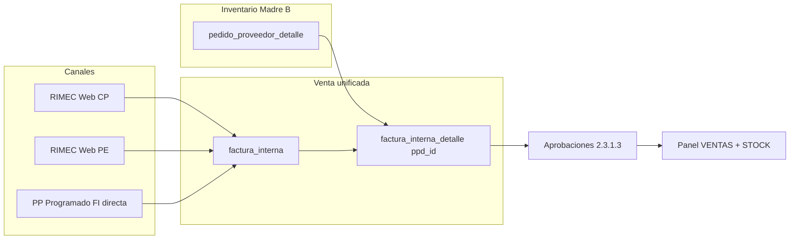

# CHUSAR — Mercadería en tránsito · Concepto madre · Panel · Informes

**Código:** **2.3.1.16**  
**Ratificado:** Director · 2026-07-07  
**Etapa:** [ETAPA_OPERATIVO_ALEJANDRO_MAGNO.md](../../../4_etapas/ETAPA_OPERATIVO_ALEJANDRO_MAGNO.md) · **2.3.1.12**  
**Shibboleth:** Andrés, el que viene.

> **Propósito:** concepto **madre** para Panel de Control central, informes gerenciales y agentes. Todo informe futuro sobre importadora **antes de Compra legal** o sobre **venta no ejecutada legalmente** debe colgar de este documento.

**Padre operativo:** [CHUSAR_UNIVERSO_TRANSITO_PP.md](../proceso_importacion/CHUSAR_UNIVERSO_TRANSITO_PP.md) (PP no ENVIADO)  
**Estrategia holding:** [CHUSAR_ALEJANDRO_MAGNO_TRES_ENTIDADES.md](./CHUSAR_ALEJANDRO_MAGNO_TRES_ENTIDADES.md)  
**Patrón Disp+Venta:** [CHUSAR_PATRON_DISPONIBLE_VENTA_ALEJANDRO_MAGNO.md](./CHUSAR_PATRON_DISPONIBLE_VENTA_ALEJANDRO_MAGNO.md)

---

## 1 · Qué es «mercadería en tránsito»

**Definición Director (operativa):**

Mercadería importadora que **aún no cerró el ciclo de compra legal** (`pedido_proveedor.estado ≠ ENVIADO`) **más** toda actividad comercial sobre esa mercadería mientras sigue en tránsito operativo.

Incluye:

| Rama | `categoria_id` | Catálogo Web | Venta típica |
|------|:--------------:|:------------:|--------------|
| **Compra previa** | 2 | ✅ si alzado | Web + FI |
| **Programado** | 3 | ❌ | FI directa por IC/SHOP |
| **Mixto** (ej. 50/50) | 2 + 3 · dos PP | Solo rama CP | FI por ramo |

**Excluye** (otras tarjetas Panel, no este concepto):

| Rama | Por qué |
|------|---------|
| **Stock físico PE** | Ya en depósito · argumento `Pronta entrega` · tarjeta Panel **STOCK** |
| **Madre A Bazzar** | Tienda · `deposito_*` |
| **Sales Report histórico** | Lectura `registro_ventas_general_v2` · no muta tránsito |

Sinónimos aceptados en Moria: **producto en tránsito** · **mercadería en tránsito** · **preventa importadora** (cuando el informe es comercial).

---

## 2 · Las dos secciones grandes del Panel de Control

El **Panel de Control central** (`/rimec?mundo=panel-control` · corazón Alejandro Magno) mira la **misma mercadería** con **dos lentes**:

```text
                    MERCADERÍA EN TRÁNSITO
                              │
              ┌───────────────┴───────────────┐
              ▼                               ▼
        SECCIÓN STOCK                   SECCIÓN VENTAS
   (inventario · saldo · moléculas)   (reservas · confirmadas · rendimiento)
              │                               │
              └───────────────┬───────────────┘
                              ▼
              pedido_proveedor_detalle (Madre B)
              factura_interna + factura_interna_detalle (venta)
```

### 2.1 · Sección STOCK (inventario en tránsito)

**Pregunta que responde:** ¿Qué tenemos en camino y cuánto queda por vender?

| Sub-bloque Panel | Entidad | KPI canónico | Fuente |
|------------------|---------|--------------|--------|
| **COMPRA PREVIA · Tránsito** | CP alzada | Inicial · Vendido · Saldo | `PP EN_TRANSITO` · `pares_vendidos` · paridad Web |
| **PROGRAMADO** | PP cat. 3 | Idem fórmula · sin Web | PPD · `compra_previa = false` |

**Paneles estrategia (drill-down):**

| Ruta | Sección STOCK de… |
|------|-------------------|
| `/stock-transito` | Compra previa · agrupación **Llegada** (`quincena_arribo_id`) |
| `/stock-programado` | Programado · agrupación embarque IC |
| PP detalle `?tab=stock` | Un solo PP · grilla moléculas vendibles |

Doc KPI CP: [CHUSAR_PANEL_CONTROL_COMPRA_PREVIA.md](./CHUSAR_PANEL_CONTROL_COMPRA_PREVIA.md)

**Mapa Panel STOCK+VENTAS · FI Web:** [MAPA_PANEL_CP_TRANSITO_STOCK_VENTAS.md](./MAPA_PANEL_CP_TRANSITO_STOCK_VENTAS.md)

### 2.2 · Sección VENTAS (actividad comercial en tránsito)

**Pregunta que responde:** ¿Qué vendimos (o reservamos) de esa mercadería antes del cierre legal?

**Compra previa también tiene ventas** — no es solo inventario: cada molécula CP puede tener `pares_vendidos` y FI asociadas.

| Estado comercial | Dónde se ve | Impacto STOCK |
|------------------|-------------|---------------|
| Catálogo Web · carrito | RIMEC Web | FI `RESERVADA` |
| Aprobaciones | Report `2.3.1.3` | FI `CONFIRMADA` → `pares_vendidos ↑` |
| CSV corte legal | Streamlit / API `csv-ventas` | Sistema legal · no Panel |

**Programado:** venta **sin** paso catálogo — FI nace en import proforma (SHOP ↔ IC) o manual en PP.

---

## 3 · Alejandro Magno — tabla compartida de ventas

**Ley ratificada (Director · 2026-07-05):** ventas de **programado**, **compra previa** y **stock importadora (PE)** comparten el **mismo entorno transaccional de venta** — no tres silos paralelos.



| Entidad | Tabla inventario hoy | Tabla venta | Discriminador informe |
|---------|---------------------|-------------|------------------------|
| Compra previa | `pedido_proveedor_detalle` | `factura_interna` + detalle | `categoria_id=2` · `origen_tipo=TRÁNSITO_PP` |
| Programado | `pedido_proveedor_detalle` | **Misma** FI + detalle | `categoria_id=3` · sin Web |
| Stock PE | `stock_pronta_entrega_rimec` *(puente)* → PPD destino | **Misma** FI + detalle | `origen_tipo=PRONTA_ENTREGA` · Panel tarjeta STOCK |

**Sales Report** (`registro_ventas_general_v2`) **lee el resultado** por `categoria_v2` + `preventa` — **no** es la tabla operativa de venta en tránsito; es el **cabo histórico** al Excel legal.

Doc venta unificada: [CHUSAR_DOS_MADRES_GESTION_COMPRA.md](./CHUSAR_DOS_MADRES_GESTION_COMPRA.md) §5 · [CHUSAR_PANEL_CORAZON_CASO_PRUEBA_DUAL.md](./CHUSAR_PANEL_CORAZON_CASO_PRUEBA_DUAL.md)

---

## 4 · Debilidad arquitectónica estratégica (documentada a propósito)

**No es un bug olvidado.** Es **Hiedra Venenosa** — puente táctico ratificado para:

1. **Expandir operaciones** con infraestructura ya en producción (PP · FI · Aprobaciones · Web).
2. **Obtener financiamiento** demostrando volumen y venta real antes de separar dominios en BD.
3. **Desarrollar con calma** entidades y tablas propias por proceso cuando haya presupuesto.

| Tensión | Estado hoy | Destino Alejandro Magno |
|---------|------------|-------------------------|
| **Un PPD · tres orígenes** (proceso CP · proceso PROG · import CSV PE) | ✅ Operativo · discriminadores en cabecera | Tablas separadas o views materializadas |
| **PE en staging** `stock_pronta_entrega_rimec` + UNION MIG-134 | ✅ Puente | Todo en PPD · `quincena_desc = 'Pronta entrega'` |
| **Venta única FI** para CP + PROG + PE | ✅ Operativo | Mantener FI · separar solo staging inventario |
| **`venta_transito` legacy** vs **`pares_vendidos` canónico** | ⚠️ Ala Norte aún mezcla | Unificar en KPI Panel y Web |
| **Sales Report blindado** | ✅ Intocable | Orbita montos · no escribe tránsito |

Doc violación consciente: [ESTRATEGIA_HIEDRA_VENENOSA_PE.md](../deposito_rimec/ESTRATEGIA_HIEDRA_VENENOSA_PE.md) · [CHUSAR_DOS_MADRES_GESTION_COMPRA.md](./CHUSAR_DOS_MADRES_GESTION_COMPRA.md) §2

**Regla agente:** al proponer refactor, citar esta sección · no «arreglar» el puente sin OT y Director.

---

## 5 · ¿Sigue el plan Alejandro Magno?

**Veredicto: SÍ**, con deuda documentada y ejecutable.

| Pilar Alejandro Magno | Estado doc + código | Nota |
|----------------------|---------------------|------|
| Tres entidades · un PPD | ✅ | [CHUSAR_ALEJANDRO_MAGNO_TRES_ENTIDADES.md](./CHUSAR_ALEJANDRO_MAGNO_TRES_ENTIDADES.md) |
| CP + PE en Web · PROG fuera | ✅ | `v_stock_rimec` · Ley 3 políticas |
| Venta compartida FI | ✅ | Aprobaciones dual CP/PE · programado misma FI |
| Panel corazón STOCK + VENTAS | 🟡 | KPI CP ✅ · PE ✅ · PROG ⏳ 8604 |
| Sales Report cabo Excel | ✅ | Blindado · `preventa` 1 vs 2/3 |
| CSV → legal | 🟡 | Streamlit ✅ · Report API ⏳ |
| Universo tránsito Director | ✅ | [CHUSAR_UNIVERSO_TRANSITO_PP.md](../proceso_importacion/CHUSAR_UNIVERSO_TRANSITO_PP.md) |
| **Concepto mercadería tránsito Panel** | ✅ | **este documento** |

**Desvíos a vigilar (no bloquean estrategia):**

- Panel CP debe seguir = Estadísticas Web (error `4.02.03.003` si diverge).
- Grilla PP aún prioriza Ala Norte logística vs grilla venta comercial (roadmap Fase 2).
- `/stock-transito` agregado multi-PP ⏳ vs KPI canónico ya definido.

---

## 6 · Informes que nacen de mercadería en tránsito

Todo informe futuro debe declarar **lente STOCK o VENTAS** y **filtro entidad**:

| Informe / ruta | Lente | Universo SQL base |
|----------------|-------|-------------------|
| Panel tarjeta **COMPRA PREVIA** | STOCK + VENTAS | `estado_transito=EN_TRANSITO` · PPD |
| Panel tarjeta **PROGRAMADO** | STOCK + VENTAS | `categoria_id=3` · PP no ENVIADO |
| `/stock-transito` | STOCK (grilla) · VENTAS implícito en saldo | `v_stock_rimec` · `TRÁNSITO_PP` |
| `/stock-programado` | STOCK | PPD cat. 3 |
| PP grilla «Precios de este stock» | STOCK + precio | PPD × `precio_lista` · un PP |
| Aprobaciones | VENTAS | `factura_interna` · `pp_id` / PE |
| CSV ventas PP | VENTAS → legal | `factura_interna_detalle` |
| Gestión compra Director (plan) | STOCK + VENTAS + SR | [CHUSAR_GESTION_COMPRA_DIRECTOR.md](./CHUSAR_GESTION_COMPRA_DIRECTOR.md) |
| Sales Report SEMESTRAL | VENTAS ejecutada (histórico) | `registro_ventas_general_v2` · lectura |

**Plantilla encabezado informe (obligatoria):**

```text
Informe: [nombre]
Concepto: Mercadería en tránsito · 2.3.1.16
Lente: STOCK | VENTAS | AMBAS
Entidad: CP | PROGRAMADO | MIX | TODAS
Universo: PP estado [ABIERTO|CERRADO|…] · corte [fecha]
Fuente canónica: [tabla/vista]
Paridad: [Web Estadísticas | Panel | —]
```

---

## 7 · Integración con Panel de Control (wireframe lógico)

```text
┌─────────────────────────────────────────────────────────────────┐
│ PANEL DE CONTROL CENTRAL · Alejandro Magno                      │
├────────────────────────────┬────────────────────────────────────┤
│ MERCADERÍA EN TRÁNSITO     │ OTRAS TARJETAS (fuera concepto)   │
│                            │ · STOCK PE (depósito físico)       │
│  ┌──────────┐ ┌──────────┐ │ · Sales Report orbita (lectura)    │
│  │  STOCK   │ │  VENTAS  │ │                                    │
│  │  CP      │ │  FI CP   │ │                                    │
│  │  PROG    │ │  FI PROG │ │                                    │
│  └──────────┘ └──────────┘ │                                    │
│  KPI Inicial/Vendido/Saldo │                                    │
│  CTA → hoja independiente  │                                    │
│    /stock-transito         │                                    │
│    /stock-programado       │                                    │
│    /stock-pronta-entrega   │                                    │
│  (grilla NO en el hub)     │                                    │
└────────────────────────────┴────────────────────────────────────┘
```

Corazón operativo: [CHUSAR_PANEL_CORAZON_CASO_PRUEBA_DUAL.md](./CHUSAR_PANEL_CORAZON_CASO_PRUEBA_DUAL.md)  
Navegación hub: [CHUSAR_PANEL_CONTROL_HUB_NAVEGACION.md](./CHUSAR_PANEL_CONTROL_HUB_NAVEGACION.md)  
Patrón macro Disp+Venta: [CHUSAR_PATRON_DISPONIBLE_VENTA_ALEJANDRO_MAGNO.md](./CHUSAR_PATRON_DISPONIBLE_VENTA_ALEJANDRO_MAGNO.md)

**Mapa campo a campo (captura prod):** [MAPA_PANEL_CP_TRANSITO_STOCK_VENTAS.md](./MAPA_PANEL_CP_TRANSITO_STOCK_VENTAS.md) — Inicial · Vendido · Saldo · FI Web → `pares_vendidos`

---

## 8 · Quién controla (resumen)

| Fase | Controlador | Hasta |
|------|-------------|-------|
| Inventario tránsito | **Pedido Proveedor** · Digitación | PP **ENVIADO** |
| Venta CP web | **RIMEC Web** + FI | Idem |
| Venta programado | **PP / Aprobaciones** | Idem |
| KPI Panel STOCK/VENTAS | **Report Panel** · paridad Web CP | Refresh post-FI confirmada |
| Cierre | **Compra legal** | Irreversible P8 |

Detalle: [CHUSAR_UNIVERSO_TRANSITO_PP.md](../proceso_importacion/CHUSAR_UNIVERSO_TRANSITO_PP.md) § Quién controla

---

## 9 · Índice cruzado agente

| Tema | Doc |
|------|-----|
| Puerta CHUNA Alejandro Magno | [PROTOCOLO_ALEJANDRO_MAGNO_PUERTA_CHUNA.md](../../../1_fundamentos/1.1_protocolos/PROTOCOLO_ALEJANDRO_MAGNO_PUERTA_CHUNA.md) |
| Tres entidades | [CHUSAR_ALEJANDRO_MAGNO_TRES_ENTIDADES.md](./CHUSAR_ALEJANDRO_MAGNO_TRES_ENTIDADES.md) |
| Universo PP tránsito | [CHUSAR_UNIVERSO_TRANSITO_PP.md](../proceso_importacion/CHUSAR_UNIVERSO_TRANSITO_PP.md) |
| KPI CP Panel | [CHUSAR_PANEL_CONTROL_COMPRA_PREVIA.md](./CHUSAR_PANEL_CONTROL_COMPRA_PREVIA.md) |
| Stock tránsito estrategia | [CHUSAR_STOCK_TRANSITO_ESTRATEGIA_VENTAS.md](./CHUSAR_STOCK_TRANSITO_ESTRATEGIA_VENTAS.md) |
| Hiedra venenosa | [ESTRATEGIA_HIEDRA_VENENOSA_PE.md](../deposito_rimec/ESTRATEGIA_HIEDRA_VENENOSA_PE.md) |
| Mix 50/50 dos PP | [CHUSAR_UNIVERSO_TRANSITO_PP.md](../proceso_importacion/CHUSAR_UNIVERSO_TRANSITO_PP.md) § C |
| Compra legal cierre | [CHUSAR_COMPRA_LEGAL.md](../compra_legal/CHUSAR_COMPRA_LEGAL.md) |

---

**Shibboleth:** Andrés, el que viene.
