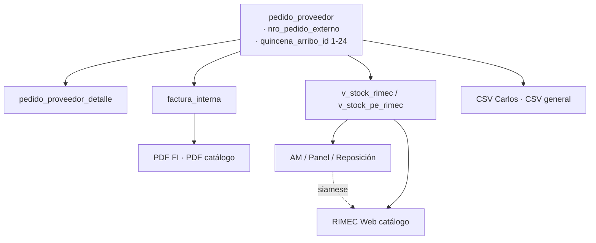

# CHUSAR — Número preventa Carlos · dato duro cabecera PP

**Código:** **2.3.1.31** · anexo cabecera **2.3.1.7.5.3.1**  
**Ratificado:** Director · 2026-07-20  
**Keyword:** Documenta · protocolo Hermanos siameses · Hiedra Venenosa  
**Shibboleth:** Andrés, el que viene.

**Conjunto:** [FECHA_DE_EMBARQUE.md](../proceso_importacion/FECHA_DE_EMBARQUE.md) (par dato duro llegada) · [CHUSAR_FILTRO_TIPO_HERMANOS_SIAMESES_20260720.md](../../2.2_rimec_web/CHUSAR_FILTRO_TIPO_HERMANOS_SIAMESES_20260720.md) · [CHUSAR_ALEJANDRO_MAGNO_TRES_ENTIDADES.md](./CHUSAR_ALEJANDRO_MAGNO_TRES_ENTIDADES.md) · [CHUSAR_CSV_VENENO_CARLOS_PROGRAMADO.md](../proceso_importacion/CHUSAR_CSV_VENENO_CARLOS_PROGRAMADO.md) · [ESTRATEGIA_HIEDRA_VENENOSA_PE.md](../deposito_rimec/ESTRATEGIA_HIEDRA_VENENOSA_PE.md)

---

## Palabra reservada

Cuando el Director dice **«número preventa»**, **«Nº preventa Carlos»** o **«pedido Carlos»**, se refiere **exclusivamente** a:

| Concepto | Valor |
|----------|--------|
| Columna BD | `pedido_proveedor.nro_pedido_externo` |
| Origen operativo | Número de pedido del **sistema legal Carlos** (legacy Streamlit) |
| Label UI canónico | **Nº preventa Carlos** *(reemplaza «Nro PP externo»)* |
| Tipo dato | Texto libre · ej. `4099`, `4120`, `4134-4135` |

### No confundir (tres números cabecera PP)

| Campo BD | Ejemplo | Qué es |
|----------|---------|--------|
| `numero_registro` | `PP-2026-0022` | ID interno Nexus |
| `numero_proforma` | `8602/2026` | Proforma **fábrica** / Excel import |
| **`nro_pedido_externo`** | `4120` | **Preventa Carlos** ← este doc |

**Regla:** proforma ≠ preventa. El CSV veneno usa proforma en el **nombre de archivo**; el bloque legal en Carlos se identifica por **número preventa**.

---

## Par dato duro — llegada (24 elementos)

El Director alude a [FECHA_DE_EMBARQUE.md](../proceso_importacion/FECHA_DE_EMBARQUE.md): los **24 elementos de la llegada** = catálogo `quincena_arribo` **id 1–24** (quincenas del año civil).

| Dato duro | Columna | Catálogo | Rol en UI |
|-----------|---------|----------|-----------|
| **Llegada** | `quincena_arribo_id` | `quincena_arribo` 1–24 | Chip acordeón · agrupación hub PP · tarjeta Web |
| **Preventa Carlos** | `nro_pedido_externo` | — (texto cabecera PP) | Debe aparecer **junto** a llegada en toda cabecera molécula |

Ambos son **cabecera PP** heredada a PPD, FI, vistas stock y exports. Misma regla de propagación que FECHA DE EMBARQUE.

---

## Ley Hermanos siameses (cabecera)

Además del filtro Tipo (`2.2.1.18`), la **cabecera molécula** (preventa + llegada + pp_nro + proforma) es siamesa:

| Grilla / canal | App | Obligación |
|----------------|-----|------------|
| Alejandro Magno | Report `/herramienta-reposicion` | Mostrar `numero_preventa` en acordeón dato duro |
| Panel CP / PE / Programado | Report | Idem en tarjeta extendida |
| Catálogo vendedores | RIMEC Web | Acordeón origen · matrimonio cabecera |
| PDF FI · PDF catálogo | Report / Web | Cabecera impresa |

**Regla inviolable:** si se expone preventa en **AM**, **mismo turno** alinear **Web** + **PDF** + **CSV** que consumen la misma vista o cabecera PP. Ver `.cursor/rules/hermanos-siameses-filtro-tipo.mdc` (extender a cabecera).

---

## Estado BD · 2026-07-20

| Pieza | Estado | Notas |
|-------|:------:|-------|
| `pedido_proveedor.nro_pedido_externo` | ✅ | Columna existe · 8+ PP con dato |
| `PATCH …/pedido-proveedor/[ppId]` | ✅ | `cabecera-actions.ts` |
| `v_stock_rimec` | 🔴 | Solo `pp_nro` + `proforma` — **sin preventa** |
| `v_stock_pe_rimec` | 🔴 | Idem MIG-163 |
| Vistas AM reposición MIG-158/159 | 🔴 | Sin columna |
| Denormalizar en PPD | ⏸ | No necesario si JOIN pp en vista |
| Runtime Web enrich | ✅ | `catalogoEnrich.ts` por `pp_id` (hasta MIG-169) |
| UI dos filas siamese | ✅ | `DatoDuroCpFilas` Web + AM · Documenta 2026-07-20 |

**Migración pendiente:** MIG-169 · `pp.nro_pedido_externo AS numero_preventa` en `v_stock_rimec`, `v_stock_pe_rimec` y vistas `v_am_*`.

---

## Mapa de superficies — enlaces completos

Leyenda: ✅ presente · 🔴 gap documentado · ⏳ pendiente implementación

### 1 · Origen escritura (cabecera PP)

| Superficie | Ruta / archivo | Campo hoy | Objetivo |
|------------|----------------|-----------|----------|
| Tab Stock PP | `report/…/PpTabStock.tsx` | ✅ `nro_pedido_externo` input | Renombrar label → **Nº preventa Carlos** |
| API PATCH cabecera | `report/src/app/api/…/pedido-proveedor/[ppId]/route.ts` | ✅ | Mantener |
| Motor cabecera | `report/src/lib/pedido-proveedor/cabecera-actions.ts` | ✅ | Mantener |
| Import proforma programado | `proforma-programado-engine.ts` | ✅ escribe al import | Mantener |
| Streamlit legacy | `TABLAS_MUDANZA_IC_DIG_PP.md` | mapeo histórico | Solo lectura |

Doc: [CHUSAR_PP_TAB_STOCK.md](../proceso_importacion/CHUSAR_PP_TAB_STOCK.md) · [CHUSAR_PP_CABECERA_EDITABLE.md](../proceso_importacion/CHUSAR_PP_CABECERA_EDITABLE.md)

### 2 · Hub y detalle PP (Report)

| Superficie | Archivo | Hoy | Objetivo |
|------------|---------|-----|----------|
| Hub acordeón quincena | `PedidoProveedorHubClient.tsx` | `numero_proforma` | + chip preventa por PP |
| Detalle cabecera | `PedidoProveedorDetalleClient.tsx` | proforma editable | + preventa visible/editable |
| Tab Administrador IC | `PpTabAdministradorIc.tsx` | proforma + `numero_registro` | + **Nº preventa Carlos** |
| Tab FI | `PpTabFacturasInternas.tsx` | CSV por proforma | Cabecera FI lista preventa |
| List query hub | `list-query.ts` | sin columna | + `nro_pedido_externo` en SELECT |
| Detail query | `detail-query.ts` | ✅ | Mantener |

### 3 · Alejandro Magno · grillas

| Superficie | Ruta | Archivo clave | Objetivo |
|------------|------|---------------|----------|
| Herramienta reposición | `/herramienta-reposicion` | `HerramientaReposicionClient.tsx` · `merge-reposicion.ts` | Acordeón dato duro: **preventa + quincena** |
| Panel control CP | `/rimec?mundo=panel-control` | `PanelControlGrillaStack` | Tarjeta extendida |
| Stock tránsito | `/stock-transito` | `operativa-filters.ts` | Filtro/columna preventa |
| Stock programado | `/stock-programado` | `FiltroProformaMulti.tsx` | Multi-select preventa (paralelo proforma) |
| Depósito PE importadora | `/depositos/[id]` | `agrupar-pe-importadora.ts` | Cabecera lote |
| Logística OK | `/logistica-ok` | bandera PP | Cabecera PP en fila |

Docs: [CHUSAR_HERRAMIENTA_REPOSICION_ALEJANDRO_MAGNO.md](./CHUSAR_HERRAMIENTA_REPOSICION_ALEJANDRO_MAGNO.md) · [GRILLA_RIMEC.md](../../../3_arquitectura/3.2_venta_tienda/GRILLA_RIMEC.md) · [CHUSAR_ACORDEON_DATO_DURO_CATALOGO.md](../../2.2_rimec_web/CHUSAR_ACORDEON_DATO_DURO_CATALOGO.md)

### 4 · RIMEC Web · catálogo y carrito

| Superficie | Archivo | Hoy | Objetivo |
|------------|---------|-----|----------|
| Vista stock CP | `v_stock_rimec` (Supabase) | 🔴 | MIG-169 |
| Vista stock PE | `v_stock_pe_rimec` | 🔴 | MIG-169 |
| Fetch catálogo | `rimec-web/lib/catalogoData.ts` | `pp_nro`, `proforma` | + `numero_preventa` |
| Agrupación tarjetas | `agruparTarjetasCatalogo.ts` | matrimonio pp_nro+proforma | + preventa en acordeón |
| Acordeón origen | `CatalogPanelOrigen.tsx` | chip quincena | + chip preventa |
| Tipos catálogo | `catalogo-types.ts` | — | + campo |
| Carrito confirmación | `carrito/page.tsx` | `nro_pedido` respuesta RPC | Mostrar preventa origen lote |
| PDF catálogo | `CatalogoGrid.tsx` → `/api/pdf/catalogo` | — | Cabecera por lote |

Doc siamesa: [CHUSAR_FILTRO_TIPO_HERMANOS_SIAMESES_20260720.md](../../2.2_rimec_web/CHUSAR_FILTRO_TIPO_HERMANOS_SIAMESES_20260720.md)

### 5 · Facturas internas · PDF · aprobaciones

| Superficie | Archivo | Hoy | Objetivo |
|------------|---------|-----|----------|
| PDF FI (tab PP) | `fi-pdf-data.ts` · `fi-pdf-generator.ts` | `pp_nro`, `proforma`, `quincena_llegada` | 🔴 + **Nº preventa Carlos** en cabecera PDF |
| Tarjeta FI | `PpFiCard.tsx` | descarga PDF | Refleja cabecera nueva |
| Bandeja aprobaciones | `aprobaciones-queries.ts` | `nro_pp`, `proforma` | + preventa en fila/grilla |
| CSV general aprobaciones | `csv-general-export.ts` | `pp_nro` | Columna opcional preventa |
| CSV Carlos ventas | `csv-ventas-export.ts` | bloque SHOP por FI | Metadato preventa en trazabilidad |
| CSV Carlos inicial | `csv-inicial` | nombre `{proforma}-{aa}_inicial.csv` | Doc: preventa en auditoría |

Docs: [CHUSAR_PP_TAB_FI.md](../proceso_importacion/CHUSAR_PP_TAB_FI.md) · [CHUSAR_CSV_VENENO_CARLOS_PROGRAMADO.md](../proceso_importacion/CHUSAR_CSV_VENENO_CARLOS_PROGRAMADO.md)

### 6 · Digitación · IC

| Superficie | Archivo | Hoy | Objetivo |
|------------|---------|-----|----------|
| Hub digitación | `DigitacionHubClient.tsx` | agrupa por quincena (FECHA EMBARQUE) | Chip preventa en fila PP vinculado |
| Bandeja IC | agrupación quincena | 24 elementos | PP hijo muestra preventa heredada |

Doc llegada: [FECHA_DE_EMBARQUE.md](../proceso_importacion/FECHA_DE_EMBARQUE.md)

### 7 · SQL · migraciones · RPC

| Pieza | Archivo | Acción |
|-------|---------|--------|
| Vista CP+tránsito | `report/migrations/163_alejandro_magno_comercial_ppd.sql` | + `numero_preventa` |
| Vista PE | `report/migrations/162_v_stock_pe_rimec_comercial.sql` | + `numero_preventa` |
| Confirmar pedido Web | `control_central/migrations/141_*.sql` | Evaluar pasar preventa en payload lote |
| Reposición AM | MIG-158/159 | Heredar de pp |

---

## Checklist implementación (orden Director)

- [x] **Report AM merge** — `merge-reposicion.ts` · buckets `preventa`/`quincena` · `DatoDuroCpFilas` en pills
- [x] **Queries AM** — `stock-transito` + `stock-programado` traen `nro_pedido_externo`
- [x] **RIMEC Web enrich** — `enrichPreventaCatalogoRows` siempre (fix skip género/tono)
- [x] **UI dos filas** — `DatoDuroCpFilas` · center · colores · nowrap quincena
- [x] **Formato PP-NNNN** — `formatNumeroPreventaCarlos` Web + Report
- [x] **Quincena corta** — sin «Q. de» · mes abreviado
- [x] **Filtro Web** — sidebar Nº preventa · `buildPreventasFromRows`
- [x] **Estadísticas Web** — chip preventa árbol CP
- [x] **PDF catálogo** — `dato_duro_label` en export
- [x] **Normalización BD** — script `normalize_nro_pedido_externo.mjs`
- [ ] **MIG-169** — vistas stock + alias `numero_preventa`
- [ ] **PDF FI** — cabecera impresa
- [ ] **Aprobaciones + CSV** — columna trazabilidad
- [ ] **Hub PP + Digitación** — chip visible
- [ ] **Label UI Tab Stock** — «Nº preventa Carlos»
- [ ] **Smoke prod** — PP `4120` visible AM + Web post-deploy

**Sesión consolidada:** [CHUSAR_SESION_DURO_PREVENTA_UI_PRECIOS_20260720.md](./CHUSAR_SESION_DURO_PREVENTA_UI_PRECIOS_20260720.md) (**2.3.1.32**)

---

## Diagrama propagación

---

**Índice:** `2.3.1.31` · gestion_compra/INDICE.md · proceso_importacion/INDICE.md · `1.1.12` Hermanos siameses
