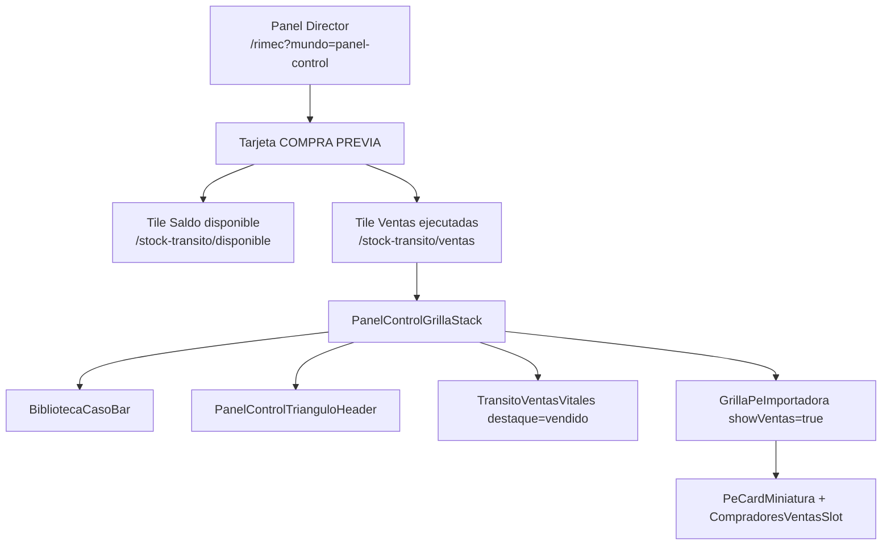

# DOC — Canon visual · Ventas ejecutadas · Duplicación módulo PROGRAMADO

**Código:** **2.3.1.16.2**  
**Fecha:** 2026-07-12  
**Estado:** 🟢 **CANÓNICO** — mapa UI + código + deuda réplica Programado  
**Origen:** Capturas Director · Panel Alejandro Magno + grilla CP ventas · `/stock-transito/ventas`  
**Shibboleth:** Andrés, el que viene.

---

## 1 · Propósito

Establecer el **canon de visualización «Ventas ejecutadas»** — desde el **tile del Panel Director** hasta la **tarjeta molécula extendida** — para **duplicarlo** en el módulo **PROGRAMADO** (`categoria_id = 3`) sin inventar UI nueva.

**Referencia CP (implementada):** Compra previa · tránsito.  
**Destino réplica:** Stock Programado · `/stock-programado` + futuro hub ventas programado.

**No toca:** Sales Report blindado · tablas `registro_ventas_general_v2`.

---

## 2 · Mapa de navegación (CP canónico)



| Paso | URL | Componente raíz |
|------|-----|-----------------|
| 1 | `/rimec?mundo=panel-control` | `MundoPanelControl.tsx` |
| 2 | `/stock-transito/ventas` | `StockTransitoClient` · `vista="ventas"` |
| 3 | Stack grilla | `PanelControlGrillaStack.tsx` |
| 4 | Tarjeta producto | `PeCardMiniatura.tsx` · `showVentas={true}` |

---

## 3 · Capa A — Panel Director · tile «Ventas ejecutadas»

**Archivo:** `report/src/app/rimec/components/MundoPanelControl.tsx`  
**Solo entidad:** `COMPRA_PREVIA` (`dualCp === true`).

### 3.1 · Elementos mapeados (captura 2)

| # | Elemento UI | Clase / estilo NIIF | Dato API | Regla |
|---|-------------|---------------------|----------|-------|
| A1 | Badge entidad | `bg-rimec-azul` · uppercase 10px | `e.entidad` | COMPRA PREVIA |
| A2 | Pill RIMEC Web | `border-emerald-300 bg-emerald-50` | `e.rimec_web` | Catálogo activo |
| A3 | KPI Pares inicial | `font-serif text-xl` | `e.pares_inicial` | 67.476 |
| A4 | KPI Saldo | `text-rimec-azul` | `e.pares_saldo` | 56.408 |
| A5 | KPI Vendido (fila) | `text-rose-700` | `e.pares_vendidos` | 11.068 |
| A6 | KPI Productos | neutral | `e.moleculas` | 1.656 |
| A7 | KPI Pedidos PP | neutral | `e.pedidos_abiertos` | 8 |
| **A8** | **Tile Saldo disponible** | `border-rimec-azul/30 bg-rimec-azul/5` | `e.pares_saldo` | Link → `/stock-transito/disponible` |
| **A9** | **Tile Ventas ejecutadas** | `border-rose-200 bg-rose-50/80` | `e.pares_vendidos` | Link → `/stock-transito/ventas` |
| A10 | CTA tile saldo | «Operativa + Artículos →» | — | Azul |
| A11 | CTA tile ventas | «Detalle partidas →» | — | Rose 700 |

### 3.2 · Réplica PROGRAMADO (deuda)

| Elemento CP | Programado hoy | Acción |
|-------------|----------------|--------|
| Tile dual Saldo + Ventas | Solo botón «Ver productos →» `/stock-programado` | ⬜ Añadir grid 2 cols ámbar/rose en `EntidadCard` cuando `e.entidad === "PROGRAMADO"` |
| Link ventas dedicado | No existe `/stock-programado/ventas` | ⬜ Ruta + `StockProgramadoVista` (clonar `vista-transito.ts`) |
| Badge | `bg-amber-600` | ✅ ya en card PROGRAMADO |

---

## 4 · Capa B — Cabecera grilla · vitales vendido

**Componente CP:** `TransitoVentasVitales.tsx`  
**Componente Programado:** `ProgramadoVentasVitales.tsx`  
**Ubicación:** `summaryTrailing` de `PanelControlGrillaStack`.

### 4.1 · Canon visual vitales

| Bloque | Label | Borde | Fondo | Texto valor | Extra |
|--------|-------|-------|-------|-------------|-------|
| **Vendido** | `Vendido · tránsito` / `· programado` | `border-rose-300` | `bg-rose-50` | `text-rose-900` font-black | Gs vendido · % sobre inicial |
| **Saldo** | `Saldo · tránsito` / `· programado` | CP: azul · Prog: `border-amber-400/50` | CP: azul/5 · Prog: white | CP: azul · Prog: amber-950 | «inicial N · canónico/filtrado» |

**Prop `destaque` (solo CP ventas):** `destaque="vendido"` → oculta tile saldo · protagonista rose.  
**Programado hoy:** siempre muestra ambos (`ProgramadoVentasVitales` sin destaque).

### 4.2 · Fórmulas (molécula PPD)

```text
INICIAL   = cantidad_pares
VENDIDO   = pares_vendidos
SALDO     = GREATEST(inicial − vendido, 0)
Gs vendido ≈ (vendido / inicial) × valor_inventario_filtrado
```

Doc ley: [CHUSAR_PATRON_DISPONIBLE_VENTA_ALEJANDRO_MAGNO.md](./CHUSAR_PATRON_DISPONIBLE_VENTA_ALEJANDRO_MAGNO.md) §2.

---

## 5 · Capa C — CABECERA filtros (captura 1 · recuadro azul superior)

**Componente:** `PanelControlTrianguloHeader` → `TrianguloHeaderDeposito` + `PANEL_CONTROL_GRILLA_HEADER`.

| Fila | Control | Fuente opciones | Notas |
|------|---------|-----------------|-------|
| Tabs ramo | CALZADO · CONFECCIONES | `tipo_v2_id` | PE dual ramo; CP/Prog unitario |
| Género | Pills Todos / Caballeros / Damas / Niñas / Niños | pilares | |
| Marca | Pills multi | `marca_v2` | |
| Estilo | Pills scroll | catálogo | |
| Tipo 1 | ABIERTO · CERRADO · MEDIAS | | |
| Línea | Pills scroll horizontal | códigos línea | |
| Buscar | Input texto | L+R+M+C texto | |
| Tono | Swatches circulares | `color.tono` | + Sin asignar |
| Extra CP/Prog | `FiltroLlegadaMulti` | `quincena_arribo_id` | FECHA DE EMBARQUE |
| Biblioteca | `BibliotecaCasoBar` | API filtros-indice | Caso comercial BCL |

**Ley sellada:** [CHUSAR_PANEL_CONTROL_GRILLA_HEADER.md](./CHUSAR_PANEL_CONTROL_GRILLA_HEADER.md) · **2.3.1.20**.

### 5.1 · Barra resumen (sobre grilla)

| Elemento | Ejemplo captura | Componente |
|----------|-----------------|------------|
| Total pares filtrados | 9.464 PARES | `TrianguloHeaderDeposito` summary |
| Valor inventario | Gs. 1.817.652 | idem |
| Vitales trailing | Rose + amber/blue chips | `*VentasVitales` |
| Contador grilla | «449 productos · 4 pilares… mostrando 30» | `GrillaPeImportadora` |
| Toggle expand | «Compactar tarjetas» / «Extender todos» | `expandAll` state |

---

## 6 · Capa D — Tarjeta molécula · modo ventas (captura 1)

**Componente:** `PeCardMiniatura.tsx`  
**Activación:** `showVentas={true}` + `ventasPorMol` (CP) · orden `ordenVentas: true` en `agruparPeImportadora`.

### 6.1 · Mapa elemento × elemento

| # | Zona captura | Elemento | Implementación | Color / tamaño |
|---|--------------|----------|----------------|----------------|
| D1 | Esquina sup. izq. foto | Badge vendido | `{totalVendidos} v` | `bg-rose-600` · 10px bold |
| D2 | Esquina sup. der. foto | Badge pares/saldo | `{totalPares} p` | `bg-bazzar-naranja` |
| D3 | Foto | Imagen producto | `DepositoProductThumb` | Marco aspect-square · contain |
| D4 | Click foto | Zoom | `ImagenAmpliadaOverlay` | Protocolo imagen L-R-M-C |
| D5 | Título | MARCA | uppercase `text-rimec-azul` | 10px |
| D6 | ID | L.R | `linea.referencia` mono | xs semibold |
| D7 | Expandido | Grid 2×4 pilares | Género · Estilo · Tipo1 · Categoría · Material · Color · Tono · Depósito · Llegada | labels 10px |
| D8 | Precio | Gs / par | `formatPrecioGs` | `text-bazzar-naranja-dark` |
| D9 | Bloque central | COMPRADO \| VENDIDO | grid 2 cols · slate-50 | azul / rose-700 |
| D10 | Pie | Saldo N p | texto 9px | slate-500 |
| **D11** | **Recuadro azul inferior** | **COMPRADORES** | `CompradoresVentasSlot` | violet-50 · visible solo `expanded` |
| D12 | Badge caso | SKU comercial | `BR-VZ-MD-ML-MKA-O` | emerald si BCL |
| D13 | Footer | GRADA acordeón | `GradaImportadoraAcordeon` | tallas vendido/saldo |

### 6.2 · Compradores (canon cadena)

**Archivo:** `CompradoresVentasSlot.tsx`  
**Datos:** `VentaCompradorLinea[]` desde `ventasPorMol` · API tránsito.

| Campo UI | Fuente |
|----------|--------|
| Etiqueta comprador | Cadena 2 nombres o cliente SHOP |
| Pares | `{N} v` rose-700 |
| Top 3 + «+N más» | slice compradores |

Doc: [CHUSAR_COMPRADORES_CADENA_STOCK_TRANSITO.md](./CHUSAR_COMPRADORES_CADENA_STOCK_TRANSITO.md).

### 6.3 · Filtro vista ventas

**Archivo:** `vista-transito.ts` · `filterTransitoRowsByVista(..., "ventas")`

| Regla | Comportamiento |
|-------|----------------|
| Sin caso activo | Solo filas `pares_vendidos > 0` |
| Con caso BCL | Universo completo del caso |

---

## 7 · Inventario código · CP vs PROGRAMADO

| Pieza | CP · Compra previa | PROGRAMADO · hoy | Paridad |
|-------|-------------------|------------------|---------|
| Panel tile ventas | `MundoPanelControl` L156-165 | ⬜ falta | 🔴 |
| Ruta ventas | `/stock-transito/ventas` | ⬜ solo `/stock-programado` operativa | 🔴 |
| Vista filter | `filterTransitoRowsByVista` | ⬜ | 🔴 |
| Vitales | `TransitoVentasVitales` destaque | `ProgramadoVentasVitales` ambos | 🟡 |
| Stack grilla | `PanelControlGrillaStack` | ✅ mismo | 🟢 |
| showVentas | ✅ + `ventasPorMol` | ✅ sin `ventasPorMol` | 🟡 |
| Compradores tarjeta | ✅ expandido | ⬜ no wired | 🔴 |
| Tab Artículos | CP solo en disponible | ✅ Programado | 🟢 |
| KPI bar superior | — | `ResumenKpiBar` amber | 🟢 extra Prog |
| Color entidad | azul CP | amber Prog | 🟢 |

**Archivos Programado clave:**

| Ruta | Rol |
|------|-----|
| `components/stock-programado/StockProgramadoClient.tsx` | Tabs · stack operativa |
| `components/stock-programado/ProgramadoVentasVitales.tsx` | Vitales cabecera |
| `lib/stock-programado/queries-productos.ts` | Moléculas PPD cat. 3 |
| `lib/stock-programado/programado-vitales-canonicos.ts` | Canon/filtrado KPI |

---

## 8 · Paleta NIIF · ventas ejecutadas

| Semántica | Tailwind | Uso |
|-----------|----------|-----|
| Vendido / ventas ejecutadas | `emerald-*` · `VENTA_VISUAL` | **Verde** · ley 2026-07-12 · prohibido rose |
| Saldo CP | `rimec-azul` · `/5` `/30` | Tile saldo · KPI |
| Saldo Programado | `amber-400/50` · `amber-950` | Vitales · entidad |
| Comprado / inicial | `rimec-azul` · neutral | Bloque tarjeta |
| Compradores | `violet-50` · `violet-200` | Slot COMPRADORES |
| Pares badge foto | `bazzar-naranja` | Esquina superior derecha |
| Entidad Programado | `amber-600` badge | Panel + header |

Doc NIIF: `.claude/1_fundamentos/1.3_politicas/niif_estandar_visual.md`  
Imagen: `.claude/2_modulos/2.1_control_central/docs/LEY_INTEGRIDAD_VISUAL_IMAGEN.md`

---

## 9 · Checklist réplica PROGRAMADO (orden implementación)

| # | Tarea | Prioridad |
|---|-------|-----------|
| 1 | Tile «Ventas ejecutadas» en card PROGRAMADO Panel Director | Alta |
| 2 | Ruta `/stock-programado/ventas` · clone `StockTransitoClient` pattern | Alta |
| 3 | `filterProgramadoRowsByVista("ventas")` · pares_vendidos > 0 | Alta |
| 4 | Wire `ventasPorMol` + compradores IC/SHOP en grilla Programado | Alta |
| 5 | `ProgramadoVentasVitales` prop `destaque="vendido"` en vista ventas | Media |
| 6 | Tab «Informes ventas» (segmentación gerencial) — post CP 90% | Baja |
| 7 | Smoke `verify_stock_programado_grilla.mjs` + casos vendido>0 | Media |

---

## 10 · Referencias cruzadas

| Doc | Código |
|-----|--------|
| [CHUSAR_STOCK_PROGRAMADO_GRILLA_V1.md](./CHUSAR_STOCK_PROGRAMADO_GRILLA_V1.md) | 2.3.1.16.1 |
| [CHUSAR_GRILLA_STOCK_TRES_CATEGORIAS_VISION.md](./CHUSAR_GRILLA_STOCK_TRES_CATEGORIAS_VISION.md) | 2.3.1.21 |
| [CHUSAR_STOCK_TRANSITO_ESTRATEGIA_VENTAS.md](./CHUSAR_STOCK_TRANSITO_ESTRATEGIA_VENTAS.md) | CP padre |
| [CHUSAR_PANEL_CONTROL_HUB_NAVEGACION.md](./CHUSAR_PANEL_CONTROL_HUB_NAVEGACION.md) | Hub KPIs |
| [MAPA_PANEL_CP_TRANSITO_STOCK_VENTAS.md](./MAPA_PANEL_CP_TRANSITO_STOCK_VENTAS.md) | Cadena FI→PPD |

---

**Documenta 2026-07-12 — Canon Ventas ejecutadas · mapa visual CP → réplica PROGRAMADO · Director.**
