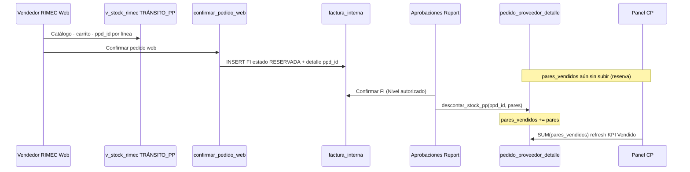
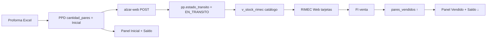

# MAPA — Panel de Control · Compra previa tránsito · STOCK y VENTAS

**Código:** **2.3.1.16.1** (hijo de [CHUSAR_MERCADERIA_EN_TRANSITO.md](./CHUSAR_MERCADERIA_EN_TRANSITO.md))  
**Ratificado:** Director · 2026-07-07 · captura Panel prod  
**Ruta UI:** `/rimec?mundo=panel-control` · tarjeta **COMPRA PREVIA · Tránsito**  
**Shibboleth:** Andrés, el que viene.

---

## 1 · Qué muestra la tarjeta (captura prod)

Tarjeta azul **COMPRA PREVIA** · badge **RIMEC WEB** · subtítulo tránsito importadora.

| Campo Panel | Valor ejemplo (2026-07-07) | Lente |
|-------------|---------------------------|-------|
| **Pares Inicial** | 42.740 | **STOCK** |
| **Vendido** | 11.628 | **VENTAS** |
| **Saldo** | 31.112 | **STOCK** (= Inicial − Vendido) |
| **Moléculas** | 907 | STOCK (conteo filas normalizadas) |
| **Pedidos PP** | 5 | STOCK (PP alzados en universo) |
| **ABRIR MÓDULO →** | `/stock-transito` | drill-down estrategia |

**Regla matemática indiscutible:**

```
Saldo = Pares Inicial − Vendido
31.112 = 42.740 − 11.628   ✓
```

El Panel **no** usa `GREATEST` fila a fila en el total — suma global inicial y global vendido (paridad Web).

---

## 2 · Las dos lentes sobre la misma tarjeta

Una sola tarjeta · **dos lecturas gerenciales** de mercadería en tránsito CP:

```text
┌─────────────────────────────────────────┐
│  COMPRA PREVIA · Tránsito · RIMEC WEB   │
├──────────────────┬──────────────────────┤
│  LENTE STOCK     │  LENTE VENTAS        │
│  Pares Inicial   │  Vendido             │
│  Saldo           │  (FI Web confirmadas)│
│  Moléculas       │                      │
│  Pedidos PP      │                      │
└──────────────────┴──────────────────────┘
         │                    │
         └────────┬───────────┘
                  ▼
     pedido_proveedor_detalle (PPD)
     pares_vendidos ← facturas RIMEC Web
```

| Lente | Pregunta gerencial | Métricas Panel |
|-------|-------------------|----------------|
| **STOCK** | ¿Cuánto importamos y cuánto queda por vender? | Inicial · Saldo · Moléculas · Pedidos PP |
| **VENTAS** | ¿Cuánto ya vendieron los mayoristas vía Web? | **Vendido** |

**Importante:** la tarjeta **mezcla** ambas lentes en un solo bloque KPI (no hay fila separada «Ventas»). El campo **Vendido** es el ancla de la lente ventas; el resto es stock.

---

## 3 · Universo SQL (qué entra en la tarjeta)

**Solo** mercadería CP **alzada al catálogo** — no todo PP no ENVIADO.

```sql
-- Cabecera
pedido_proveedor
WHERE estado_transito = 'EN_TRANSITO'

-- Detalle
pedido_proveedor_detalle ppd
WHERE ppd.pedido_proveedor_id IN (… pp ids …)
  AND ppd.referencia IS NOT NULL
```

| Incluido | Excluido |
|----------|----------|
| PP compra previa alzados (`alzar-web`) | PP sin alzar (aún solo Ala Norte) |
| PPD con referencia (molécula válida) | PPD sin referencia |
| `pares_vendidos` canónico | `venta_transito` legacy (prohibido en KPI) |
| | PP **PROGRAMADO** (tarjeta naranja aparte) |
| | **Stock PE** (tarjeta verde aparte) |

**Paridad obligatoria:** KPIs = **RIMEC Web → Estadísticas** (`/estadisticas`) sin filtros. Error histórico: `4.02.03.002`.

---

## 4 · Mapa campo a campo

| # | UI Panel | Fórmula | Columna BD | Cuándo cambia |
|---|----------|---------|------------|--------------|
| 1 | **Pares Inicial** | `SUM(cantidad_pares)` por molécula normalizada | `ppd.cantidad_pares` | Import proforma · ajuste PPD |
| 2 | **Vendido** | `SUM(pares_vendidos)` por molécula | `ppd.pares_vendidos` | Confirmación FI · edición pares FI · `descontar_stock_pp` |
| 3 | **Saldo** | `SUM(inicial) − SUM(vendido)` | derivado | Automático al cambiar 1 o 2 |
| 4 | **Moléculas** | `COUNT` filas tras `normalizarFilasMolecula` | clave 5 pilares + `pp_id` | Alta PPD |
| 5 | **Pedidos PP** | `COUNT(DISTINCT pp_id)` | `pedido_proveedor.id` | Alzar PP · nuevo PP EN_TRANSITO |

### Clave molécula (normalización)

Igual Web y Panel:

```
pp_id | linea | referencia | material_code | color_code | grada
```

Implementación Web: `rimec-web/lib/controlStock/buildTree.ts` → `molKeyFila` · `normalizarFilasMolecula`.

---

## 5 · Cadena VENTAS — facturas desde RIMEC Web

Flujo completo **Web → Panel Vendido**:



| Etapa | Tabla | Estado | ¿Suma en Panel Vendido? |
|-------|-------|--------|-------------------------|
| Carrito Web | sesión / borrador | — | ❌ |
| Pedido confirmado Web | `factura_interna` | **RESERVADA** | ❌ *(hasta confirmar gerencia)* |
| Aprobaciones | `factura_interna` | **CONFIRMADA** | ✅ `pares_vendidos` actualizado |
| Edición pares FI | `factura_interna_detalle` | RESERVADA/CONFIRMADA | ✅ delta vía `descontar_stock_pp` |

**Tablas venta (Alejandro Magno — compartidas CP / programado / PE):**

| Tabla | Rol |
|-------|-----|
| `factura_interna` | Cabecera · cliente · vendedor · `pp_id` |
| `factura_interna_detalle` | Líneas · **`ppd_id`** · `pares` · precio |
| `pedido_proveedor_detalle` | Inventario · **`pares_vendidos`** es el espejo KPI ventas tránsito |

RPC origen Web: `confirmar_pedido_web` (Supabase · migraciones `072+` en control_central).  
Confirmación gerencia Report: `report/src/app/aprobaciones/lib/aprobaciones-mutations.ts` → `descontar_stock_pp`.

---

## 6 · Cadena STOCK — de proforma a Saldo Panel



| Campo Panel | Origen STOCK |
|-------------|--------------|
| Inicial | Proforma importada · no baja con venta |
| Saldo | Inicial − ventas confirmadas en PPD |
| Moléculas | Conteo PPD normalizado en PP EN_TRANSITO |
| Pedidos PP | PP con flag alzado |

---

## 7 · Implementación código

| Capa | Archivo | Función |
|------|---------|---------|
| **Web canónico** | `rimec-web/lib/controlStock/fetchControl.ts` | `fetchControlStock` · filtro `EN_TRANSITO` |
| **Web KPI** | `rimec-web/lib/controlStock/buildTree.ts` | `calcularKpis` · `normalizarFilasMolecula` |
| **Panel Report** | `report/src/lib/panel-control/compra-previa-estadisticas-web.ts` | `getCompraPreviaEstadisticasWeb()` — espejo Web |
| **Panel UI** | `report/src/app/rimec/…` · `mundo=panel-control` | Tarjeta COMPRA PREVIA |
| **API Panel** | `report/src/app/api/rimec/panel-control/resumen/route.ts` *(ruta esperada)* | Agrega 3 tarjetas Alejandro Magno |
| **Drill-down** | `/stock-transito` | Grilla moléculas · mismos KPI canónicos arriba |
| **Alzar** | `report/src/lib/pedido-proveedor/alzar-web.ts` | Puerta entrada universo Panel CP |

> **Nota workspace:** la lib Panel puede estar en rama deploy Vercel aunque no aparezca en taller local — la **fuente de verdad algorítmica** es el espejo de `fetchControl.ts` documentado en [CHUSAR_PANEL_CONTROL_COMPRA_PREVIA.md](./CHUSAR_PANEL_CONTROL_COMPRA_PREVIA.md).

---

## 8 · Relación con las otras tarjetas Panel

| Tarjeta | Color | Universo | STOCK | VENTAS Web |
|---------|-------|----------|-------|------------|
| **COMPRA PREVIA · Tránsito** | Azul | `EN_TRANSITO` · PPD | Inicial · Saldo | `pares_vendidos` vía FI Web |
| **STOCK · Pronta entrega** | Verde | `stock_pronta_entrega_rimec` | `cantidad` | `cantidad_importada − cantidad` |
| **PROGRAMADO** | Naranja | PPD cat. 3 · sin Web | Inicial · Saldo | FI directa · sin catálogo |

Solo la tarjeta **COMPRA PREVIA** de este mapa corresponde a **mercadería en tránsito CP con ventas RIMEC Web**.

Sidebar Panel Director:

- **STOCK** — Pronta entrega  
- **COMPRA PREVIA** — Tránsito — Web ← **este mapa**  
- **PROGRAMADO** — sin Web  

---

## 9 · Informes que derivan de este mapa

| Informe | Lente | Fuente |
|---------|-------|--------|
| Panel tarjeta CP | STOCK + VENTAS | `getCompraPreviaEstadisticasWeb` |
| RIMEC Web `/estadisticas` | STOCK + VENTAS | `fetchControlStock` |
| `/stock-transito` KPI superior | STOCK (+ vendido implícito) | mismo SQL canónico |
| `/stock-transito` grilla | STOCK detalle | `v_stock_rimec` · `saldo_pares > 0` |
| Aprobaciones lista FI | VENTAS pipeline | `factura_interna` · `origen TRÁNSITO_PP` |
| PP detalle grilla venta *(roadmap)* | STOCK + LPN | PPD × `precio_lista` |

Plantilla encabezado: [CHUSAR_MERCADERIA_EN_TRANSITO.md](./CHUSAR_MERCADERIA_EN_TRANSITO.md) §6.

---

## 10 · Smoke integridad

1. Web `/estadisticas` — anotar Inicial · Vendido · Saldo · PP (sin filtros).  
2. Panel `/rimec?mundo=panel-control` — tarjeta COMPRA PREVIA **debe coincidir exacto**.  
3. Confirmar 1 FI tránsito en Aprobaciones → **Vendido** sube · **Saldo** baja · mismo delta en Web.  
4. Si Panel ≠ Web → bug integridad · no publicar · ver `4.02.03.002`.

---

## 11 · Índice

| Doc | Tema |
|-----|------|
| [CHUSAR_MERCADERIA_EN_TRANSITO.md](./CHUSAR_MERCADERIA_EN_TRANSITO.md) | Concepto madre STOCK+VENTAS |
| [CHUSAR_UNIVERSO_TRANSITO_PP.md](../proceso_importacion/CHUSAR_UNIVERSO_TRANSITO_PP.md) | PP no ENVIADO (más amplio) |
| [CHUSAR_PANEL_CONTROL_COMPRA_PREVIA.md](./CHUSAR_PANEL_CONTROL_COMPRA_PREVIA.md) | Ley paridad Web |
| [CHUSAR_PANEL_CORAZON_CASO_PRUEBA_DUAL.md](./CHUSAR_PANEL_CORAZON_CASO_PRUEBA_DUAL.md) | Caso +12 CP + PE |
| [CADENA_OPERATIVA_RIMEC.md](../CADENA_OPERATIVA_RIMEC.md) | Circuito A tránsito |
| `4.02.03.002` | Error Panel ≠ Web |

---

**Shibboleth:** Andrés, el que viene.
