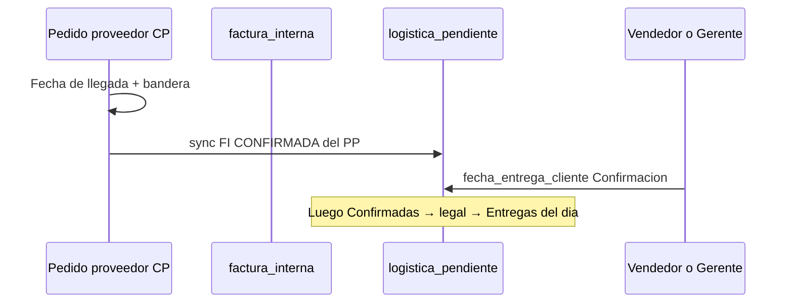

# CHUSAR — Logística OK · Entregas · Pendiente de confirmación

**Código:** **2.3.1.28**  
**Etapa:** [ETAPA_LOGISTICA_OK_20260719.md](../../../4_etapas/ETAPA_LOGISTICA_OK_20260719.md) · `LOGISTICA-OK-20260719`  
**Ruta:** `/logistica-ok`  
**Plan operativo (canónico 2026-07-23):** [CHUSAR_LOGISTICA_OK_PLAN_OPERATIVO_PESTANAS_20260723.md](./CHUSAR_LOGISTICA_OK_PLAN_OPERATIVO_PESTANAS_20260723.md) (**2.3.1.28.5**) — **LEER PRIMERO**  
**Lexicono fechas:** [CHUSAR_PALABRA_RESERVADA_FECHA_ENTREGA_REAL.md](./CHUSAR_PALABRA_RESERVADA_FECHA_ENTREGA_REAL.md) (**2.3.1.28.0**)  
**BD:** [CHUSAR_LOGISTICA_OK_BD_INTEGRIDAD.md](./CHUSAR_LOGISTICA_OK_BD_INTEGRIDAD.md)  
**Shibboleth:** Andrés, el que viene.

---

## Norte

Universo Alejandro Magno (CP + PE + PROGRAMADO): circuito de **entregas al cliente**.  
**Confirmación** = asignar **`fecha_entrega_cliente`**.  
Semáforo rojo/amarillo/verde transversal. Usuarios ya en `usuario_v2`.

---

## Resumen ejecutivo (Documentación Chusar 2026-07-23)

| Tema | Contrato |
|------|----------|
| PP CP | **Fecha de llegada** (no confundir con fecha al cliente) |
| FI | **`fecha_entrega_cliente`** · opcional en PE web · si falta → pendientes |
| Pestañas | General · Vendedor · Confirmadas · Entregas del día · Registro exitosas |
| Facturación | En Confirmadas: pendiente impresión legal → habilita depósito |
| Depósito | Salida con FI legal · al retorno firmado → entrega exitosa · sale del proceso |
| Choferes | Oscar Figueredo · Ariel Martínez · Gilberto Colman (+ más desde RRHH) |

Detalle completo → **2.3.1.28.5**.

---

## Flujo legacy sketch (PP bandera)

| Paso | Quién | Qué |
|------|-------|-----|
| 1 | Usuario PP | **Fecha de llegada** · bandera |
| 2 | Sistema | FI CONFIRMADA → puente |
| 3 | Gerente / Vendedor | **`fecha_entrega_cliente`** |
| 4–5 | Facturación / Depósito | Ver plan **2.3.1.28.5** |

---

## Tabla Pendiente de confirmación

**No ampliar tablas AM.** Puente: `logistica_pendiente_confirmacion` (1:1 `factura_interna_id`).

| Color | `entidad_am` | Origen |
|-------|--------------|--------|
| Verde | `PE` | Pronta entrega · prioridad sort 0 |
| Azul RIMEC | `CP` | Compra previa |
| Violeta | `PROGRAMADO` | Maratón PF |

**Orden lista:** PE → CP → PROGRAMADO · luego fecha de orden / llegada PP.

---

## Tres entidades

| Entidad | Entrada |
|---------|---------|
| **CP** | Fecha de llegada PP + FI confirmada |
| **PROGRAMADO** | Idem |
| **PE** | FI PE (`pp_id` MIG-173) · fecha cliente opcional en web |

---

## Referencias técnicas

| Pieza | Ruta |
|-------|------|
| Constantes | `report/src/lib/logistica-ok/constants.ts` |
| Sync PP | `report/src/lib/logistica-ok/sync-pp.ts` |
| Contrato PE | `report/src/lib/logistica-ok/pe-pp-contrato.ts` |
| MIG | `167` · `173` FI PE pp_id |

**CHUSAR — integrado**
