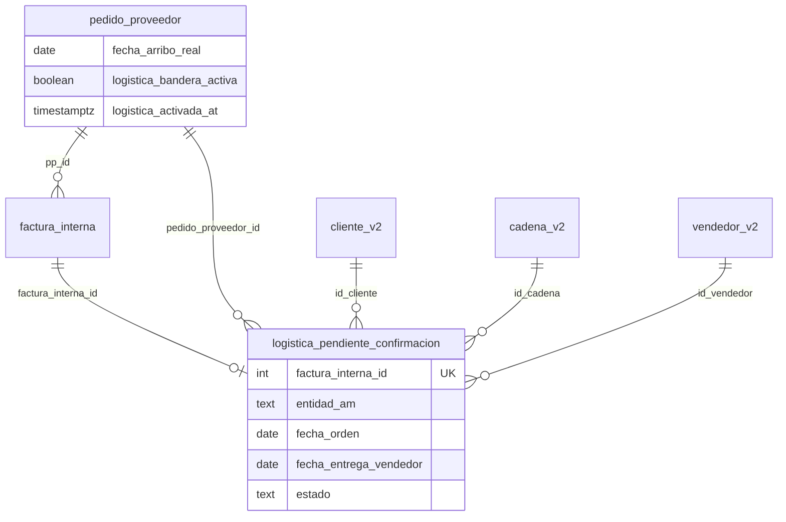

# CHUSAR — Logística OK · Integridad BD

**Código:** **2.3.1.28.1**  
**Migración:** `report/migrations/167_logistica_ok_pendiente_confirmacion.sql`  
**Padre:** [CHUSAR_LOGISTICA_OK.md](./CHUSAR_LOGISTICA_OK.md)  
**Palabra reservada:** [CHUSAR_PALABRA_RESERVADA_FECHA_ENTREGA_REAL.md](./CHUSAR_PALABRA_RESERVADA_FECHA_ENTREGA_REAL.md)

---

## Decisión de arquitectura (Director · integridad)

| Opción | Veredicto |
|--------|-----------|
| Agrandar `pedido_proveedor_detalle` / vistas AM | ❌ **Prohibido** — AM queda comercial/stock |
| Duplicar FI completa en JSON suelto | ❌ **Prohibido** |
| **Tabla puente `logistica_pendiente_confirmacion`** | ✅ **Canónico** — 1 fila por FI · FK estrictas |
| Columnas mínimas en `pedido_proveedor` | ✅ bandera + Fecha de entrega Real ya existente |

**Principio:** Alejandro Magno **alimenta** logística; logística **no muta** PPD ni pilares.

---

## Modelo entidad-relación



---

## Tabla `logistica_pendiente_confirmacion`

| Columna | Tipo | Regla |
|---------|------|-------|
| `id` | `BIGSERIAL PK` | |
| `factura_interna_id` | `INT UNIQUE NOT NULL` | FK → `factura_interna(id)` ON DELETE CASCADE |
| `pedido_proveedor_id` | `INT NOT NULL` | FK → `pedido_proveedor(id)` |
| `entidad_am` | `TEXT NOT NULL` | `'CP'` \| `'PE'` \| `'PROGRAMADO'` — color UI |
| `fecha_orden` | `DATE NOT NULL` | Copia `pp.fecha_arribo_real` al alta/sync |
| `id_cliente` | `INT NOT NULL` | FK denormalizado · acordeón cliente |
| `id_cadena` | `INT NULL` | FK · acordeón cadena (Sales Report pattern) |
| `id_vendedor` | `INT NULL` | Sin FK — `vendedor_v2` es vista en prod · validar en app |
| `pares` | `INT NOT NULL DEFAULT 0` | Snapshot `fi.total_pares` al sync |
| `monto_neto` | `NUMERIC(18,2) NULL` | Snapshot opcional |
| `nro_factura` | `TEXT NULL` | Snapshot display |
| `fecha_entrega_vendedor` | `DATE NULL` | **Legacy nombre** · producto 2026-07-23 = **`fecha_entrega_cliente`** (Confirmación) · ver **2.3.1.28.5** |
| `estado` | `TEXT NOT NULL DEFAULT 'PENDIENTE'` | `PENDIENTE` \| `CONFIRMADA` |
| `confirmado_at` | `TIMESTAMPTZ NULL` | |
| `confirmado_por` | `INT NULL` | FK `usuario_v2` |
| `created_at` | `TIMESTAMPTZ DEFAULT now()` | |
| `updated_at` | `TIMESTAMPTZ DEFAULT now()` | |

**Índices:** `(estado, fecha_orden)`, `(id_cadena, id_cliente)`, `(id_vendedor, estado)`, `(entidad_am, fecha_orden)`.

---

## Alter `pedido_proveedor`

| Columna | Tipo | Rol |
|---------|------|-----|
| `fecha_arribo_real` | `DATE` | Ya existe (MIG-097) · **Fecha de entrega Real** |
| `logistica_bandera_activa` | `BOOLEAN NOT NULL DEFAULT false` | Bandera encendida |
| `logistica_activada_at` | `TIMESTAMPTZ NULL` | Auditoría |
| `logistica_activada_por` | `INT NULL` | FK usuario |

---

## Reglas `entidad_am` (color)

| Valor | Origen | Color NIIF (plan) | Sort priority |
|-------|--------|-------------------|:-------------:|
| `PE` | `quincena_desc = 'Pronta entrega'` o universo PE | Verde `#059669` | **0** (siempre primero) |
| `CP` | `categoria_id = 2` PRE VENTA | Azul RIMEC `#002B4E` | 1 |
| `PROGRAMADO` | `categoria_id = 3` | Violeta `#6D28D9` | 2 |

Función SQL: `logistica_ok_resolver_entidad_am(pp_id)` — centraliza criterio.

---

## Orden bandeja (ley Director)

```sql
ORDER BY
  CASE entidad_am WHEN 'PE' THEN 0 WHEN 'CP' THEN 1 WHEN 'PROGRAMADO' THEN 2 END,
  fecha_orden ASC NULLS LAST,
  id_cadena NULLS LAST,
  id_cliente,
  nro_factura
```

Agrupación UI (acordeones · inspiración Sales Report):

1. **Cadena** (`cadena_v2.descp_cadena` · [CHUSAR_COMPRADORES_CADENA](../gestion_compra/CHUSAR_COMPRADORES_CADENA_STOCK_TRANSITO.md))  
2. **Cliente** (`cliente_v2.descp_cliente`)  
3. **Filas FI** con chip color CP/PE/PROGRAMADO  

---

## Eventos (aplicación — no triggers prod hasta OT)

| Evento | Acción |
|--------|--------|
| **E1** PP botón + Fecha de entrega Real | UPDATE pp · bandera ON · `sync_logistica_pp(pp_id)` |
| **E2** FI INSERT/UPDATE → CONFIRMADA | Si `pp.logistica_bandera_activa` → UPSERT pendiente |
| **E3** Vendedor confirma en Logística OK | UPDATE `fecha_entrega_vendedor` · `estado=CONFIRMADA` |
| **E4** FI anulada | DELETE pendiente (CASCADE) |

Función planificada: `sync_logistica_pp(p_pp_id INT)` en `report/src/lib/logistica-ok/sync-pp.ts`.

---

## Futuro — mapa entregas (sin implementar)

Tabla reservada **`logistica_entrega_geo`** (fase 2):

| Columna | Rol |
|---------|-----|
| `pendiente_id` FK | Punto sobre FI confirmada |
| `lat`, `lng` | Mapa |
| `direccion_texto` | Opcional |

**No crear en MIG-167** — solo comentario en migración.

---

## Sales Report

`registro_ventas_general_v2` — **blindado** · cero JOIN en migración logística.

---

**Integrado:** 2026-07-19 · **Documenta** Director
