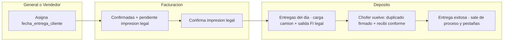

# CHUSAR — Logística OK · Plan operativo completo (pestañas · fechas · semáforo)

**Código:** **2.3.1.28.5** · padre **2.3.1.28**  
**Etapa:** `LOGISTICA-OK-20260719` · [ETAPA_LOGISTICA_OK_20260719.md](../../../4_etapas/ETAPA_LOGISTICA_OK_20260719.md)  
**Fecha:** 2026-07-23 · **Documentación Chusar** (Director)  
**Apps:** Report `/logistica-ok` · puente PE rimec-web (`:3001`)  
**Shibboleth:** Andrés, el que viene.

---

## Norte

Circuito de **entregas al cliente** post-venta (CP + PE + PROGRAMADO).  
Cada paso lo ejecuta un **departamento distinto**. El usuario ve el **cuello de botella** con semáforo **rojo / amarillo / verde** en cualquier módulo.

**Usuarios / vendedores:** ya mapeados — `usuario_v2` (rol + categoría) · FI `vendedor_id` · `confirmado_por` · diccionarios Carlos solo CSV PE (**2.3.1.9.F**). No reinventar.

---

## Lexicono de fechas (inviolable · no mezclar)

| Nombre UI | Campo / ancla | Universo | Rol |
|-----------|---------------|----------|-----|
| **Fecha de llegada** | Cabecera PP Compra previa (`fecha_arribo_real` / bandera PP — rename UI) | **CP** | Publicación / arribo · **desde cuándo** las FI del PP entran al circuito logístico |
| **`fecha_entrega_cliente`** | FI / pendiente logística (evoluciona `fecha_entrega_vendedor`) | **CP y PE** | Día en que el **cliente quiere recibir** |
| **Fecha de la entrega** (real operativa) | Al cierre depósito | Ambos | Día efectivo de entrega (puede ser **posterior** a `fecha_entrega_cliente`) |
| **Confirmación** | **Acto** (no es una fecha) | Ambos | Asignar `fecha_entrega_cliente` a una FI que **ya llegó** (CP) o **nació en PE** |

### Pronta entrega (rimec-web)

- `fecha_entrega_cliente` digitable en PE · **no obligatoria** al VALIDAR/confirmar venta.
- Si **no** tiene fecha → FI entra a **Pendiente de confirmación**.
- Comunicación: **rimec-web PE ↔ Logística OK** (distinto del PP CP).

### Compra previa

1. PP recibe **Fecha de llegada**.  
2. FI del PP pueden entrar al circuito.  
3. Gerente (General) o Vendedor asigna **`fecha_entrega_cliente`**.  
4. Con fecha → pestaña **Confirmadas**.

---

## Pestañas mínimas (`/logistica-ok`)

| # | Pestaña | Quién | Qué |
|---|---------|--------|-----|
| 1 | **General** | Nivel Dios / gerente | Visión total · puede asignar `fecha_entrega_cliente` |
| 2 | **Vendedor** | RIMEC VENDEDOR + jefe de depósito | Misma asignación de fecha · filtro por vendedor de sesión |
| 3 | **Confirmadas** | Usuario **facturación** | FI con `fecha_entrega_cliente` · bandera **pendiente impresión legal** · botón avisa a depósito |
| 4 | **Entregas del día** | Depósito (aviso desde Confirmadas) | Acordeones **por día** agrupados por `fecha_entrega_cliente` |
| 5 | **Registro de entregas exitosas** | Histórico | Solo entra al completar cierre depósito (ver abajo) |

---

## Flujo por departamento (canónico)

| Paso | Depto | Bandera / acto | Semáforo |
|------|-------|----------------|----------|
| 1 | Gerente o Vendedor | Asigna `fecha_entrega_cliente` | Rojo (sin fecha) → Amarillo |
| 2 | Facturación | Bandera **pendiente impresión legal** en Confirmadas | Amarillo |
| 3 | Facturación | Confirma impresión legal → **habilita** depósito | Amarillo → Verde parcial |
| 4 | Jefe depósito | Alza mercadería / salida con factura legal | Amarillo operativo |
| 5 | Depósito | Chofer: duplicado firmado + recibí conforme → baja pendiente **Entrega exitosa** | Verde · **desaparece** de proceso y pestañas activas → **Registro exitosas** |

### Condición de salida de «Entregas del día» → Registro exitosas

**Todas** obligatorias:

1. `fecha_entrega_cliente`  
2. Bandera **impresión factura legal** (encendida / confirmada)  
3. Bandera **entregado**  
4. **Fecha de la entrega** (real; si es posterior a `fecha_entrega_cliente`, se registra el atraso)  
5. **Chofer** asignado  

Falta uno → permanece en Entregas del día.

---

## Choferes (arranque)

Catálogo desde **funcionarios RIMEC** (RRHH). Primer mapeo:

- Oscar Figueredo  
- Ariel Martínez  
- Gilberto Colman  

*(Hay más; ampliar desde la misma lista de funcionarios.)*

---

## Semáforo transversal (UX)

- Iconos **rojo / amarillo / verde** visibles en Logística y, idealmente, en módulos hermanos (facturación, depósito, PE).  
- Un paso = un depto · botones simples.  
- El color = verdad del embudo (dónde está el cuello de botella).

---

## Relación con código / MIG previos

| Pieza | Estado respecto a este plan |
|-------|------------------------------|
| MIG-167 `logistica_pendiente_confirmacion` | Base puente · renombrar/evolucionar campo vendedor → `fecha_entrega_cliente` |
| MIG-173 FI PE → `pp_id` real | Puente PE ↔ PP para entrar al circuito |
| MIG-174 banderas / estados | Embudo CONFIRMADA · EN_ENTREGA · EXITOSA |
| Multi lote fecha+vendedor | `confirmarEntregaLote` · error **4.02.03.021** · UI select vendedor lote |
| Palabra reservada antigua «Fecha de entrega Real» | **UI PP CP** → **Fecha de llegada** |
| `fecha_entrega_vendedor` | Destino de producto: **`fecha_entrega_cliente`** |
| Pestañas 5 · semáforo 3 pelotas · choferes | Implementado local 2026-07-23 |

---

## Docs hermanos

- [CHUSAR_LOGISTICA_OK.md](./CHUSAR_LOGISTICA_OK.md)  
- [CHUSAR_PALABRA_RESERVADA_FECHA_ENTREGA_REAL.md](./CHUSAR_PALABRA_RESERVADA_FECHA_ENTREGA_REAL.md) · actualizado 2026-07-23 (Fecha de llegada)  
- [CHUSAR_LOGISTICA_OK_BD_INTEGRIDAD.md](./CHUSAR_LOGISTICA_OK_BD_INTEGRIDAD.md)  
- PE facturación · [CHUSAR_FACTURACION_PRONTA_ENTREGA.md](../facturacion/CHUSAR_FACTURACION_PRONTA_ENTREGA.md)  
- Usuarios · [MATRIZ_ROLES_ACCESOS_HOLDING.md](../../../1_fundamentos/1.3_politicas/MATRIZ_ROLES_ACCESOS_HOLDING.md) · traductor Carlos **2.3.1.9.F**

**CHUSAR — integrado**
