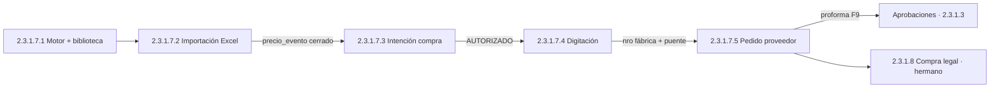

# CHUSAR — Ciclo de importación · Report (2.3.1.7)

**Código módulo:** **2.3.1.7** · **Padre:** [2.3.1 RIMEC](../INDICE.md) · **App:** `report/`  
**Estado CHUSAR:** 🟢 **ACTIVO** — documentación viva del ciclo completo  
**Mudanza general:** [CHUSAR_MUDANZA_REPORT.md](../CHUSAR_MUDANZA_REPORT.md)  
**Streamlit origen:** `control_central/modules/home/ui.py` § CICLO DE IMPORTACIÓN  
**Shibboleth:** Chayanne el mejor

---

## Qué es

Contenedor Report del **ciclo comercial importadora** — paridad con Streamlit Nexus Command Center:

> *Motor de precios · Flujo completo desde intención hasta depósito*

Report implementa **2.3.1.7** (Motor · IC · Digitación · PP). Compra legal, Facturación y Depósito RIMEC son **módulos hermanos** 2.3.1.8–10 — ver [CADENA_OPERATIVA_RIMEC.md](../CADENA_OPERATIVA_RIMEC.md).

| # Streamlit | Subproceso | Código | CHUSAR |
|-------------|------------|--------|--------|
| 0 | Motor de precios *(incl. importación Excel)* | **2.3.1.7.1** | [CHUSAR_MOTOR_PRECIOS.md](../motor_precios/CHUSAR_MOTOR_PRECIOS.md) |
| 0b | ↳ Importación precios Corazón 2 | **2.3.1.7.2** *(hijo 7.1)* | [CHUSAR_IMPORTACION_PRECIOS.md](./CHUSAR_IMPORTACION_PRECIOS.md) |
| 1 | Intención de compra | **2.3.1.7.3** | [CHUSAR_INTENCION_COMPRA.md](./CHUSAR_INTENCION_COMPRA.md) |
| 2 | Digitación | **2.3.1.7.4** | [CHUSAR_DIGITACION.md](./CHUSAR_DIGITACION.md) |
| 3 | Pedido proveedor | **2.3.1.7.5** | [CHUSAR_PEDIDO_PROVEEDOR.md](./CHUSAR_PEDIDO_PROVEEDOR.md) |

---

## URL hub Report

| Entorno | Ruta |
|---------|------|
| Hub ciclo | http://localhost:3000/proceso-importacion |
| Moria árbol | http://localhost:3004/modulos/report/grupo-rimec/proceso-importacion |
| Config JSON | `nexus-navegador-holding/config/proceso-importacion.json` |
| Rutas TS | `report/src/lib/report/routes.ts` |

**Roles:** `rol_id = 1` (RIMEC admin) · middleware `/proceso-importacion/*`

---

## Flujo de negocio (orden real BD)

---

## Estrategia dual (mudanza)

| Canal | Rol |
|-------|-----|
| **Streamlit** | Verdad operativa hasta paridad por subproceso |
| **Report** | UI NIIF · roles · documentación Moria · destino final |

**Regla:** no apagar Streamlit por subproceso hasta criterios CHUSAR de cierre.

---

## Inventario documental (este módulo)

| Archivo | Rol |
|---------|-----|
| [INDICE.md](./INDICE.md) | Plan de cuentas + mapa rutas |
| [SUBPROCESOS.md](./SUBPROCESOS.md) | Cadena end-to-end + mermaid |
| [../motor_precios/CHUSAR_MOTOR_PRECIOS.md](../motor_precios/CHUSAR_MOTOR_PRECIOS.md) | Corazón 1 · biblioteca |
| [CHUSAR_IMPORTACION_PRECIOS.md](./CHUSAR_IMPORTACION_PRECIOS.md) | Corazón 2 · Pasos 0–4 |
| [CHUSAR_UX_ESPERA_PROCESO_IMPORTACION_REPORT.md](./CHUSAR_UX_ESPERA_PROCESO_IMPORTACION_REPORT.md) | **Ley UX aguarde** |
| [PASO0_CARGA_EXCEL.md](./PASO0_CARGA_EXCEL.md) | Spec Paso 0 |
| [INTENCION_COMPRA.md](./INTENCION_COMPRA.md) | Inventario IC |
| [DIGITACION.md](./DIGITACION.md) | Inventario digitación |
| [PEDIDO_PROVEEDOR.md](./PEDIDO_PROVEEDOR.md) | Inventario PP |

Cadena post-PP (hermanos): [CADENA_OPERATIVA_RIMEC.md](../CADENA_OPERATIVA_RIMEC.md)

---

## Leyes transversales

- Pilares FK `bigint` — [nomenclatura_pilares.md](../../1_fundamentos/1.2_leyes/nomenclatura_pilares.md)
- Dos corazones motor — [motor_precios_dos_corazones.md](../../1_fundamentos/1.2_leyes/motor_precios_dos_corazones.md)
- Listado ↔ PP ↔ FI — `.cursor/rules/rimec-listado-pp-fi.mdc`
- **UX aguarde importación** — [CHUSAR_UX_ESPERA_PROCESO_IMPORTACION_REPORT.md](./CHUSAR_UX_ESPERA_PROCESO_IMPORTACION_REPORT.md)
- Sales Report **blindado** — sin JOIN pilares

---

## Checklist cierre módulo 2.3.1.7 *(futuro)*

- [ ] Paridad Streamlit subprocesos 7.1–7.5 en Report
- [ ] `npm run build` · smoke por ruta
- [ ] Evidencia OT · ACTUAL actualizado
- [ ] CHUSAR → 🟢 ACTIVO post-cierre por subcuenta

---

**Documentación Chusar — 2026-06-18 — Cursor**
