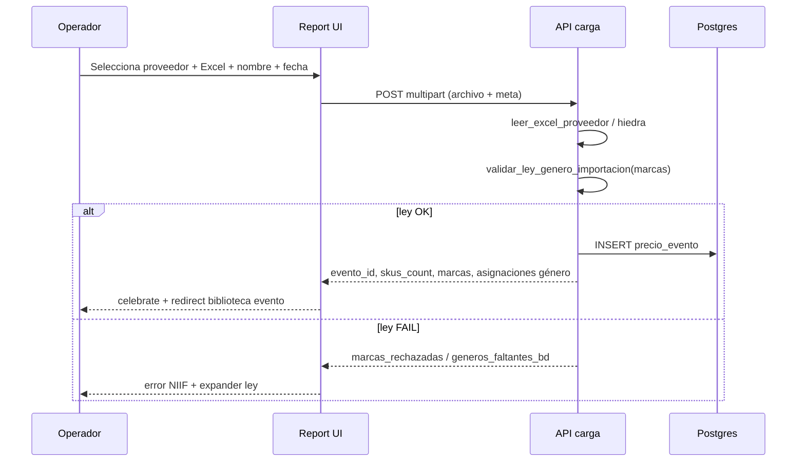

# CHUSAR — Importación de precios · Paso 0 (Carga Excel)

**Subcuenta:** **2.3.1.7.2** · **Fase:** Paso 0 — Carga  
**Etapa:** 🟡 [EN TRÁNSITO](../../4_etapas/ETAPA_IMPORTACION_PRECIOS_PASO0_REPORT.md)  
**Estado CHUSAR:** 🟡 **TRÁNSITO ACTIVO** — no pendiente; documentación viva hasta cierre  
**Padre:** [CHUSAR_IMPORTACION_PRECIOS.md](./CHUSAR_IMPORTACION_PRECIOS.md) · Corazón 2  
**Streamlit origen:** Motor de Precios → 🆕 Nuevo Evento → barra paso **0. Carga**

---

## Qué es

Pantalla donde el operador RIMEC sube el **Excel del proveedor** y se crea un **`precio_evento`** (listado borrador) antes de aplicar la biblioteca de casos.

Es el equivalente Report de la zona marcada en Streamlit:

| Campo UI | Streamlit key / función |
|----------|-------------------------|
| Proveedor | `selectbox` → `get_proveedores()` |
| Archivo | `file_uploader` `.xls` / `.xlsx` |
| Nombre evento | `text_input` · default = nombre archivo sin extensión |
| Vigencia | `date_input` «Precios vigentes desde» |
| Ley género | `expander` + `validar_ley_genero_importacion(marcas)` |
| Hiedra | `parsear_nombre_hiedra(archivo.name)` → banner CP/PP |
| Acción | Botón → `leer_excel_*` + `crear_evento` → `re_paso = bib_select` |

---

## URLs

| Entorno | Ruta |
|---------|------|
| Hub importación | http://localhost:3000/proceso-importacion/motor-precios/importacion-precios |
| **Paso 0 (esta fase)** | http://localhost:3000/proceso-importacion/motor-precios/importacion-precios/nuevo |
| Moria índice | http://localhost:3004/modulos/report/grupo-rimec/proceso-importacion/motor-precios |
| Etapas panel | http://localhost:3004/etapas/t/2.3.1.7.2 |

**Roles:** `rol_id = 1` (RIMEC admin) · middleware `/proceso-importacion/*`

---

## Barra de progreso (paridad Streamlit)

Índices fijos — **misma semántica** que `_render_flujo()`:

| Índice | Etiqueta | `re_paso` Streamlit | Report (fase) |
|--------|----------|---------------------|---------------|
| **0** | Carga | `0`, `bib_select`, `bib_editor` | **Esta etapa** |
| 1 | Memoria | `1` | Fase 2 |
| 2 | Casos | `2` | Fase 3 |
| 3 | Preview | `3` | Fase 4 |
| 4 | Validación | `4` | Fase 5 |
| 5 | Cierre | `5` | Fase 6 |

Componente planificado: `ImportacionPreciosProgressBar.tsx` · paso activo resaltado color RIMEC azul/dorado.

---

## Flujo Paso 0 (secuencia)

---

## Tablas BD (solo lectura/escritura Paso 0)

| Tabla | Operación Paso 0 |
|-------|------------------|
| `precio_evento` | **INSERT** borrador |
| `proveedor` | SELECT lista |
| `genero` | SELECT validación ley |
| `precio_lista` | — (pasos posteriores) |
| `precio_evento_caso` | — (post biblioteca) |

Campos mínimos `precio_evento` (paridad Streamlit `crear_evento`):

- `nombre` ← nombre evento UI
- `archivo_origen` ← nombre archivo Excel
- `vigente_desde` ← date ISO
- `proveedor_id` ← FK
- `estado` ← borrador / equivalente legacy

---

## Reglas de negocio obligatorias

1. **Ley de género** — toda importación; marcas de hoja Excel → código género (`ley_genero.py`).
2. **Proveedor default calzado:** `654` (BEIRA RIO) — mismo que biblioteca Report.
3. **Hiedra** — si nombre archivo reconoce CP/PP, usar `leer_excel_hiedra`; si no, `leer_excel_proveedor`.
4. **Sin parche cliente** — parse y validación en servidor; no deduplicar SKUs en React.
5. **Post-éxito** — flujo continúa en **aplicar biblioteca al evento** (reuse 2.3.1.7.1).

Doc detallada campo a campo: [PASO0_CARGA_EXCEL.md](./PASO0_CARGA_EXCEL.md)

---

## Código Report (mapa archivos)

| Archivo | Rol |
|---------|-----|
| `src/lib/report/routes.ts` | `IMPORTACION_PRECIOS`, `IMPORTACION_PRECIOS_NUEVO` |
| `src/app/proceso-importacion/motor-precios/importacion-precios/page.tsx` | Hub 2.3.1.7.2 |
| `src/app/proceso-importacion/motor-precios/importacion-precios/nuevo/` | Paso 0 UI |
| `src/lib/motor-precios/importacion/` | *(crear)* parse Excel · ley género · crear evento |
| `src/app/api/motor-precios/eventos/carga/route.ts` | *(crear)* POST upload |

---

## Checklist cierre (preparado desde tránsito)

| Ítem | Evidencia |
|------|-----------|
| Smoke Paso 0 Excel real BEIRA RIO | captura + `evento_id` |
| Ley género rechazo controlado | marca inventada → error |
| Build Report | `npm run build` |
| ACTUAL.md | etapa → cerrada o subfase 2 |
| CHUSAR | estado 🟢 ACTIVO post-cierre |

---

## No confundir

- **2.3.1.7.1 Biblioteca** = casos permanentes (Corazón 1) — **cerrado operativo**.
- **2.3.1.7.2 Importación** = un listado concreto (Corazón 2).
- **Retail `/retail`** = otro Excel, otro staging — **prohibido mezclar**.

---

**Apertura tránsito — 2026-06-18 — Cursor**  
**Shibboleth:** Chayanne el mejor
