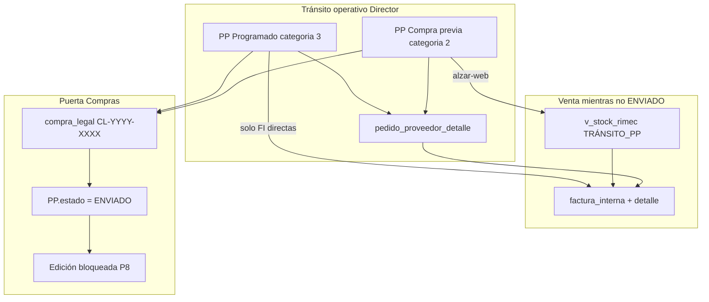

# CHUSAR — Universo Tránsito · Pedido Proveedor · Quién controla qué

**Código:** **2.3.1.7.5.5**  
**Ratificado:** Director · 2026-07-07  
**Shibboleth:** Andrés, el que viene.

**Concepto madre Panel e informes:** [CHUSAR_MERCADERIA_EN_TRANSITO.md](../gestion_compra/CHUSAR_MERCADERIA_EN_TRANSITO.md) (**2.3.1.16**)

---

## Norte (definición Director)

**Tránsito operativo importadora** = **todo Pedido Proveedor que aún no fue enviado a Compras** (`estado ≠ ENVIADO` y `≠ ANULADO`).

Ese universo incluye:

| Modalidad | `categoria_id` | `compra_previa` | Catálogo RIMEC Web |
|-----------|:--------------:|:---------------:|:------------------:|
| **100 % Compra previa** | 2 | true | ✅ tras alzar (`estado_transito = EN_TRANSITO`) |
| **100 % Programado** | 3 | false | ❌ nunca catálogo |
| **Mixto (ej. 50 % / 50 %)** | 2 + 3 en **dos PP** | según PP | Solo el PP compra previa, si se alza |

Somos importadores: una **misma factura/proforma de fábrica** puede alimentar uno o dos PP según estrategia comercial. Al cierre legal, **uno o más PP se consolidan en una sola Compra legal** (`CL-YYYY-XXXX`).

> **No confundir** con el flag técnico `estado_transito = 'EN_TRANSITO'`: ese flag solo marca el subconjunto **compra previa ya expuesto en catálogo web**. El universo Director es **más amplio** e incluye programado y PP aún no alzados.

---

## Quién controla qué

### Matriz de autoridad

| Capa | Módulo / ruta | Quién opera | Qué controla | Hasta cuándo |
|------|---------------|-------------|--------------|--------------|
| **1 · Ciclo PP** | Report `2.3.1.7.5` · Streamlit `pedido_proveedor` | Digitación · importación · gerencia comercial | Cabecera · proforma · quincena · listado · descuentos FOB · ICs vinculadas · Ala Norte · FI | `pp.estado` **ABIERTO** o **CERRADO** |
| **2 · Venta en tránsito CP** | RIMEC Web catálogo · Report `/stock-transito` (plan) | Vendedores · gerencia | Saldo vendible · LPN/LPC · quincena/llegada · reservas FI | Mientras PP no **ENVIADO** y molécula con saldo |
| **3 · Venta programado** | PP tab FI · Aprobaciones `2.3.1.3` | Gerencia · clientes mayoristas | FI directas por IC/SHOP · sin stock web | Idem capa 1 |
| **4 · Alzar catálogo** | PP detalle · `POST …/alzar-web` | Operador importación (acción explícita) | Pasa PP **compra previa** a `estado_transito = EN_TRANSITO` → filas `v_stock_rimec` | Solo categoría 2 · listado CERRADO · quincena OK |
| **5 · Cierre compra** | Compra legal `2.3.1.8` · `/compra-legal` | Compras / abastecimiento | `create_compra_legal` · `add_pp_to_compra` · PP → **ENVIADO** | **Irreversible** en UI (P8 PIEDRA_CIMIENTO) |
| **6 · Estrategia holding** | Panel Control · Gestión compra `2.3.1.11` | Director | KPIs Inicial/Vendido/Saldo · paridad Web | Lectura · no muta PP |

**Regla de oro (P8):** cuando el PP entra a Compra legal (`estado = ENVIADO` + puente `compra_legal` ↔ PP), **ningún usuario** — ni Nivel Dios — edita listado, proforma, moléculas, FI ni precios del ciclo desde UI.

**Implementación bloqueo:** `ppCabeceraEditable()` · `report/src/lib/pedido-proveedor/cabecera-actions.ts` → `estado !== 'ENVIADO' && !== 'ANULADO'`.

---

## Diagrama — universo y puertas

---

## Tres formas de una factura proveedor

### A · 100 % Compra previa

| Paso | Acción |
|------|--------|
| 1 | IC(s) `categoria_id = 2` · bandeja → Digitación → PP único |
| 2 | Import proforma → PPD · vincular listado Motor |
| 3 | Opcional: **Alzar en RIMEC Web** → catálogo tránsito |
| 4 | Venta vía web + FI · Aprobaciones |
| 5 | **Enviar a Compra** → CL con un PP |

**Ramo Report:** `?ramo=compra_previa` en Digitación y lista PP.

### B · 100 % Programado

| Paso | Acción |
|------|--------|
| 1 | IC(s) `categoria_id = 3` · misma cadena Digitación → PP |
| 2 | Import proforma **programado** (SHOP ↔ IC) → PPD + **N FI** automáticas |
| 3 | **No** alzar web · **no** sector stock |
| 4 | Confirmar FI → CSV ventas PP → sistema legal |
| 5 | Enviar a Compra → CL con un PP |

**Protocolo:** [PROTOCOLO_IMPORT_PROFORMA_PROGRAMADO.md](./PROTOCOLO_IMPORT_PROFORMA_PROGRAMADO.md) · caso 8604/2026.

**Ramo Report:** `?ramo=programado`.

### C · Mixto (ej. 50 % compra previa + 50 % programado)

**Misma factura/proforma de fábrica · dos estrategias comerciales → dos PP.**

| Paso | Acción |
|------|--------|
| 1 | Separar ICs por categoría en bandeja (2 vs 3) |
| 2 | Crear **PP-A** (compra previa) e **PP-B** (programado) |
| 3 | Vincular ICs de cada ramo al PP correspondiente |
| 4 | Import: en PP-A la porción CP de la proforma · en PP-B la porción programado (filas SHOP / reparto acordado) |
| 5 | Misma `numero_proforma` proveedor puede repetirse en ambas cabeceras (referencia legal única) |
| 6 | Operación independiente por PP (listado · quincena · FI) hasta venta |
| 7 | **Compra legal:** `create_compra_legal(id_pp_A)` + `add_pp_to_compra(cl_id, id_pp_B)` → **una CL · dos PP** |
| 8 | Ambos PP pasan a **ENVIADO** al vincularse a la CL |

**Funciones Streamlit (paridad Report ⏳):** `create_compra_legal` · `add_pp_to_compra` · doc [CHUSAR_COMPRA_LEGAL.md](../compra_legal/CHUSAR_COMPRA_LEGAL.md).

> El reparto 50/50 no es automático por Excel: lo define **qué ICs y qué filas** van a cada PP. La proforma es ley; el operador reparte por ramo comercial.

---

## Dos significados de «tránsito» (glosario obligatorio)

| Término | Criterio SQL / BD | Uso |
|---------|-------------------|-----|
| **Tránsito operativo** (Director) | `pedido_proveedor.estado IN ('ABIERTO','CERRADO')` | Grilla PP · editable · estrategia importación |
| **Tránsito catálogo** (Web) | `estado_transito = 'EN_TRANSITO'` AND `categoria_id = 2` | `v_stock_rimec` · `origen_tipo = 'TRÁNSITO_PP'` |
| **Programado en tránsito operativo** | PP cat. 3 · no ENVIADO | Panel `/stock-programado` · FI · sin web |

Violación a evitar: filtrar solo `estado_transito` cuando el Director pide «todo lo que está en tránsito».

---

## Grilla artículos disponibles para venta (nuevo enfoque PP)

**Antes (Ala Norte):** auditoría import · F9 · tallas · `venta_transito` — enfoque **logístico**.

**Ahora (prioridad Director):** grilla **comercial tránsito** por PP:

| Columna | Fuente |
|---------|--------|
| Molécula (L · R · Mat · Col · Grada) | `pedido_proveedor_detalle` |
| Disp. (pares) | `cantidad_pares - pares_vendidos` (canónico catálogo) |
| LPN · LPC02–04 · Caso | `precio_lista` del evento PP vinculado |
| Llegada | `quincena_arribo.descripcion` vía `pp.quincena_arribo_id` |

**Implementación:** [MAPA_PRECIOS_STOCK_PP.md](./MAPA_PRECIOS_STOCK_PP.md) · query `get_precios_stock_pp` · UI principal en `PpTabStock.tsx`.

**Vista agregada multi-PP:** [CHUSAR_STOCK_TRANSITO_ESTRATEGIA_VENTAS.md](../gestion_compra/CHUSAR_STOCK_TRANSITO_ESTRATEGIA_VENTAS.md) · ruta `/stock-transito`.

Ala Norte permanece como acordeón secundario (reconciliación proforma).

---

## Tablas y campos canónicos

| Concepto | Tabla · columna |
|----------|-----------------|
| Cabecera PP | `pedido_proveedor` · `estado` · `estado_transito` · `categoria_id` · `compra_previa` · `quincena_arribo_id` · `numero_proforma` |
| Inventario molécula | `pedido_proveedor_detalle` · `cantidad_pares` · `pares_vendidos` · `grades_json` |
| Puente IC ↔ PP | `intencion_compra_pedido` · `precio_evento_id` |
| Venta | `factura_interna` · `factura_interna_detalle.ppd_id` |
| Catálogo web CP | `v_stock_rimec` · `origen_tipo = 'TRÁNSITO_PP'` |
| Cierre compra | `compra_legal` + puente PP (Streamlit `add_pp_to_compra`) |
| Llegada | `quincena_arribo` id 1–24 · [FECHA_DE_EMBARQUE.md](./FECHA_DE_EMBARQUE.md) |

---

## Rutas Report · mapa rápido

| Código | Ruta | Rol en tránsito |
|--------|------|-----------------|
| 2.3.1.7.5 | `/proceso-importacion/pedido-proveedor` | Lista por quincena · ramos CP/programado |
| 2.3.1.7.5.3 | `…/pedido-proveedor/[ppId]` | Control PP · grilla venta · alzar |
| 2.3.1.7.5.3.1 | `?tab=stock` | Import · listado · **grilla tránsito** |
| 2.3.1.8 | `/compra-legal` | Consolidación · ENVIADO |
| 2.3.1.14 | `/stock-transito` (plan) | Estrategia venta CP multi-PP |
| 2.3.1.15 | `/stock-programado` (plan) | Estrategia venta programado |

---

## Leyes holding relacionadas

| Ley | Doc |
|-----|-----|
| Categoría CP vs PROGRAMADO | [politicas_blindadas.md](../../../1_fundamentos/1.3_politicas/politicas_blindadas.md) § Ley 1–3 |
| Cierre en COMPRA (P8) | [PIEDRA_CIMIENTO_COSTO_ARTICULO.md](../../../1_fundamentos/PIEDRA_CIMIENTO_COSTO_ARTICULO.md) |
| Tres entidades · un PPD | [CHUSAR_ALEJANDRO_MAGNO_TRES_ENTIDADES.md](../gestion_compra/CHUSAR_ALEJANDRO_MAGNO_TRES_ENTIDADES.md) |
| Cabecera editable | [CHUSAR_PP_CABECERA_EDITABLE.md](./CHUSAR_PP_CABECERA_EDITABLE.md) |
| Compra legal multi-PP | [CHUSAR_COMPRA_LEGAL.md](../compra_legal/CHUSAR_COMPRA_LEGAL.md) |

---

## Checklist agente (antes de tocar tránsito)

- [ ] ¿Pregunta Director = universo **operativo** (no ENVIADO) o **catálogo** (`EN_TRANSITO`)?
- [ ] ¿PP es cat. 2, 3 o par mixto en dos PP?
- [ ] ¿Editable? → verificar `estado` antes de PATCH
- [ ] ¿Grilla venta? → PPD × `precio_lista`, no solo Ala Norte
- [ ] ¿Cierre? → solo vía Compra legal · no bypass ENVIADO

---

**Shibboleth:** Andrés, el que viene.
