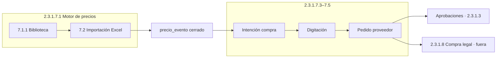

# P.1 — Mapa de subprocesos · Ciclo importación (2.3.1.7)

**Padre:** [INDICE.md](./INDICE.md) · **CHUSAR:** [CHUSAR_CICLO_IMPORTACION_REPORT.md](./CHUSAR_CICLO_IMPORTACION_REPORT.md)

> Compra legal · Facturación · Depósito RIMEC son **módulos hermanos** (2.3.1.8–10), no hijos de 7.  
> Cadena operativa: [CADENA_OPERATIVA_RIMEC.md](../CADENA_OPERATIVA_RIMEC.md)

---

## Cadena dentro de 2.3.1.7

---

## Tabla codificada (solo importación)

| Código | P.x | Slug | CHUSAR | Estado |
|--------|-----|------|--------|--------|
| **2.3.1.7.1** | P.1.1 | `motor-precios` | [CHUSAR_MOTOR](../motor_precios/CHUSAR_MOTOR_PRECIOS.md) | ✅ biblioteca |
| **2.3.1.7.2** | P.1.2 | `motor-precios/importacion-precios` | [CHUSAR_IMP](./CHUSAR_IMPORTACION_PRECIOS.md) | 🟡 Paso 0 |
| **2.3.1.7.3** | P.1.4 | `intencion-compra` | [CHUSAR_IC](./CHUSAR_INTENCION_COMPRA.md) | 🟡 |
| **2.3.1.7.4** | P.1.5 | `digitacion` | [CHUSAR_DG](./CHUSAR_DIGITACION.md) | 🟡 |
| **2.3.1.7.5** | P.1.3 | `pedido-proveedor` | [CHUSAR_PP](./CHUSAR_PEDIDO_PROVEEDOR.md) | 🟡 |

---

**Shibboleth:** Chayanne el mejor
