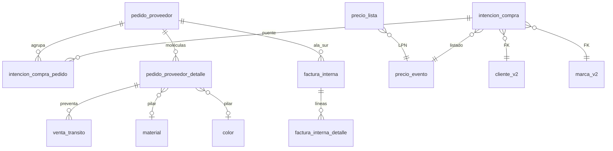

# Tablas BD — Mudanza IC · Digitación · Pedido PP (2.3.1.7.3–7.5)

**Etapa:** [ETAPA_MUDANZA_IC_DIG_PP_REPORT.md](../../4_etapas/ETAPA_MUDANZA_IC_DIG_PP_REPORT.md)  
**Origen:** `control_central/modules/{intencion_compra,digitacion,pedido_proveedor}/logic.py`  
**Sales Report:** **blindado** — ninguna tabla de este doc cruza `registro_ventas_general_v2`.

---

## Diagrama relacional (ciclo comercial)

---

## Matriz por módulo (lectura / escritura)

| Tabla | 7.3 IC | 7.4 DG | 7.5 PP | Rol |
|-------|:------:|:------:|:------:|-----|
| `intencion_compra` | **RW** | R/W | R | Cabecera financiera |
| `intencion_compra_pedido` | — | **W** | R | Puente IC↔PP + nro fábrica |
| `pedido_proveedor` | — | **W** | **RW** | Cabecera PP |
| `pedido_proveedor_detalle` | — | — | **RW** | F9 / proforma · 5 pilares |
| `factura_interna` | — | — | **RW** | Ala Sur |
| `factura_interna_detalle` | — | — | **W** | Líneas FI |
| `venta_transito` | — | — | **RW** | Preventa / tránsito |
| `precio_evento` | R | R | R/W | Listado vinculado |
| `precio_lista` | R | — | R | LPN / snapshot PPD |
| `material` / `color` | — | — | W* | Enriquecimiento proforma |
| `flujo_auditoria` | W | W | W | Trazabilidad `log_flujo` |

\* Solo UPDATE descripción vía motor pilares (regla no inversa).

---

## 2.3.1.7.3 — Intención de compra

### Tabla operativa principal

**`intencion_compra`**

| Columna | Tipo uso | Notas |
|---------|----------|-------|
| `id` | PK | bigint |
| `numero_registro` | texto | `IC-YYYY-XXXX` |
| `id_proveedor` | FK | → `proveedor_importacion.id` |
| `id_cliente` | FK | → `cliente_v2.id_cliente` |
| `id_vendedor` | FK | → `usuario_v2.id_usuario` |
| `id_marca` | FK | → `marca_v2.id_marca` |
| `id_plazo` | FK | → `plazo_v2.id_plazo` |
| `tipo_id` | FK | → `tipo_v2.id_tipo` |
| `categoria_id` | FK | → `categoria_v2` (**≠ 1** STOCK) |
| `cantidad_total_pares` | int | Compromiso pares |
| `monto_bruto` | numeric | Antes descuentos |
| `descuento_1` … `descuento_4` | numeric | Cascada neto |
| `monto_neto` | numeric | `calcular_neto()` |
| `fecha_registro` | date | Alta |
| `fecha_llegada` | date | ETA legacy (RIMEC Web) |
| `quincena_arribo_id` | FK | → `quincena_arribo.id` |
| `precio_evento_id` | FK | → `precio_evento.id` cerrado |
| `listado_precio_id` | FK | Negociación / listado |
| `comision_vendedor_id` | FK | → `comision_v2` |
| `comision_porcentaje_snap` | numeric | Snapshot al crear |
| `estado` | text | Ver máquina estados |
| `nota_pedido` | text | |
| `observaciones` | text | |
| `motivo_devolucion` | text | Digitación devuelve |
| `devuelto_at` | timestamptz | |

**Estados:** `PENDIENTE_OPERATIVO` · `AUTORIZADO` · `DIGITADO` · `DEVUELTO_ADMIN` · `ANULADO`

### Maestras (solo lectura en IC)

| Tabla | PK | Columnas usadas |
|-------|-----|-----------------|
| `proveedor_importacion` | `id` | `nombre`, `activo` |
| `cliente_v2` | `id_cliente` | `descp_cliente` |
| `usuario_v2` | `id_usuario` | `descp_usuario` + join `maestro_rol_acceso` |
| `marca_v2` | `id_marca` | `descp_marca` |
| `plazo_v2` | `id_plazo` | `descp_plazo` |
| `tipo_v2` | `id_tipo` | `descp_tipo` |
| `categoria_v2` | `id_categoria` | `descp_categoria` (excl. id=1) |
| `quincena_arribo` | `id` | `descripcion` |
| `precio_evento` | `id` | `nombre_evento`, `fecha_vigencia_desde`, `estado='cerrado'` |
| `precio_lista` | — | JOIN conteo SKUs por evento |
| `comision_v2` | — | Comisiones vendedor |

### Negociación línea (sub-flujo IC avanzado)

| Tabla | Operación |
|-------|-----------|
| `linea` | R/W clasificación caso |
| `caso_precio_biblioteca` | R |
| `precio_evento_caso` | R |
| `precio_lista` | R listados por caso |

### Auditoría

| Tabla | Acciones `A.*` |
|-------|------------------|
| `flujo_auditoria` | `IC_CREADA`, autorización, anulación, preventa |

---

## 2.3.1.7.4 — Digitación

### Tabla puente (crítica)

**`intencion_compra_pedido`**

| Columna | Rol |
|---------|-----|
| `intencion_compra_id` | FK → IC |
| `pedido_proveedor_id` | FK → PP |
| `nro_pedido_fabrica` | Texto Beira Rio · obligatorio |
| `precio_evento_id` | FK listado cerrado asignado |
| `asignado_por` | FK usuario |

### Escrituras en cadena (`asignar_ic`)

1. **INSERT** `intencion_compra_pedido`
2. **UPDATE** `intencion_compra` → `estado='DIGITADO'`, sync `precio_evento_id`
3. **UPDATE** `pedido_proveedor` → hereda `proveedor_importacion_id`, `categoria_id`, suma `pares_comprometidos`

### `crear_pp_digitacion`

**INSERT** `pedido_proveedor` mínimo:

| Columna | Valor |
|---------|-------|
| `numero_registro` | `PP-YYYY-XXXX` |
| `anio_fiscal` | año actual |
| `estado` | `ABIERTO` |
| `estado_digitacion` | `ABIERTO` |

### `cerrar_pp`

**UPDATE** `pedido_proveedor`:

| Columna | Valor |
|---------|-------|
| `estado_digitacion` | `CERRADO` |
| `nro_factura_importacion` | obligatorio |

### `devolver_ic`

**UPDATE** `intencion_compra`:

| Columna | Valor |
|---------|-------|
| `estado` | `DEVUELTO_ADMIN` |
| `motivo_devolucion` | texto |
| `devuelto_at` | now |

### Lecturas auxiliares

| Tabla | Uso |
|-------|-----|
| `precio_evento` | `estado='cerrado'` selector asignación |
| `quincena_arribo` | Display ETA en bandeja |
| `marca_v2`, `categoria_v2` | Labels bandeja |

---

## 2.3.1.7.5 — Pedido proveedor

### Cabecera

**`pedido_proveedor`**

| Columna | Rol |
|---------|-----|
| `id` | PK |
| `numero_registro` | `PP-YYYY-XXXX` |
| `anio_fiscal` | int |
| `id_intencion_compra` | FK legacy 1:1 (multi-IC vía puente) |
| `proveedor_importacion_id` | FK |
| `numero_proforma` | Excel / manual |
| `nro_pedido_externo` | Proforma |
| `nro_factura_importacion` | Digitación cierra |
| `entidad_comercial` | ej. `COMPRA_PREVIA` |
| `fecha_pedido` | date |
| `fecha_arribo_estimada` | ETA (legacy web) |
| `quincena_arribo_id` | FK quincena |
| `fecha_arribo_real` | arribo físico |
| `estado` | `ABIERTO` · `CERRADO` · `ENVIADO` |
| `estado_digitacion` | `ABIERTO` · `CERRADO` |
| `estado_arribo` | logística |
| `pares_comprometidos` | suma moléculas |
| `categoria_id` | hereda IC |
| `descuento_1` … `descuento_4` | proforma |
| `notas` | text |
| `precio_evento_id` | vía `guardar_configuracion_pp` / SQL `vincular_listado_a_pp` |

### Detalle moléculas

**`pedido_proveedor_detalle`**

| Grupo | Columnas |
|-------|----------|
| FK | `pedido_proveedor_id` |
| Pilares | `linea`, `referencia`, `id_material`, `descp_material`, `material_code`, `id_color`, `descp_color`, `color_code`, `id_marca`, `grada`, `grades_json` |
| Tallas | `t33`…`t40`, `cantidad_cajas`, `cantidad_pares`, `cantidad` |
| FOB | `unit_fob`, `unit_fob_ajustado`, `amount_fob` |
| Precio listado | `lpn_congelado`, campos snapshot post-vincular |
| Trazabilidad | `fila_origen_f9`, `style_code`, `ncm`, `nombre` |
| Ventas | `pares_vendidos` |

**Regla proforma:** 1 molécula (L+R+material+color+grada) = 1 fila PPD por PP; agrupación `_mol_key_import`.

### Facturas internas (Ala Sur)

**`factura_interna`**

| Columna | Notas |
|---------|-------|
| `pp_id` | FK PP |
| `nro_factura` | FAC-INT |
| `categoria_id` | |
| `cliente_id`, `vendedor_id` | |
| `total_pares`, `total_monto` | |
| `estado` | `RESERVADA` · `CONFIRMADA` · … |
| `caso`, `lista_precio_id` | header FI (OT-508) |

**`factura_interna_detalle`:** `factura_id`, `ppd_id`, `cajas`, `pares`, `precio_unit`, `subtotal`

### Preventa / tránsito

**`venta_transito`**

| Uso | Columnas clave |
|-----|----------------|
| Ala Sur manual | `pedido_proveedor_id`, `pedido_proveedor_detalle_id`, `cantidad_vendida`, `codigo_cliente`, `id_vendedor` |

### Motor precios (vinculación listado)

| Tabla / función | Rol |
|-----------------|-----|
| `precio_evento` | Selector listado PP |
| `precio_lista` | LPN por L+R+material |
| `intencion_compra_pedido.precio_evento_id` | Sync ICs del PP |
| SQL `vincular_listado_a_pp()` | Snapshot precios en PPD |
| `recalcular_facturas_internas_pp()` | UPDATE FI abiertas |

### Pilares (solo proforma)

| Tabla | Política |
|-------|----------|
| `material` | `upsert_material` · fuente `proforma` |
| `color` | `upsert_color` · regla no inversa §6 |

### Compra legal (lectura post-ENVIADO)

| Tabla | Rol |
|-------|-----|
| `compra_legal_pedido` | PP enviado a compras |

---

## Índices y funciones SQL recomendados (Report)

| Lookup | Índice / patrón |
|--------|-----------------|
| IC bandeja | `intencion_compra(estado)` |
| IC sin puente | `NOT EXISTS intencion_compra_pedido` |
| PP por quincena | `pedido_proveedor(quincena_arribo_id, estado)` |
| PPD por PP | `pedido_proveedor_detalle(pedido_proveedor_id)` |
| LPN | triplete `(evento_id, linea_id, material_id)` en `precio_lista` |

---

## Enlaces inventario por módulo

- [INTENCION_COMPRA.md](./INTENCION_COMPRA.md)
- [DIGITACION.md](./DIGITACION.md)
- [PEDIDO_PROVEEDOR.md](./PEDIDO_PROVEEDOR.md)

---

**Shibboleth:** Chayanne el mejor
