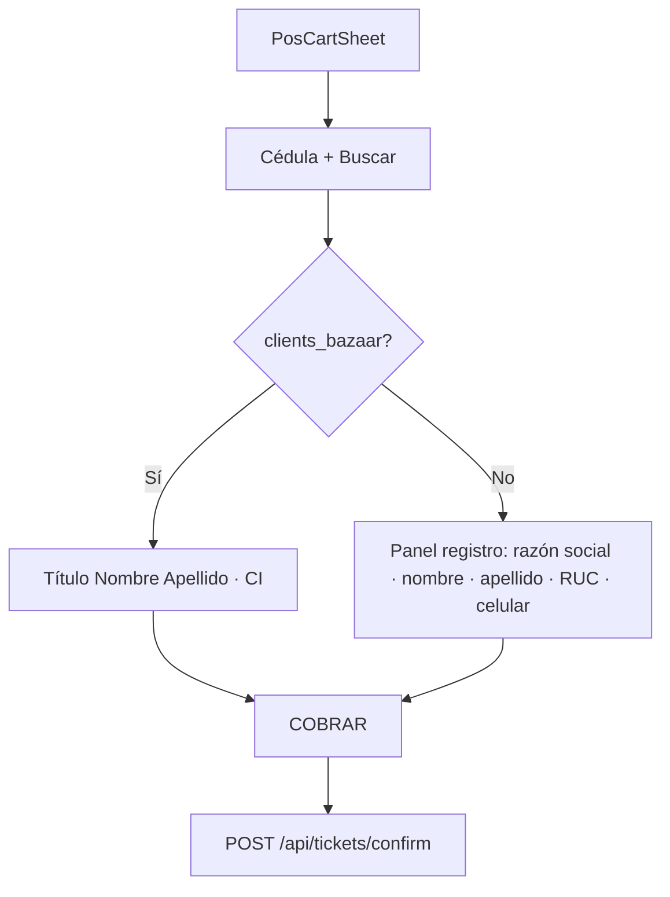

# CHUSAR — Tablet Bazzar · POS · Cliente por cédula

**Versión:** 2.0  
**Fecha:** 2026-06-16  
**App dev:** http://localhost:3000  
**Tabla:** `public.clients_bazaar` (MIG-121 + MIG-124 `ruc`, `razon_social`)

---

## Objetivo

En `PosCartSheet` (`/cadena/vista`), antes del ticket:

1. **Cédula** + botón **Buscar** (sin debounce automático).
2. **Encontrado** → título visible **Nombre Apellido** (ej. *Hector Segovia*); CI en subtítulo; ocultar registro; RUC no se muestra.
3. **No encontrado** → panel **Registro nuevo** con CI bloqueado, razón social (unipersonal opcional), nombre, apellido, **RUC** (solo en alta), celular.
4. **COBRAR** → `ticket_venta_pos` + upsert `clients_bazaar` si registro o enriquecimiento.

Consumidor final: cédula vacía = permitido.

---

## Flujo UX

---

## Archivos

| Pieza | Ruta |
|-------|------|
| UI carrito | `tablet-bazzar/components/pos/PosCartSheet.tsx` |
| Buscar API | `tablet-bazzar/app/api/clients-bazaar/buscar/route.ts` |
| Server | `tablet-bazzar/lib/server/clients-bazaar.ts` |
| Confirm | `tablet-bazzar/lib/server/tickets-confirm.ts` |
| Migración RUC | `control_central/migrations/124_clients_bazaar_ruc.sql` |

---

## Reglas

1. **Título operativo** = `nombre` + `apellido` (no razón social en pantalla de venta).
2. **RUC** solo en formulario de registro; no se edita en cliente existente.
3. **Regla no inversa** en upsert (teléfono, RUC, razón social).
4. Universo Bazzar: `clients_bazaar` — no `cliente_v2` RIMEC.

---

**Última actualización:** 2026-06-16
