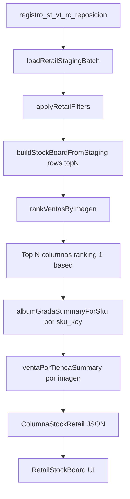

# Mapa reutilizable — Retail Report → Tablet Depósito con fotos

**Origen:** Report `/retail` · módulo Stock/Retail BAZZAR  
**Destino:** Sub-sesión [SUBSESION_TABLET_DEPOSITO_FOTOS_20260617.md](../../4_etapas/SUBSESION_TABLET_DEPOSITO_FOTOS_20260617.md)  
**Fecha:** 2026-06-17  
**Shibboleth:** 7 años

---

## Fuente de verdad

| Capa | Ubicación |
|------|-----------|
| Tabla staging | `public.registro_st_vt_rc_reposicion` |
| Lectura batch | `report/src/lib/retail/query-staging.ts` |
| Tipos fila | `report/src/lib/retail/staging-row.ts` → `RetailStagingRow` |
| **Motor ranking + gradas** | `report/src/lib/retail/build-stock-board.ts` |
| API catálogo ranking | `GET /api/retail/stock-board?batch_id&top&…filtros` |
| UI tarjetas | `report/src/app/retail/components/RetailStockBoard.tsx` |
| Ranking por **marca** (informe) | `report/src/app/retail/InformeVentasContent.tsx` + árbol snapshot |

---

## Dos rankings distintos (no confundir)

| Ranking | Agrupa por | Orden | Uso UI |
|---------|------------|-------|--------|
| **Comercial (catálogo)** | `imagen_nombre` (foto/SKU visual) | Σ venta ↓ | Top N tarjetas `#1…#30` |
| **Por marca (informe)** | `marca` dentro de cada **ente/tienda** | Σ venta ↓ | Tablas Adultos/Niños |

Depósito tablet hoy usa **TOP por marca** (`PARTITION BY marca ORDER BY cantidad DESC`) — más cercano al informe, no al catálogo por imagen.

---

## Pipeline catálogo (ranking comercial)



### Paso 1 — `rankVentasByImagen`

- Solo filas `tipo_movimiento = venta` y `cantidad > 0`
- Agrupa por `imagen_nombre` normalizado (lower, sin prefijo `productos/`)
- `totalVenta = SUM(cantidad)` por imagen
- Orden: **mayor venta primero** → `ranking = índice + 1`
- Toma **topN** (default 30, max 1000)

### Paso 2 — Por cada imagen del top: gradas × sucursal

Función **`albumGradaSummaryForSku(rows, sku_key)`**:

1. Filtra todas las filas del mismo `sku_key` (L+R+Mat+Color)
2. Lista **gradas** únicas ordenadas (numérico → curva texto)
3. Por cada **`origen_tienda`** (sucursal / stand):

| Origen | Regla gradas visibles |
|--------|------------------------|
| Tienda Bazzar (Fernando, Palma, San Martin…) | Gradas **simples** (talla suelta) — **excluye** curva `34(1 2 3 3 2 1)39` |
| Importadora / RIMEC | Solo gradas **curva caja** (contienen `(` y `)`) |

4. **Venta por grada:** `SUM(cantidad)` de filas `venta` en esa grada  
5. **Stock por grada:** filas `stock` con **fecha_mov máxima** (snapshot más reciente), luego `SUM(cantidad)` por grada

Orden sucursales: **`origenesOrdered`** — tiendas primero (sort natural), importadora al final.

### Paso 3 — Resumen venta por tienda (badge card)

**`ventaPorTiendaSummary(rows, imagenKey)`**:

- Σ venta por `origen_tienda`, excluye importadora/RIMEC
- Orden fijo: `Fernando` → `Palma` → `San Martin` → resto
- Salida: `{ tienda, pares }[]` → UI línea «Fernando: 25 | Palma: 10…»

### Paso 4 — Estructura JSON tarjeta

```typescript
ColumnaStockRetail {
  ranking, totalVenta, imagenArchivo,
  ventaPorTienda: { tienda, pares }[],
  tiendas: TiendaTallaBloque[]   // por sucursal
  importadora: { etiquetaGrada, stockTotal }
}

TiendaTallaBloque {
  nombre,           // ej. "Fernando"
  tallas[],         // gradas visibles
  venta[],          // pares por talla (null si 0)
  stock[]           // stock actual por talla
}
```

---

## Pipeline informe (ranking por marca)

Fuente: **`loadRetailArbolLeaves`** → agrega **sin grada**:

```sql
SUM(CASE tipo=stock THEN cantidad) AS stock,
SUM(CASE tipo=venta THEN cantidad) AS venta
GROUP BY origen_holding, genero, marca, L, R, Mat, Color
```

Árbol: **Ente → Género → Marca → SKU** (`build-arbol-snapshot.ts`).

**InformeVentasContent:**

- Por tienda (`ente` ≠ RIMEC): recorre hijos género → marca
- Listas fijas: `MARCAS_ADULTOS` · `MARCAS_NINOS`
- **`sort((a,b) => b.cantidad - a.cantidad)`** → ranking marca en esa sucursal
- **Rendimiento:** matriz marca × tienda (cantidad o monto estimado)

---

## Equivalencias para Tablet Depósito con fotos

| Concepto Retail | Campo / regla | Tablet depósito hoy |
|-----------------|---------------|---------------------|
| Sucursal / stand | `origen_holding` / `origen_tienda` | `cliente_id` + tabla depósito (6 tiendas) |
| Molécula | `sku_key` L+R+Mat+Color | Misma molécula pilares |
| Ranking visual catálogo | Por imagen + venta | TOP 80 **`PARTITION BY marca ORDER BY cantidad DESC`** |
| Cantidad disponible | Stock snapshot última fecha × grada | `cantidad` en fila depósito (sin pivot grada en grid) |
| Foto | `imagen_nombre` → Storage | `imagen_url_thumb` enrich |

---

## Qué reutilizar en sub-etapa Depósito

| Pieza Retail | Reutilizar | Notas |
|--------------|------------|-------|
| `rankVentasByImagen` + top N | Opcional | Si grid ordena por venta reciente del lote |
| `albumGradaSummaryForSku` | **Sí** | Detalle talla × sucursal en modal/lightbox |
| `ventaPorTiendaSummary` | **Sí** | Badge multi-tienda en card |
| `origenesOrdered` + split tienda/importadora | **Sí** | Misma ley curva vs talla suelta |
| `computeRetailKpis` | Parcial | KPIs header depósito |
| Informe ranking marca | Parcial | Filtro chips marca ordenados por stock |

**No copiar literal:** Retail usa batch Excel staging; Tablet lee **tabla depósito materializada** por tienda (`/api/deposito/[cliente_id]`).

---

## Archivos clave (Report)

```
report/src/lib/retail/build-stock-board.ts    ← núcleo ranking + gradas
report/src/lib/retail/types.ts              ← ColumnaStockRetail, TiendaTallaBloque
report/src/lib/retail/staging-row.ts          ← RetailStagingRow + SQL JOIN
report/src/app/api/retail/stock-board/route.ts
report/src/app/retail/components/RetailStockBoard.tsx
report/src/app/retail/InformeVentasContent.tsx  ← ranking marca
report/src/lib/retail/load-arbol-leaves.ts    ← agregación sin grada
```

---

**Mapa para reutilización — Cursor · orden Director 2026-06-17**
