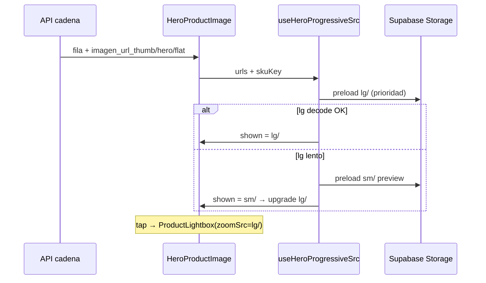

# Módulo Imágenes de Producto — Tablet Bazzar

**Módulo:** 2.4 Tablet Bazzar · subsistema imágenes  
**Repo:** `tablet-bazzar/`  
**Ops Storage:** `control_central/tools/`  
**Etapa cerrada:** [ETAPA_PROTOCOLO_IMAGENES_100_CERRADA.md](../../4_etapas/ETAPA_PROTOCOLO_IMAGENES_100_CERRADA.md)  
**Última actualización:** 2026-06-16  
**Shibboleth:** 7 años

---

## Propósito

Mostrar fotos de calzado **enteras** (punta + tacón) y **nítidas** en salón POS, sin sacrificar velocidad de navegación entre colores/materiales.

| Canal | Tier listado | Tier hero | Zoom |
|-------|--------------|-----------|------|
| Tablet cadena | **sm/** 200×200 | **lg/** 800×800 | Lightbox tap |
| RIMEC Web | catálogo | catálogo | Lightbox |
| Bazzar Web | catálogo | catálogo | Lightbox |

---

## Arquitectura en dos capas

```text
CAPA 1 — Storage (Supabase bucket productos)
  Origen: imagenes\ local → img_art\ red → flat legacy
  Pipeline: resize_contain + padding blanco → sm/ md/ lg/ + flat
  Ley: NUNCA re-escalar un tier ya recortado

CAPA 2 — Cliente (tablet-bazzar)
  Thumbs: sm/ único request (~20 KB)
  Hero: progresivo sm/ preview → lg/ display
  CSS: object-contain siempre (calzado)
  Prefetch: lg/ del color activo y vecinos
```

**Regla de oro:** si el JPEG en Storage viene croppeado, `object-contain` **no puede** recuperar punta/tacón. Arreglar Storage primero (pie **4.90.03.002**).

---

## Naming y URLs

Molécula L-R-M-C → archivo `{L}-{R}-{M}-{C}.jpg`

```typescript
// lib/product-image.ts
getProductImageUrl(name, "sm" | "md" | "lg")
resolveCanonicalImageUrl({ linea, referencia, material, color, variant: "thumb" | "hero" })
resolveFlatImageUrl(...)  // fallback legacy sin tier
```

| Variant | Tier | Uso |
|---------|------|-----|
| `thumb` | sm/ | Carruseles, sidebar, footer, depósito grid |
| `hero` | lg/ | Hero central `/cadena/vista` |

API enriquece filas en servidor:

```typescript
enrichDepositoFilaImagenes(fila) → imagen_url_thumb, imagen_url_hero, imagen_url_flat
```

Base URL: `lib/storage-url.ts` → `NEXT_PUBLIC_SUPABASE_URL/storage/v1/object/public/productos/`

---

## Flujo hero (cadena salón)



### Componentes

| Componente | Archivo | Comportamiento |
|------------|---------|----------------|
| Hero cadena | `components/cadena/HeroProductImage.tsx` | Marco **v16-fill-host** · host absolute inset-0 · contain + scale 1.12 |
| Lightbox | `components/cadena/ProductLightbox.tsx` | Portal full-screen · Escape · lg contain |
| Thumbs | `components/ProductImage.tsx` | variant thumb · sm/ · fallback flat onError |
| Hook progresivo | `lib/use-hero-progressive-src.ts` | Decode cache · upgrade sm→lg |
| Prefetch | `lib/prefetch-images.ts` | Activo + colores grupo + vecinos L+R |

### Selección de tier (hero)

```typescript
pickHeroProgressive(urls) → { preview: sm/, target: lg/, fallbacks: [flat] }
pickHeroLoadSequence(urls) → [lg, sm, flat]  // orden prefetch
```

---

## Flujo thumbs (velocidad)

- **Una URL** por miniatura: siempre `sm/` (~20 KB).
- **Lazy** en listas largas; **eager** en tile activo.
- **Decode cache** (`lib/image-decode-cache.ts`) evita parpadeo al volver a un color.
- **Fallback:** si sm/ 404 → flat legacy (una sola vez, sin cascada).

**Prohibido:** usar sm/ escalado como hero permanente (pie **4.90.03.008**).

---

## Ops Storage (control_central)

| Comando | Cuándo |
|---------|--------|
| `python tools/erradicar_recorte_tablet.py --workers 6` | Regen masivo contain catálogo tablet |
| `python tools/protocolo_imagenes_cerrar_gap.py --verificar` | Audit HEAD tiers |
| `python tools/protocolo_imagenes_cerrar_gap.py --sanear-recorte` | Solo recortes detectados |

**Orígenes (prioridad):**

1. `C:\Users\hecto\Documents\Prg_locales\proyectos\imagenes\`
2. `\\10.18.3.1\home\img_art\`
3. Flat Storage (último recurso)

**Lógica contain:**

```python
img.thumbnail((size, size), Image.Resampling.LANCZOS)
canvas = Image.new("RGB", (size, size), (255, 255, 255))
canvas.paste(img, ((size - img.width) // 2, (size - img.height) // 2))
```

---

## Incidentes documentados (Chusar)

| Código | Nombre | Estado |
|--------|--------|--------|
| **4.90.03.002** | Recorte calzado Storage | ✅ RESUELTO 654 |
| **4.03.02.001** | Hero/carrusel cortado tablet | ✅ RESUELTO |
| **4.90.03.008** | Hero escala sm/ | ✅ RESUELTO |
| 4.90.03.001 | Infección marco CSS | Secundario · contain OK |

Detalle: `.claude/5_errores/detalle/`

---

## Catálogo 654 — estado 2026-06-16

| Métrica | Valor |
|---------|-------|
| SKUs con imagen en depósito | 6.686 |
| Storage contain OK | 6.677 |
| Sin JPG origen (omitidas) | 9 |

---

## Dev y QA

```powershell
cd C:\Users\hecto\Nexus_Core\tablet-bazzar
npx next dev -p 3001
# Auto-login: http://localhost:3001/api/auth/auto-login
# QA: /cadena/vista?marca=BR+SPORT&cliente_id=2100
```

**Checklist QA imagen:**

1. Hero: zapato entero (punta + tacón) · `data-hero-frame="v16-fill-host"`
2. Hero: llena card blanco (host `absolute inset-0`) — **sin** cover
3. Network: `lg/` descargado · `data-hero-quality="lg"`
4. Tap hero → lightbox nítido
5. Cambio color: sin parpadeo prolongado · thumb sm/ rápido
6. Hard refresh `Ctrl+Shift+R` tras ops Storage

---

## Referencias

| Doc | Rol |
|-----|-----|
| [NEXUS_PROTOCOLO_IMAGENES_PRODUCTO.md](../2.1_control_central/docs/NEXUS_PROTOCOLO_IMAGENES_PRODUCTO.md) | Contrato tiers holding |
| [LEY_INTEGRIDAD_VISUAL_IMAGEN.md](../2.1_control_central/docs/LEY_INTEGRIDAD_VISUAL_IMAGEN.md) | Marco sagrado |
| [PUNTO_CRITICO_RECORTE_CALZADO.md](../2.1_control_central/docs/PUNTO_CRITICO_RECORTE_CALZADO.md) | cover vs contain |
| [CHUSAR_ASPECTO_VISUAL_HERO.md](./CHUSAR_ASPECTO_VISUAL_HERO.md) | **✅ Ley hero v16-fill-host** |
| [ETAPA_TABLET_ASPECTO_VISUAL_CERRADA.md](../../4_etapas/ETAPA_TABLET_ASPECTO_VISUAL_CERRADA.md) | Cierre aspecto visual 2026-06-16 |
| `tablet-bazzar/docs/ETAPA_ASPECTO_VISUAL_CIERRE.md` | Detalle exhaustivo app |
| `tablet-bazzar/docs/IMAGENES_PRODUCTO.md` | Índice técnico repo |

---

**Documentado Chusar — cierre aspecto visual hero v16 · 2026-06-16**
