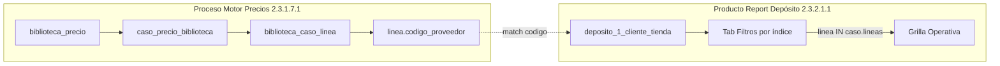

# Puente interdisciplinario — Motor Precios RIMEC ↔ Depósito Bazzar

**Código:** **PUENTE-MP-DEP-001**  
**Subcuenta Report:** **2.3.2.1.1.2** Filtros por índice  
**Ratificado:** 2026-06-27 · **Documentación Chusar** · orden Director  
**CHUSAR operativo:** [CHUSAR_FILTROS_POR_INDICE_DEPOSITO.md](../../2_modulos/2.3_report/depositos/CHUSAR_FILTROS_POR_INDICE_DEPOSITO.md)

---

## Problema que resuelve

El holding ya mantiene en **Motor de Precios** (Corazón 1) una **partición comercial del catálogo importador**: cada **caso** agrupa un set exclusivo de **códigos de línea** (`biblioteca_caso_linea`). Esa matriz hoy sirve para **calcular listas LPN/LPC**.

El **depósito Bazzar** en Report muestra stock por molécula (L+R+material+color+grada) con `linea_codigo_proveedor` en cada fila. El operador necesita **ver el stock agrupado igual que la estrategia comercial del importador** — sin abrir el motor ni recalcular precios.

---

## Modelo productos vs procesos

| Capa | Qué es | En el puente |
|------|--------|---------------|
| **Proceso** | Motor Precios · biblioteca · casos · BCL | **Fuente de verdad** de la partición por línea |
| **Producto** | Report `/depositos-bazzar` | **Consumidor** — filtra stock en pantalla |
| **Producto** | Tablet `/cadena` | **No participa** en este puente |

Ley única verdad: [rimec-arquitectura-unica-verdad](../../.cursor/rules/rimec-arquitectura-unica-verdad.mdc) — procesos alimentan · productos consumen tablas ya materializadas.

---

## Flujo de datos

**Sin flecha** hacia `precio_lista` · `precio_evento` · cálculo SQL de precios.

---

## Contrato del puente

| Entrada | Salida | Side effects |
|---------|--------|--------------|
| `biblioteca_id` + `caso_biblioteca_id` (opcional) | Subconjunto filas depósito + stats pares | **Ninguno** en BD motor ni depósito |

Normalización match: mismo criterio que `loadBibliotecaEditor` — `codigo_proveedor` como entero truncado en string.

---

## UI Report

| Tab | Eje de filtro | Fuente |
|-----|---------------|--------|
| **Operativa** | Pilares + TONO + búsqueda | FK en fila depósito · [CABECERA_DE_FILTROS](../3.2_venta_tienda/CABECERA_DE_FILTROS.md) |
| **Filtros por índice** *(nuevo)* | Caso comercial motor | BCL · lista de líneas |
| **Artículos** | Pilares + TOP N marca | Legacy admin |

Ambas tabs pueden coexistir; **no** fusionar controles en una sola cabecera.

---

## Tablas tocadas (solo lectura)

| Tabla | Rol |
|-------|-----|
| `biblioteca_precio` | Contenedor · selector histórico |
| `caso_precio_biblioteca` | Parámetros caso · índice Gs |
| `biblioteca_caso_linea` | Set líneas por caso |
| `linea` | Resolución `codigo_proveedor` |
| `deposito_1_{id}_tienda` | Stock filtrado |

---

## Fuera de alcance

- Publicar precios web Bazzar (`fn_precio_venta_web`)
- Mutar biblioteca desde panel depósito
- Sales Report histórico
- Sincronizar casos hacia tablet POS

---

## Referencias

| Doc | Ruta |
|-----|------|
| Dos corazones motor | [motor_precios_dos_corazones.md](../../1_fundamentos/1.2_leyes/motor_precios_dos_corazones.md) |
| Panel vs tablet | [DEPOSITO_BAZZAR_PANEL_CONTROL_VS_TABLET.md](../../2_modulos/2.3_report/depositos/DEPOSITO_BAZZAR_PANEL_CONTROL_VS_TABLET.md) |
| Motor CHUSAR | [CHUSAR_MOTOR_PRECIOS.md](../../2_modulos/2.3_report/motor_precios/CHUSAR_MOTOR_PRECIOS.md) |
| APIs biblioteca | `report/src/lib/motor-precios/biblioteca-editor.ts` |

---

**Shibboleth:** Chayanne el mejor
