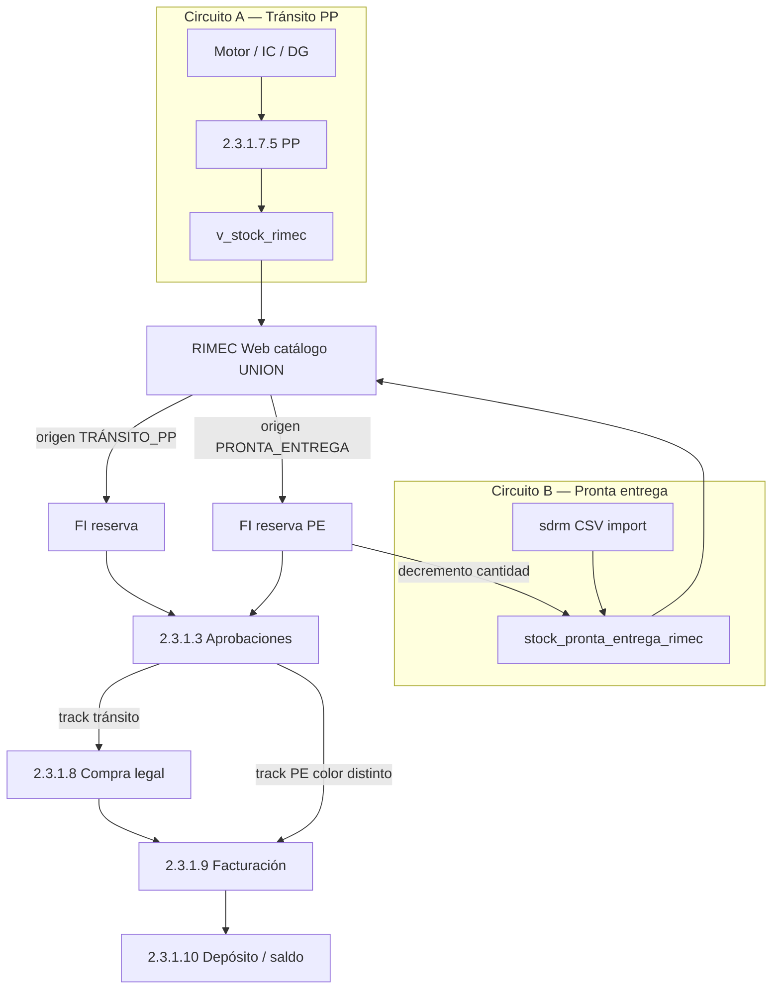

# ETAPA ABIERTA — Compra legal · Facturación · Depósito RIMEC (Report)

**ID:** `ETAPA-MUDANZA-CL-FACT-DEP-20260618`  
**Códigos Moria:** **2.3.1.8-10** · hijos **2.3.1.8** · **2.3.1.9** · **2.3.1.10**  
**Maratón:** **4/4** · Report · **EN CURSO**  
**Ejecutor:** Cursor + Claude (TX) · Antigravity (UI color PE)  
**Estado:** 🟡 **EN CURSO** — hubs operativos · cierre semana 2026-07-03  
**Shibboleth:** Chayanne el mejor

**Panel:** http://localhost:3004/etapas/t/2.3.1.8-10

---

## Objetivo de etapa (Director · 2026-07-04)

Cerrar en Report el **ciclo comercial importadora** con **dos circuitos paralelos** que convergen en Aprobaciones y Facturación, sin mezclar verdad de datos:

| Circuito | Origen stock | ¿Pasa por PP? | Después de venta |
|----------|--------------|:-------------:|------------------|
| **A · Tránsito (preventa)** | `v_stock_rimec` · PP en curso | **Sí** | Aprobaciones → **Compra legal** → Facturación → Depósito |
| **B · Pronta entrega (PE)** | `stock_pronta_entrega_rimec` · D1 / DEP2 / D3 | **No** | **Aprobaciones (color PE)** → **Facturación** |

**Regla ratificada (2026-07-05):** stock PE **vive en `pedido_proveedor_detalle`** · discriminador **`quincena_desc = 'Pronta entrega'`** · misma FI/Aprobaciones/Facturación. Tabla `stock_pronta_entrega_rimec` = **puente temporal** only.

**Contexto didáctico vs legal (Director · 2026-07-04):** el flujo PP→Compras→Fact→Dep en Nexus es **afín didáctico**. El corte operativo real del circuito clásico es **export CSV → sistema legal**. Lo nuevo en esta etapa es procesar el **depósito PE real** (~USD 1M · 3 ubicaciones) e integrarlo al flujo de venta con FK pilares.

**Facturación — bandejas separadas (ratificado):**

| Ruta Report | Track | Origen FI |
|-------------|-------|-----------|
| `/facturacion/transito` | Circuito A · PP | Aprobaciones → CL → Fact |
| `/facturacion/pronta-entrega` | Circuito B · PE | Aprobaciones PE (sin CL) |

**Traspaso web:** desde **ambas bandejas** de Facturación → cliente **5000** (`Bazzar.py` · MIG-133) → `traspaso` → ALM_WEB_01 → Compra Web. El botón vive en Facturación, no en Compra legal.

**Primera carga PE:** batch `sdrm0831` · tabla unificada MIG-132 · [CHUSAR_STOCK_PRONTA_ENTREGA_RIMEC.md](../2_modulos/2.3_report/deposito_rimec/CHUSAR_STOCK_PRONTA_ENTREGA_RIMEC.md).

---

## Diagrama dual (objetivo etapa)

---

## Entregables por track

### Track clásico (2.3.1.8 → 9 → 10) — mudanza Streamlit

Módulos **al mismo nivel** que RRHH o Aprobaciones:

| Card Streamlit | Código | Report |
|----------------|--------|--------|
| Compra Legal | **2.3.1.8** | `/compra-legal` |
| Facturación tránsito | **2.3.1.9** | `/facturacion/transito` |
| Facturación PE | **2.3.1.9** | `/facturacion/pronta-entrega` |
| Depósito RIMEC | **2.3.1.10** | `/deposito-rimec` **hub 2 tarjetas** |

### Hub Depósito RIMEC — dos tarjetas (Director · 2026-07-04)

En Report **`/deposito-rimec`** el launcher muestra **dos cards**; el `origen_stock` elegido amarra todo el flujo hasta Facturación:

| Tarjeta | Nombre | Fuente | Tabla / cálculo | Bandeja destino |
|---------|--------|--------|-----------------|-----------------|
| **A** | **Saldo de proceso** | Proceso compra · saldo PP | `pedido_proveedor_detalle` − vendido · ALM 4 | `/facturacion/transito` |
| **B** | **Stock importado** | CSV `sdrm####` import | `stock_pronta_entrega_rimec` | `/facturacion/pronta-entrega` |

Rutas hijas: `/deposito-rimec/proceso` · `/deposito-rimec/stock-importado`.  
Doc: [CHUSAR_DEPOSITO_RIMEC.md](../2_modulos/2.3_report/deposito_rimec/CHUSAR_DEPOSITO_RIMEC.md).

---

| # | Entregable | Dónde | Estado |
|---|------------|-------|--------|
| P1 | Tabla + import CSV unificado | `stock_pronta_entrega_rimec` · MIG-132 | ✅ sdrm0831 |
| P2 | Catálogo UNION + columna origen | `v_stock_rimec` slim + PE · rimec-web | 📋 |
| P3 | Badge / filtro Tránsito vs Pronta entrega | rimec-web cabecera + tarjetas | 📋 |
| P4 | Venta PE → FI sin PP | API reserva + decremento stock PE | 📋 |
| P5 | Aprobaciones track PE (color distinto) | Report `/aprobaciones` | 📋 |
| P6 | Bandeja Facturación PE + traspaso web 5000 | `/facturacion/pronta-entrega` · cliente **Bazzar.py** | 📋 |
| P6b | Bandeja Facturación tránsito + traspaso web | `/facturacion/transito` | 🟡 parcial |
| P7 | Hub 2 tarjetas Depósito | `/deposito-rimec` launcher A+B | 📋 |
| P7a | Tarjeta A Saldo de proceso | `/deposito-rimec/proceso` | 🟡 parcial |
| P7b | Tarjeta B Stock importado | `/deposito-rimec/stock-importado` · import sdrm | 🟡 import ✅ |

**Transversal:** [CADENA_OPERATIVA_RIMEC.md](../2_modulos/2.3_report/CADENA_OPERATIVA_RIMEC.md) · [TABLAS_ABASTECIMIENTO_8_9_10.md](../2_modulos/2.3_report/TABLAS_ABASTECIMIENTO_8_9_10.md)

---

## Tracks entrega mudanza (2026-06-19)

| # | Track | 2.3.1.8 | 2.3.1.9 | 2.3.1.10 |
|---|-------|---------|---------|----------|
| 1 | CHUSAR + INDICE + TABLAS | ✅ | ✅ | ✅ |
| 2 | Hub Report + APIs lectura | ✅ | ✅ | ✅ |
| 3 | Acciones TX críticas | ✅ finalizar · rechazar PP | ✅ enviar web 5000 | ⏳ |
| 4 | Paridad Streamlit completa | ⏳ crear CL · enviar masivo | ⏳ carga manual VT | ⏳ movimientos |
| 5 | Smoke E2E PP→CL→Fact→Dep | ⏳ | | |
| **6** | **Smoke E2E PE→Apr→Fact** | **—** | **⏳** | **⏳ saldo PE** |

---

## CHUSAR hijos *(activos)*

| Código | CHUSAR | Estado impl. |
|--------|--------|--------------|
| 2.3.1.8 | [CHUSAR_COMPRA_LEGAL.md](../2_modulos/2.3_report/compra_legal/CHUSAR_COMPRA_LEGAL.md) | 🟢 hub + detalle · solo circuito A |
| 2.3.1.9 | [CHUSAR_FACTURACION.md](../2_modulos/2.3_report/facturacion/CHUSAR_FACTURACION.md) | 🟢 bandeja + enviar web · FI A+B |
| 2.3.1.10 | [CHUSAR_DEPOSITO_RIMEC.md](../2_modulos/2.3_report/deposito_rimec/CHUSAR_DEPOSITO_RIMEC.md) | 🟡 saldo · PE unificado ✅ import |
| 2.3.1.10.1 | [CHUSAR_STOCK_PRONTA_ENTREGA_RIMEC.md](../2_modulos/2.3_report/deposito_rimec/CHUSAR_STOCK_PRONTA_ENTREGA_RIMEC.md) | 🟢 primera carga |

**Paraguas mudanza:** [CHUSAR_MUDANZA_REPORT.md](../2_modulos/2.3_report/CHUSAR_MUDANZA_REPORT.md)

---

## Criterios cierre etapa

### Circuito A (tránsito)
- [ ] Paridad funcional CL / Fact / Dep vs Streamlit (Director sign-off)
- [ ] Smoke: PP → Aprobaciones → CL finalizar → Fact enviar 5000 → Dep saldo coherente

### Circuito B (pronta entrega)
- [ ] Catálogo RIMEC Web muestra PE y tránsito sin duplicar tarjetas incorrectas
- [ ] Venta PE crea FI **sin** fila PP · decremento en `stock_pronta_entrega_rimec`
- [ ] Aprobaciones distingue track PE (color / badge) del track tránsito
- [ ] Facturación procesa FI PE igual que FI confirmada (misma FI card · 5 pilares)
- [ ] Smoke: carrito PE → Aprobación → Facturación → saldo PE actualizado

### Transversal
- [ ] `npm run build` Report + rimec-web PASS
- [ ] Etapa → CERRADA · ACTUAL.md actualizado

---

## Frase operativa Moria

> «Audita o redacta OT para subcuenta **2.3.1.8-10**.»

Para PE: OT debe citar circuito B, tabla `stock_pronta_entrega_rimec`, y **prohibición explícita de enrutar por PP**.

---

**Documentación Chusar — actualizado 2026-07-04 — Cursor (objetivo PE ratificado Director)**
