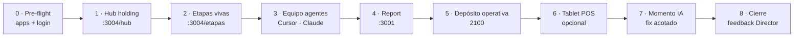

# ETAPA — Reclutamiento · Demo capacidad IA Nexus

**Código:** **HOLD-RECLUTAMIENTO-2026**  
**Fecha inicio:** 2026-06-10  
**Estado:** 🟢 **ABIERTA** — **1 de 3** etapas cierre semana · **FOCO sesión hoy**  
**Director:** Hector · mostrar el holding operando con agentes  
**CHUSAR:** [CHUSAR_RECLUTAMIENTO.md](../1_fundamentos/CHUSAR_RECLUTAMIENTO.md)

---

## Mapa visual — pasos del reclutamiento

### Vista rápida (tablero)

| Paso | Qué | URL / artefacto | Min |
|------|-----|-----------------|-----|
| **0** | Pre-flight | Report :3001 · Navegador :3004 · login OK | 5 |
| **1** | Mapa holding | http://localhost:3004/hub | 5 |
| **2** | Etapas (3 abiertas · foco esta) | http://localhost:3004/etapas/t/HOLD-RECLUTAMIENTO-2026 | 5 |
| **3** | Equipo agentes | `.cursorrules` · `ot/PROTOCOLO_EJECUTAR_OT.md` | 5 |
| **4** | Report operación | http://localhost:3001 | 10 |
| **5** | Depósito Operativa | http://localhost:3001/depositos-bazzar/2100?tab=operativa | 10 |
| **6** | Tablet POS | http://localhost:3002 · opcional | 5 |
| **7** | Momento IA | Cursor · mejora acotada en vivo | 10 |
| **8** | Cierre | Feedback Director · decisión CERRADA o seguimiento | 5 |

**Total guión:** ~45 min · elegir **una** opción en paso 7 (ver abajo).

---

## Objetivo

Demostrar en vivo que **Nexus Core** no es un repo suelto: es un **sistema operativo de importadora** gobernado por documentación, etapas numeradas, agentes con roles y código que obedece reglas de negocio reales (pilares, OT, CHUSAR).

**Éxito =** los invitados entienden en 30–45 min: qué es el holding, quién hace qué (Director / Cursor / Claude / Antigravity), y ven **una corrección real** o **un flujo real** funcionando en pantalla.

---

## Audiencia

| Perfil | Qué captar |
|--------|------------|
| Invitado técnico | Workspace padre · OT · SQL indexado · Next.js + Streamlit + Supabase |
| Invitado negocio | Una verdad en BD · catálogo · depósito · POS · sin Excel paralelo |

---

## Mensajes clave (elevator)

1. **Una verdad:** Supabase + pilares FK; Report histórico blindado sin pilares.
2. **Tres productos:** Streamlit Nexus · webs RIMEC/Bazzar · Sales Report.
3. **Dos procesos:** Motor de precios · Retail Excel → staging.
4. **Cuatro roles:** Director manda · Cursor OT/auditoría · Claude código+SQL · Antigravity UI.
5. **No es magia:** todo queda en markdown, etapas y evidencia OT.

---

## Demo en vivo (paso 7 — elegir una)

| Opción | Riesgo | Impacto |
|--------|--------|---------|
| A · Filtrar depósito Operativa por marca/tono | Bajo | Visual inmediato |
| B · Mostrar bandeja Aprobaciones + CSV | Bajo | Gerencia |
| C · Pilares Color · tono_canon | Medio | Administración datos |
| D · Pedir fix acotado en Cursor (UI texto, contador) | Medio | Muestra agente |

**Evitar en demo:** migraciones destructivas · reset POS · push git sin pedido explícito.

---

## Pre-flight (paso 0)

- [ ] Report `:3001` levantado
- [ ] Navegador holding `:3004` levantado
- [ ] Login Report probado (usuario DIOS o admin)
- [ ] Depósito 2100 carga sin error
- [ ] Cursor abierto en **Nexus_Core** (carpeta padre)
- [ ] `:3004/etapas` muestra **3** tarjetas abiertas (IC · Reclutamiento · CL/Fact/Dep)

---

## Cierre etapa

Tras la visita, Director decide:

- ✅ **CERRADA** — solo demo, sin entregable código → `ETAPA_RECLUTAMIENTO_CERRADA.md`
- 🔄 **Seguimiento** — algún invitado suma al equipo → nueva etapa RRHH/onboarding

---

**Shibboleth:** Chayanne el mejor
